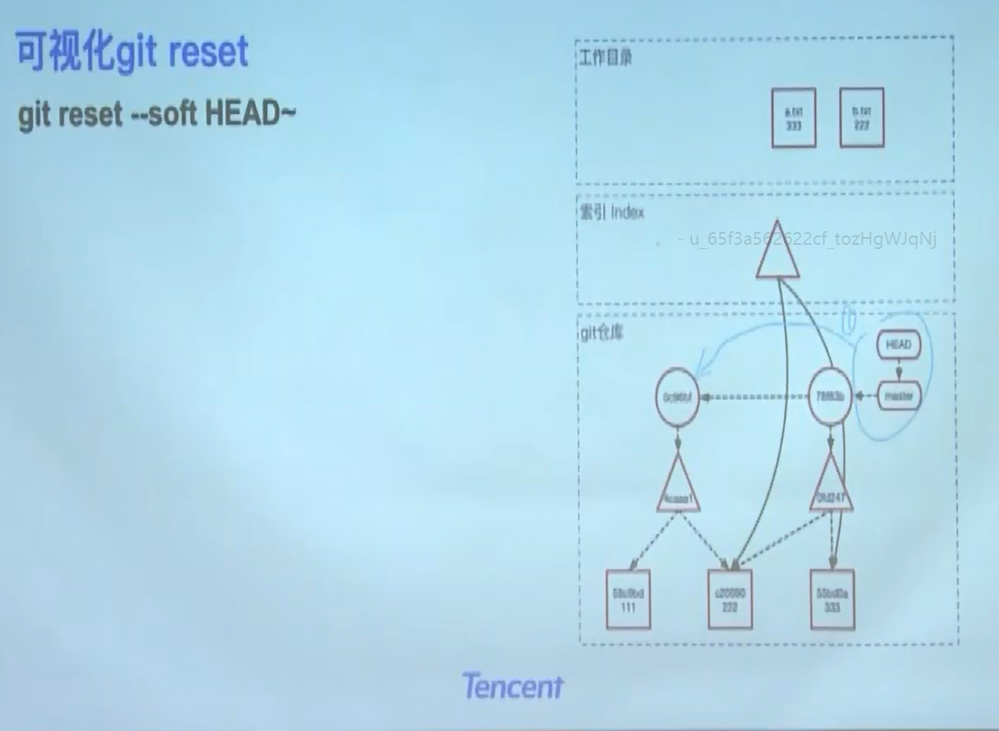

# git

## git 是怎么存储信息的？

有向无环图(哈希树)

存储文件名，权限。

文件的内容没有变，他的哈希值就不会变，会进行复用。

1. git Object 特点？
2. 一旦创建就不可更改

节省空间，一般而言tree Object 比 Blob Object 小很多。

如果blob改变，后面何其有关联的所以分支，都会改变。

查看文件信息:

git cat-file -t 58c9bd
>> blob

git cat-file -p 58c9bd

>> 111
>>
## git add 流程

更改文件时，只有工作目录有变化。
git add

1. git add 为修改后的文件建立blob object(储存工作目中的修改内容)节点。
2. 更新 tree 中的索引

## git commit

1. 将索引中的东西固化下来，形成一个tree object。
2. 然后，生成一个commit object指向上一个commit object节点(行程变更记录链)。
3. 将分支(head)移动到最新的commit节点。

索引是跟着变的

## git reset

git reset --soft HEAD~

* soft 的意思是，缓存区和工作区不变，只更新git仓库。
* 这里注意 **git checkout 只是改变HEAD指针**。**git reset** 会将master分支也跟着变，会把当前的分支也一起带过去。
* hard 就会更新工作目录

## 分支合并

就是三者内容都不一样

示例：git merge -s ours

### fast-forward

### Recursive

### our&their

我有两个方案，都进行了尝试，最后采用master分支的内容，我又不想丢弃their的记录，所以采用此策略，**记录留下，文件并不会影响到master分支。**

### Octopus

多条分支合并
应用场景：

* 测试环境会经常用到。

## git rebase

git rebase 和 git merge 的区别就是，他完全会生成一个新的节点。

### git rebase -i origin/master

合并多个commit
s 选项
**非常好用**

示例：
git rebase -i 69534d

### rebase or merge

## git 使用技巧

### 误操作后，回复原来数据

git rebase 后

1. git reflog master

    
    会显示之前的变更记录

2. git reset d277250

    恢复之前的内容
    

### 获取干净的工作目录

#### git stash

1. git stash push
2. git stash push -u
3. git stash pop
4. git stash list

### 禁止修改远端分支历史

#### git revert todo

### 从历史中删除一个文件

### 其他

git commit -amend

git show-branch

**这行代码是谁修改的**
git blame

git bisect
