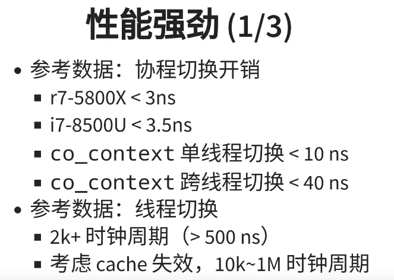

[toc]

# 面试回答

## 项目中遇到哪些难点？

**项⽬难点：**

* 基于**epoll和定时器实现多线程IO协程调度器**，**⽀持对定时任务协程和IO任务协程的调度，且⽀持主线程（创建调度器的线程）参与调度。**
* 对**sleep、IO等阻塞系统调⽤进⾏hook封装**，在函数内部进⾏协程切换，将阻塞系统调⽤改造为⾮阻塞。

## 简要介绍⼀下协程库这个项⽬

简历

### 协程是什么

**协程是可以暂停和恢复的函数。**

**协程的本质就是函数和函数运⾏状态的组合**。协程和函数的不同之处是，函数⼀旦被调⽤，只能从头开始执⾏，直到函数执⾏结束退出，⽽协程则可以执⾏到⼀半就退出（称为yield），但此时协程并未真正结束，只是暂时让出CPU执⾏权，在后⾯适当的时机协程可以重新恢复运⾏（称为resume），在这段时间⾥其他的协程可以获得CPU并运⾏，所以协程被描述称为“轻量级线程”。

协程能够半路yield、再重新resume的关键是协程存储了函数在yield时间点的执⾏状态，这个状态称为协程上下⽂。协程上下⽂包含了函数在当前执⾏状态下的全部CPU寄存器的值，这些寄存器值记录了函数栈帧、代码的执⾏知识位置等信息，如果将这些寄存器的值重新设置给CPU，就相当于重新恢复了函数的运⾏。单线程环境下，协程的yield和resume⼀定是同步进⾏的，⼀个协程的yield，必然对应另⼀个协程的resume，因为线程不可能没有执⾏主体。并且，协程的yield和resume是完全由应⽤程序来控制的。与线程不同，线程创建之后，线程的运⾏和调度也是由操作系统⾃动完成的，但协程创建后，协程的运⾏和调度都要由应⽤程序来完成，就和调⽤函数⼀样，所录 以协程也被称为“⽤户态线程”。

### 对称协程和非对称协程

**对称协程，协程可以不受限制地将控制权交给任何其他协程。** 任何⼀个协程都是相互独⽴且平等的，调度权可以在任意协程之间转移。

对称协程更灵活，⾮对称协程实现更简单。在对称协程中，⼦协程可以直接和⼦协程切换，也就是说每个协程不仅要运⾏⾃⼰的⼊⼝函数代码，还要负责选出下⼀个合适的协程进⾏切换，相当于每个协程都要充当调度器的⻆⾊，这样程序设计起来会⽐较麻烦，并且程序的控制流也会变得复杂和难以管理。⽽在⾮对称协程中，可以借助专⻔的调度器来负责调度协程，每个协程只需要运⾏⾃⼰的⼊⼝函数，然后结束时将运⾏权交回给调度器，由调度器来选出下⼀个要执⾏的协程即可。

### 有栈协程和无栈协程

**所谓的有栈，无栈并不是说这个协程运行的时候有没有栈，而是说协程之间是否存在调用栈（callbackStack）**。其实仔细一想即可，但凡是个正在运行的程序，不管你是协程也好，线程也好，怎么可能在运行的时候不使用栈空间呢，调用参数往哪搁，局部变量往哪搁。

有栈协程：⽤独⽴的执⾏栈来保存协程的上下⽂信息。当协程被挂起时，栈协程会保存当前执⾏状态（例如函数调⽤栈、局部变量等），并将控制权交还给调度器。当协程被恢复时，栈协程会将之前保存的执⾏状态恢复，从上次挂起的地⽅继续执⾏。类似于内核态线程的实现，不同协程间切换还是要切换对应的栈上下⽂，只是不⽤陷⼊内核⽽已。

**其实无栈协程的本质就是一个状态机（state machine），它可以理解为在另一个角度去看问题，即同一协程协程的切换本质不过是指令指针寄存器的改变。**
⽆栈协程：它不需要独⽴的执⾏栈来保存协程的上下⽂信息，协程的上下⽂都放到公共内存中，当协程被挂起时，⽆栈协程会将协程的状态保存在堆上的数据结构中，并将控制权交还给调度器。当协程被恢复时，⽆栈协程会将之前保存的状态从堆中取出，并从上次挂起的地⽅继续执⾏。协程切换时，使⽤状态机来切换，就不⽤切换对应的上下⽂了，因为都在堆⾥的。⽐有栈协程都要轻量许多。

<https://mthli.xyz/stackful-stackless/>
<https://zhuanlan.zhihu.com/p/347445164>

### 【⼤部分公司】对⽐⼀下进程、线程和协程

进程是操作系统进⾏资源分配的基本单位，每个进程都有⾃⼰的独⽴内存空间。由于进程⽐较重量，占据独⽴的内存，所以上下⽂进程间的切换开销（栈、寄存器、虚拟内存、⽂件句柄等）⽐较⼤，但相对⽐较稳定安全。

线程⼜叫做轻量级进程，是进程的⼀个实体，是处理器任务调度和执⾏的基本单位。它是⽐进程更⼩的能独⽴运⾏的基本单位。线程只拥有⼀点在运⾏中必不可少的资源(如程序计数器，⼀组寄存器和栈)，但是它可与同属⼀个进程的其他的线程共享进程所拥有的全部资源。

协程，⼜称微线程，是⼀种⽤户态的轻量级线程，协程的调度完全由⽤户控制（也就是在⽤户态执⾏）。协程拥有⾃⼰的寄存器上下⽂和栈。协程调度切换时，将寄存器上下⽂和栈保存到线程的堆区，在切回来的时候，恢复先前保存的寄存器上下⽂和栈，直接操作栈则基本没有内核切换的开销，可以不加锁的访问全局变量，所以上下⽂的切换⾮常快。

**异步与协程 的性能 是 一个数量级的，没什么多大区别。两者都可以极大提高 线程时间片 使用率，减少线程切换，跟多线程阻塞模型相比，这才是高效的主要原因。**

### 协程的缺点是什么？

难以调试、占⽤更多内存，学习成本相对较⾼等，最明显的缺点是：⽆法利⽤多核资源。线程才是系统调度的基本单位，单线程下的多协程本质上还是串⾏执⾏的，只能⽤到单核计算资源，所以协程往往要与多线程、多进程⼀起使⽤。

### ucontext_t 的缺点是什么？

libco的切换要更快。

一般用ucontext实现的coroutine, 切换基于glibc的swapcontext.S

主要保存和恢复以下部分：

* 栈
* 寄存器
* 浮点环境（不需要）
* signal mask（不需要）

操作信号掩码会增加上下文切换的开销，因为这涉及到内核对于进程信号状态的修改。**这在密集的协程切换场景中会导致性能问题。**

从而引起内核态和用户态的上下文切换，这个是最主要的性能瓶颈。

此外，在网络应用中，通常也不需要浮点环境，也可以去掉。

**coctx_swap.S里面，省掉了上面的浮点环境和signal掩码。**
从这个角度看，libco的实现，是一个优化版。

### 【阿⾥巴巴本地⽣活、京东、快⼿】你觉得协程有什么⽤？

1. 线程的切换由操作系统负责调度，协程由用户自己进行调度，因此减少了上下文切换，提高了效率。
2. 线程的默认Stack大小是1M，而协程更轻量，接近1K。因此可以在相同的内存中开启更多的协程。
3. 由于在同一个线程上，因此可以避免竞争关系而使用锁。
4. 适用于被阻塞的，且需要大量并发的场景。但不适用于大量计算的多线程，遇到此种情况，更好实用线程去解决。

**协程非常适合**网络编程，因为网络通信通常**涉及大量的IO操作。使用协程可以避免阻塞线程**，从而提高程序的性能。

提⾼资源利⽤率，提⾼程序并发性能。协程允许开发者编写异步代码，实现⾮阻塞的并发操作，通过在适当的时候挂起和恢复协程，可以有效地管理多个任务的执⾏，提⾼程序的并发性能。与线程相⽐，协程是轻量级的，它们的创建和上下⽂切换开销较⼩，可以同时执⾏⼤量的协程，⽽不会导致系统负载过重，可以在单线程下实现异步，使程序不存在阻塞阶段，充分利⽤cpu资源。

简化异步编程逻辑。使⽤协程可以简化并发编程的复杂性，通过使⽤适当的协程库或语⾔特性，可以避免显式的线程同步、锁和互斥量等并发编程的常⻅问题，**⽤同步的思想就可以编写成异步的程序。**

## 协程最大的好处是什么(应用场景)？

异步IO : 阻塞时切换要比线程切换快。

⽤同步的思想就可以编写成异步的程序。比如在IO阻塞的地方挂起，当IO完成时，恢复回来，

用协程做分步的运算，比如现在只有一个线程，有一个任务耗时很多，可以先做一部分加载，之后保存上下文，去做其他任务，之后回来继续做，将一个耗时的任务分几步完成。

1. 协程最大的作用是去做IO密集型任务，不用切换到内核态。
2. ⽤同步的编码方式就可以实现编写成异步的程序。

### 【滴滴】衡量⼀个协程库性能的标准有哪些？

**响应时间**：衡量在给定负载下协程调度的快慢。较低的响应时间表示更⾼的性能。

**吞吐量**：指在单位时间内执⾏的任务数量。较⾼的吞吐量表示更⾼的性能。
**并发能⼒**：指同时处理的协程数量。更⾼的并发能⼒表示更好的性能。
**上下⽂切换开销**：在协程库中，上下⽂切换是指从⼀个协程切换到另⼀个协程的操作。较低的上下⽂切换开销表示更⾼的性能，因为过多的上下⽂切换会浪费时间和资源。
**资源利⽤率**：⼀个好的协程库应该有效地利⽤系统资源，例如处理器、内存和⽹络等。协程库在资源利⽤⽅⾯的优化程度可以影响性能。

### 【滴滴、华为】你是怎样做的性能测试？

同一线程下，协程的切换需要 10ns
不同线程下，协程的切换需要 40ns左右

线程切换则需要 500ns

单线程下，不需要多线程的锁机制，因为只有一个线程，也不存在同时写变量冲突，在协程中控制共享资源不加锁，只需要判断状态就好了，所以执行效率比多线程高很多。

================================================

测试工具

AB http-tools

压测服务器

压测数据

#### 短链接

```cpp
一个线程
-n 100万次请求， -c  并发数 200
ab -n 1000000 -c 200

Benchmarking 192.168.5.92 (be patient)
Completed 100000 requests
Completed 200000 requests
Completed 300000 requests
Completed 400000 requests
Completed 500000 requests
Completed 600000 requests
Completed 700000 requests
Completed 800000 requests
Completed 900000 requests
Completed 1000000 requests
Finished 1000000 requests


Server Software:        ylar/1.0.0
Server Hostname:        192.168.5.92
Server Port:            8020

Document Path:          /sylar
Document Length:        132 bytes

Concurrency Level:      200
Time taken for tests:   35.064 seconds
Complete requests:      1000000
Failed requests:        0
Non-2xx responses:      1000000
Total transferred:      242000000 bytes
HTML transferred:       132000000 bytes
Requests per second:    28519.61 [#/sec] (mean)
Time per request:       7.013 [ms] (mean)
Time per request:       0.035 [ms] (mean, across all concurrent requests)
Transfer rate:          6739.99 [Kbytes/sec] received

Connection Times (ms)
              min  mean[+/-sd] median   max
Connect:        0    3   1.0      3      13
Processing:     1    4   1.1      4      20
Waiting:        0    3   1.1      3      14
Total:          2    7   1.2      7      22

Percentage of the requests served within a certain time (ms)
  50%      7
  66%      7
  75%      8
  80%      8
  90%      8
  95%      9
  98%      9
  99%     10
 100%     22 (longest request)

两个线程
Server Software:        ylar/1.0.0
Server Hostname:        192.168.5.92
Server Port:            8020

Document Path:          /sylar
Document Length:        132 bytes

Concurrency Level:      200
Time taken for tests:   30.337 seconds
Complete requests:      1000000
Failed requests:        0
Non-2xx responses:      1000000
Total transferred:      242000000 bytes
HTML transferred:       132000000 bytes
Requests per second:    32963.14 [#/sec] (mean)
Time per request:       6.067 [ms] (mean)
Time per request:       0.030 [ms] (mean, across all concurrent requests)
Transfer rate:          7790.12 [Kbytes/sec] received

Connection Times (ms)
              min  mean[+/-sd] median   max
Connect:        0    3   0.8      2      10
Processing:     0    4   1.4      3      97
Waiting:        0    3   1.4      2      96
Total:          1    6   1.6      6      97
WARNING: The median and mean for the initial connection time are not within a normal deviation
        These results are probably not that reliable.

Percentage of the requests served within a certain time (ms)
  50%      6
  66%      7
  75%      7
  80%      7
  90%      7
  95%      7
  98%      8
  99%      8
 100%     97 (longest request)

三个线程

Server Software:        ylar/1.0.0
Server Hostname:        192.168.5.92
Server Port:            8020

Document Path:          /sylar
Document Length:        132 bytes

Concurrency Level:      200
Time taken for tests:   34.756 seconds
Complete requests:      1000000
Failed requests:        0
Non-2xx responses:      1000000
Total transferred:      242000000 bytes
HTML transferred:       132000000 bytes
Requests per second:    28772.15 [#/sec] (mean)
Time per request:       6.951 [ms] (mean)
Time per request:       0.035 [ms] (mean, across all concurrent requests)
Transfer rate:          6799.67 [Kbytes/sec] received

Connection Times (ms)
              min  mean[+/-sd] median   max
Connect:        0    3   0.8      3      18
Processing:     1    4   1.8      4     146
Waiting:        0    3   1.8      3     145
Total:          3    7   1.8      7     146

Percentage of the requests served within a certain time (ms)
  50%      7
  66%      7
  75%      7
  80%      7
  90%      8
  95%      9
  98%     10
  99%     11
 100%    146 (longest request)

nginx
一个线程
Server Software:        nginx/1.18.0
Server Hostname:        192.168.5.92
Server Port:            80

Document Path:          /sylar
Document Length:        162 bytes

Concurrency Level:      200
Time taken for tests:   44.394 seconds
Complete requests:      1000000
Failed requests:        0
Non-2xx responses:      1000000
Total transferred:      321000000 bytes
HTML transferred:       162000000 bytes
Requests per second:    22525.66 [#/sec] (mean)
Time per request:       8.879 [ms] (mean)
Time per request:       0.044 [ms] (mean, across all concurrent requests)
Transfer rate:          7061.27 [Kbytes/sec] received

Connection Times (ms)
              min  mean[+/-sd] median   max
Connect:        0    4   1.1      4      16
Processing:     1    5   1.3      5      17
Waiting:        0    3   1.3      3      16
Total:          3    9   1.0      9      24

Percentage of the requests served within a certain time (ms)
  50%      9
  66%      9
  75%      9
  80%      9
  90%     10
  95%     10
  98%     11
  99%     12
 100%     24 (longest request)
```

### 个⼈收获

* 深⼊了解了协程技术，熟悉了共享栈、对称/⾮对称协程等概念
* 了解了主要协程库的优缺点以及适⽤场景，对进程、线程、协程的区别有了更深⼊的了解
* 熟练掌握了Linux⽹络编程、系统编程接⼝，对IO多路复⽤、事件驱动模型有了⼀定的了解

### 【京东】项⽬中有没有加锁的场景，加的是什么锁？

项⽬中有很多地⽅需要加锁，⽐如在多线程的协程调度器在从协程的任务队列取协程任务执⾏的时候需要加互斥锁，协程调度器全局变量访问时加读写锁。

1. socket事件上下文的容器
   1.`std::vector<FdContext *> m_fdContexts;`
2. 文件句柄上下文
   1. std::vector<FdCtx::ptr> m_datas;
3. 设置调度器状态时.
4. 添加调度任务时.
单线程下则不需要加锁。

### 【滴滴】了解Go语⾔的协程吗？

Go语⾔最⼤的特⾊就是从语⾔层⾯⽀持并发（Goroutine），Goroutine是Go中最基本的执⾏单元。事实上
每⼀个Go程序⾄少有⼀个Goroutine：main Goroutine。Go 程序从 main 包的 main() 函数开始，在程序启
动时，Go 程序就会为 main() 函数创建⼀个默认的 goroutine。更多内容参考<https://juejin.cn/post/7044741465930465311>

### 【华为】服务器运⾏时每建⽴⼀个⽤户连接就要创建⼀个协程，不会影响性能吗？

是的，会存在这个问题，在承受⾼并发时，⼤量的协程的创建、析构都会消耗较⼤的系统资源，可以采⽤“协程池”的⽅法解决，提前创建指定数量的协程，有新的任务执⾏时，选择⼀个协程进⾏任务函数绑定，任务完成将协程重置返回到协程中。

### 【科⼤讯⻜】为什要有空闲协程，和主协程合成⼀个不⾏吗？

在IO协程调度器空闲协程⾥要进⾏epoll监听，添加协程任务，最基本的协程调度器包含idle协程，IO协程调度器对其进⾏了重写，主协程只进⾏任务调度，idle只进⾏任务添加，降低了不同功能之间的耦合，便于后续扩展维护。

### 【阿⾥云、华为】了解c++的协程吗？

C++的协程是从C++20标准开始引⼊的⼀种语⾔特性，旨在提供⼀种⽅便、⾼效处理异步任务和并发编程的机制。C++的协程通过关键字co_await和co_yield来实现，结合协程类型和协程函数来定义和使⽤协程。更多细节可参考<https://www.bennyhuo.com/2022/03/09/pp-coroutines-01-intro/>

## libco

参考资料
<https://www.cyhone.com/articles/analysis-of-libco/>
<https://blog.csdn.net/affrewg/article/details/126449237?spm=1001.2014.3001.5501>

## 测试



## 锁实现的方式，加锁效率太低，如何改进甚至不加锁？

通过构造函数进行加锁，析构函数进行解锁， 防止我们漏掉解锁。

多协程在访问全局变量时，竞争如何优化？

1. 原子变量(实现原子操作)
2. 互斥锁
「互斥锁」或「原子操作」

## 信号量用在哪里了？

用在线程创建的时候，

``` cpp
Thread::Thread(std::function<void()> cb, const std::string &name)
    : m_cb(cb), m_name(name) {
  if (name.empty()) {
    m_name = "UNKNOW";
  }
  int rt = pthread_create(&m_thread, nullptr, &Thread::run, this);
  if (rt) {
    SYLAR_LOG_ERROR(g_logger)
        << "pthread_create thread fail, rt=" << rt << " name= " << name;
    throw std::logic_error("pthread_create error");
  }
  // 有的时候，创建的线程会在线程的构造函数执行完成之后，还未执行，为了防止此情况发生。
  // 确保线程跑起来。// 阻塞去获取信号量，信号量的释放是在
  // run函数中，这样可以确保线程跑起来
  m_semaphore.wait();
}
```

有的时候，创建的线程会在线程(Thread)的构造函数执行完成之后，还未执行，为了防止此情况发生。(顺序不确定性).

**信号量就是为了确保顺序性。**
确保线程跑起来。阻塞去获取信号量，信号量的释放是在run函数中，这样可以确保线程跑起来。

## 协程是怎么实现在用户态进行切换的？

协程切换只涉及基本的**CPU上下文切换**，所谓的 CPU 上下文，就是一堆寄存器，里面保存了 CPU运行任务所需要的信息：**从哪里开始运行（%rip：指令指针寄存器**，标识 CPU 运行的下一条指令），**栈顶的位置（%rsp： 是堆栈指针寄存器**，通常会指向栈顶位置），**当前栈帧在哪（%rbp 是栈帧指针，用于标识当前栈帧的起始位置**）以及其它的CPU的中间状态或者结果（%rbx，%r12，%r13，%14，%15 等等）。

协程切换非常简单，**就是把当前协程的 CPU 寄存器状态保存起来，然后将需要切换进来的协程的 CPU 寄存器状态加载的 CPU 寄存器上就 ok 了。**而且完全在用户态进行，一般来说一次协程上下文切换最多就是几十ns 这个量级。

### linux的 ucontext_t 有哪些缺点？

这里要和libco的实现做一个对比。
libco的协程切换要比ucontext_t效率高。

## 多线程之间互斥的方式有哪些？

## 如何通知idle协程，退出epoll_wait，进行任务调度(如何实现的跨线程调用)？

1. 对应的操作是tickle
2. 注册的IO事件就绪

主要说明下情况一：
**这里通知epoll使用了管道，往写端写数据，读端会在创建IOmanager时注册在epoll上。**

```cpp
/**
 * @brief 通知调度器有任务要调度
 * @details
 * 写pipe让idle协程从epoll_wait退出，待idle协程yield之后Scheduler::run就可以调度其他任务
 * 如果当前没有空闲调度线程，那就没必要发通知
 */
void IOManager::tickle() {
  // 如果没有空闲线程，就直接返回
  if (!hasIdleThreads()) {
    return;
  }
  // 往管道的写端写
  int rt = write(m_tickleFds[1], "T", 1);
  SYLAR_ASSERT(rt == 1);
}
bool IOManager::stopping(uint64_t &timeout) {
  timeout = getNextTimer();
  return timeout == ~0ull && m_pendingEventCount == 0 && Scheduler::stopping();
}
bool IOManager::stopping() {
  uint64_t timeout = 0;
  return stopping(timeout);
}

```

``` cpp
/**
 * @brief 构造函数
 * @param[in] threads 线程数量
 * @param[in] use_caller 是否将调用线程包含进去
 * @param[in] name 调度器的名称
 */
IOManager::IOManager(size_t threads, bool use_caller, const std::string &name)
    : Scheduler(threads, use_caller, name) {
  // 创建epoll实例
  m_epfd = epoll_create(5000);
  SYLAR_ASSERT(m_epfd > 0);

  // 创建pipe，获取m_tickleFds[2]，其中m_tickleFds[0]是管道的读端，m_tickleFds[1]是管道的写端
  int rt = pipe(m_tickleFds);
  // 不等于0异常
  SYLAR_ASSERT(!rt);

  // 注册pipe读句柄的可读事件，用于tickle调度协程，通过epoll_event.data.fd保存描述符
  epoll_event event;
  memset(&event, 0, sizeof(epoll_event));
  event.events = EPOLLIN | EPOLLET;  // 边沿触发
  event.data.fd = m_tickleFds[0];    // 设置句柄

  // 非阻塞方式，配合边缘触发
  rt = fcntl(m_tickleFds[0], F_SETFL, O_NONBLOCK);
  SYLAR_ASSERT(!rt);

  // 将管道的读描述符加入epoll多路复用，如果管道可读，idle中的epoll_wait会返回
  rt = epoll_ctl(m_epfd, EPOLL_CTL_ADD, m_tickleFds[0], &event);
  SYLAR_ASSERT(!rt);

  contextResize(64);

  // 这里直接开启了Schedluer，也就是说IOManager创建即可调度协程
  start();
}
```

### muduo 中，跨线程调用的实现？

**eventfd。eventfd是一个比pipe更高效的线程间事件通知机制。**

muduo采用eventfd进行线程间通信，函数定义如下：

```cpp
#include <sys/eventfd.h>
 
int eventfd(unsigned int initval, int flags);

```

第一个参数是初始值，一般设置为0，后面是O_NONBLOCK、EFD_CLOEXEC之类的标志。

eventfd()创建了一个事件对象 (eventfd object)， 能在用户态用做事件wait/notify机制，通过内核去唤醒用户态的事件。内核会为这个对象维护一个64位的计数器(uint64_t)。并且使用第一个参数(initval)初始化这个计数器。调用这个函数就会返回一个新的文件描述符(event object)。这个描述符支持 read，write，以及有关epoll等操作。

wakeup()函数就是向我们想唤醒的线程所绑定的EventLoop对象持有的wakeupFd_(eventfd)随便写入一个8字节数据。

因为**wakeupFd_**已经注册到了这个**EventLoop**中的事件监听器上，这时候事件监听器监听到有文件描述符的事件发生，epoll_wait()阻塞结束而返回。

**这就相当于起到了唤醒线程的作用！** 你这个EventLoop对象既然阻塞在事件监听上，那我就通过wakeup()函数给你这个EventLoop对象一个事件，让你结束监听阻塞。然后去执行 **doPendingFunctors()**。

**muduo库实现跨线程调用其实就是通过向指定的IO线程的wakeupFd_上随便发点数据**，让对应线程中loop()循环中之前阻塞监听的poll函数返回活跃通道，好让线程赶快执行回调函数。这样，回调函数执行完毕，其就可以调用doPendingFunctors函数执行我们之前添加的th_fn函数了。也就是说，**之前对应的线程可能没有活跃事件，所以一直阻塞，我们随便向wakeupFd_上发点数据就可以让poll返回了，然后赶快处理对应通道上注册的回调，其实处理指定的线程的回调函数并不是我们的目的，只是说，只有指定的线程执行完回调，我们期望的跨线程调用的函数才能被执行到。wakeup的目的其实就是通知线程赶快执行我们跨线程调用的函数，不然，其实以后只要该线程上有活跃事件，其实跨线程调用的函数还是会被执行的。也就是说，不通过wakeup方式，我们的跨线程调用的函数也会被执行，只是什么时候被执行就不好说了，只要线程检测到活跃事件才行。另外，为什么我们可以在主线程中向loop指针指向的EventLoop对象的成员pendingFunctors_中添加数据呢?这都是因为我们在主线程有了指向该EventLoop对象的指针loop，通过loop指针，我们就可以修改它上面的数据**。

```cpp
void EventLoop::wakeup()
// 用来唤醒loop所在线程 向wakeupFd_写一个数据 wakeupChannel就发生读事件 当前loop线程就会被唤醒
{
    uint64_t one = 1;
    ssize_t n = write(wakeupFd_, &one, sizeof(one));
    if (n != sizeof(one))
    {
        LOG_ERROR("EventLoop::wakeup() writes %lu bytes instead of 8\n", n);
    }
}
```

### 通常一个进程（线程）通知另一个等待中的（线程），有以下几种方法

1. pipe，使用fd[0] 为读端，fd[1]为写端，半双工。等待线程关注fd[0]的可读事件。
2. socketpair，也有一对文件描述符，可用于双向通信，全双工。
   1. 在Linux中，完全可以把这一对socket当成pipe返回的文件描述符一样使用，唯一的区别就是这一对文件描述符中的任何一个都可读和可写，
3. eventfd。eventfd是一个比pipe更高效的线程间事件通知机制
   1. 一方面:**它比 pipe少用一个pipe descriptor，节省了资源；**
   2. 另一方面，**eventfd的缓冲区管理简单，全部“buffer"只有定长8bytes，不像pipe那样可能有不定长的真正buffer。**
4. condition。线程可以使用条件变量condition来实现消息通信。

## 如何实现的让协程在指定的线程上运行？

在进行协程创建时，会将协程和线程id绑定起来(FiberAndThread)，并将其ft放入待执行的队列中。

**实现在指定协程上运行。** 在run函数中(**也就是在调度协程调度任务的这个函数中**)。
在进行任务调度时，**他会检测当前线程的id和指定的线程的id是否一致**，如果不一致，就通知其他线程来处理此任务。

如下所示：

```cpp

  if (it->thread != -1 && it->thread != sylar::GetThreadId()) {
          ++it;
          // 通知别人来处理，后面可以优化，通知这里。
          tickle_me = true;
          continue;
        }
```

下面是整个测试的流程：

```cpp
#include <unistd.h>
#include <iostream>
#include "sylar/fiber.h"
#include "sylar/log.h"
#include "sylar/schedule.h"
#include "util.h"

sylar::Logger::ptr g_logger = SYLAR_LOG_ROOT();

void test_fiber() {
  static int s_count = 5;
  SYLAR_LOG_INFO(g_logger) << "test in fiber s_count =" << s_count;

  if (--s_count >= 0) {
    // 在指定线程执行
    sylar::Scheduler::GetThis()->schedule(&test_fiber, sylar::GetThreadId());
    // 任意线程执行任务
    // sylar::Scheduler::GetThis()->schedule(&test_fiber);
  }
}
int main() {
  SYLAR_LOG_INFO(g_logger) << "main";
  // // bug--已解决
  // sylar::Scheduler sc(1, true, "test");
  sylar::Scheduler sc(3, true, "test");

  sc.start();
  // sleep(2);
  SYLAR_LOG_INFO(g_logger) << "schedule";
  // 添加调度任务
  sc.schedule(&test_fiber);
  sc.stop();
  SYLAR_LOG_INFO(g_logger) << "over";
  return 0;
}
```

syscall() 是一个系统调用函数，它用于执行系统调用，并返回系统调用的结果。在这里，syscall(SYS_gettid) 执行了 SYS_gettid 系统调用，该系统调用返回当前线程的线程ID。

```cpp
pid_t GetThreadId() { return syscall(SYS_gettid); }
```

``` cpp
  /**
   * @brief 协程调度启动(无锁)
   */
  template <class FiberOrCb>
  bool scheduleNoLock(FiberOrCb fc, int thread) {
    bool need_tickle = m_fibers.empty();  // true = 空的待执行队列
    FiberAndThread ft(fc, thread);
    // 是协程或者function
    if (ft.fiber || ft.cb) {
      m_fibers.push_back(ft);
    }
    // 以前是空的，加上一个后不为空了，我就需要唤醒线程，有任务来了
    return need_tickle;
  }

```

```cpp
 struct FiberAndThread {
    /// 协程
    Fiber::ptr fiber;
    /// 协程执行函数
    std::function<void()> cb;
    /// 线程id，---需要指定协程在哪一个线程上执行
    int thread;

    /**
     * @brief 构造函数
     * @param[in] f 协程
     * @param[in] thr 线程id
     */
    FiberAndThread(Fiber::ptr f, int thr) : fiber(f), thread(thr) {}

    /**
     * @brief 构造函数
     * @param[in] f 协程指针
     * @param[in] thr 线程id
     * @post *f = nullptr---swap  todo
     */
    FiberAndThread(Fiber::ptr *f, int thr) : thread(thr) { fiber.swap(*f); }

    /**
     * @brief 构造函数
     * @param[in] f 协程执行函数
     * @param[in] thr 线程id
     */
    FiberAndThread(std::function<void()> f, int thr) : cb(f), thread(thr) {}

    /**
     * @brief 构造函数
     * @param[in] f 协程执行函数指针
     * @param[in] thr 线程id
     * @post *f = nullptr
     */
    FiberAndThread(std::function<void()> *f, int thr) : thread(thr) {
      cb.swap(*f);
    }

    /**
     * @brief 无参构造函数
     * stl 中一定需要默认构造函数
     */
    FiberAndThread() : thread(-1) {}

    /**
     * @brief 重置数据
     */
    void reset() {
      fiber = nullptr;
      cb = nullptr;
      thread = -1;
    }
  };

```

``` cpp
// 这个run 一个线程只会有一个协程来执行
// 一个是use_caller的线程在run执行,线程池里面自己创建的线程也在run中执行
void Scheduler::run() {
  // set_hook_enable(true);
  // 设置当前的协程调度器
  SYLAR_LOG_INFO(g_logger) << "run";
  set_hook_enable(true);
  setThis();
  // 如果当前线程id != 主线程id
  // 这里m_rootThread指的是user_caller的线程，user_caller线程需要特殊处理
  // 除了user_caller线程的其他线程在执行run时，都要将执行run的协程设置为主协程(调度协程)
  if (sylar::GetThreadId() != m_rootThread) {
    // Fiber::GetThis() 如果当前线程还未创建协程，则创建线程的第一个协程。
    t_scheduler_fiber = Fiber::GetThis().get();
  }

  // Fiber::ptr idle_fiber(new Fiber(std::bind(&Scheduler::idle, this)));
  Fiber::ptr idle_fiber =
      std::make_shared<Fiber>(std::bind(&Scheduler::idle, this));
  Fiber::ptr cb_fiber;

  // 协程和线程
  FiberAndThread ft;
  while (true) {
    ft.reset();
    bool tickle_me = false;
    // 防止协程调度结束
    bool is_active = false;
    // 协程的消息队列中，取出一个协程任务
    {
      MutexType::Lock lock(m_mutex);
      auto it = m_fibers.begin();
      while (it != m_fibers.end()) {
        // 如果一个任务(协程)已经指定好在哪个线程执行，我当前执行run的线程id !=
        // 他期望的线程id
        if (it->thread != -1 && it->thread != sylar::GetThreadId()) {
          ++it;
          // 通知别人来处理，后面可以优化，通知这里。
          tickle_me = true;
          continue;
        }
        // fiber cb 至少要有一个，确定任务非空
        SYLAR_ASSERT(it->fiber || it->cb);
        // exec--正在执行状态，此时也不处理。
        if (it->fiber && it->fiber->getState() == Fiber::EXEC) {
          ++it;
          continue;
        }

        ...   
      } 

  ...


```

## 多核扩展性

任务的分发大都是使用**全局mutex + condition保护的队列**，当所有线程都在争抢时，效率显然好不到哪去。

更好的办法也许是使用**更多的任务队列**，并调整调度算法以减少全局竞争。

比如**每个系统线程有独立的runqueue，由一个或多个scheduler把用户线程分发到不同的runqueue**，每个**系统线程优先运行自己runqueue中的用户线程，然后再考虑其他线程的runqueue**。这当然更复杂，但比全局mutex + condition有更好的扩展性。这种结构也更容易支持NUMA。

## 负载均衡

理想的算法是每个请求都得到及时的处理，且任意机器crash对全局影响较小。但由于client端无法及时获得server端的延迟或拥塞，而且负载均衡算法不能耗费太多的cpu，一般来说用户得根据具体的场景选择合适的算法，目前rpc提供的算法有（通过load_balancer_name指定）：

### 轮询(Round Robin)

即round robin，总是选择列表中的下一台服务器，结尾的下一台是开头，无需其他设置。比如有3台机器a,b,c，那么brpc会依次向a, b, c, a, b, c, …发送请求。注意这个算法的前提是服务器的配置，网络条件，负载都是类似的。

### weighted round robin

根据服务器列表配置的权重值来选择服务器。服务器被选到的机会正比于其权重值，并且该算法能保证同一服务器被选到的结果较均衡的散开

实例的tag需要是表示权值的int32数字，如tag=“50”。

### random

随机从列表中选择一台服务器，无需其他设置。和round robin类似，这个算法的前提也是服务器都是类似的。

### locality-aware

优先选择延时低的下游，直到其延时高于其他机器，无需其他设置。
<https://brpc.apache.org/zh/docs/rpc-in-depth/locality-aware/>

### 一致性哈希

## NUMA(非一致性内存访问)

同一个物理CPU的多个Core，**有自己独立的L1和L2 Cache，共享L3 Cache。**

## 定时器设计

libco 通过 epoll 实现了一个时间轮定时器，因此该定时器的精度是 1ms。

libco 的时间轮，事实上是长度为 iItemSize 的环形数组，即 pItems

* 数组的每个元素都是一个定时事件（ stTimeoutItem_t ）双向链表
* iItemSize 的默认大小是 60 * 1000，也就是时间轮转一圈是一分钟
* ullStart 是最近超时时间的时间戳
* llStartIdx 是最近超时时间在时间轮数组中的 index

定时事件结构体 stTimeoutItem_t

* ullExpireTime
  * 定时事件的超时时间
  
* pfnPrepare 和 pfnProcess
  * 预处理和处理回调函数

我们会计算事件超时时间和最近超时时间的时间差以确定它在时间轮中的插入位置

可以看到对于时间差超过一分钟的事件，我们直接将它插到了一分钟后超时的位置上，在 epoll 循环里检查到事件没超时，会把它再插回时间轮里。

超时事件插入到时间轮里的复杂度是 O(1)
