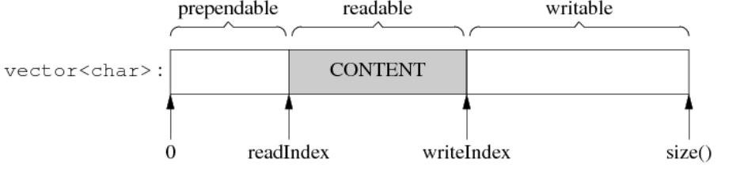

#

## muduo

非阻塞IO + IO多路复用

### 细节？

1.RAII
用Socket对象包装文件描述符，所有对此文件描述符的操作都通过此对象进行，在对象的析构函数中关闭文件描述符。

**为什么这样用？**
POSIX标准要求每次打开新文件(含socket)的时候必须要使用当前最小可用的文件描述符，这种分配文件描述符的方式稍微不注意就会造成串话，**就是多个线程对同一个描述符操作。**

### 为什么muduo 要使用LT模式？

若要发生可读或者可写事件，首先，前提是要向epoll注册（调用epoll_ctl）需要关注的事件类型。当关注了可读事件时，若文件描述符对应的缓冲区从空变为非空，则触发读事件；

**当关注了可写事件时，若文件描述符对应的缓冲区由满变为不满，则触发写事件。当然epoll的LT模式会多次触发，而ET模式仅触发一次**，这里不过多介绍。

Epoll的ET模式通常是高效的代名词，使用ET模式事件就绪只会通知一次，即使一次未将数据读取完毕之后也不再通知，减少了Epoll底层回调机制的触发次数，提高了性能。

ET模式的高效是相对的，为什么muduo使用LT模式？我认为有以下好处：

1. 低延迟：每次读取/写入只调用一次系统调用，兼顾每个连接，不会因为某个连接需要进行大量读写影响其余连接。
2. 数据完整性：LT模式只要数据没读完就会一直上报。

回到上面的项目来说，一般我们的文件描述符对应的缓冲区都不是满的，所以**一开始不会关注写事件，否则如果说缓冲区不满就触发写事件，那就会一直轮询触发，对系统资源是一种浪费**，所以一般情况下只关注读事件。

只有当系统要向文件描述符对应的缓冲区写数据时，再关注写事件，这样一来，**当缓冲区有“空位”，我就立刻往里面丢数据，反而在这种关键时刻关注写事件，写效率会更高一些**，写完数据记得再通过epoll_ctl取消对写事件的关注。

### muduo 包含几大模块？

* socket 模块
  * 对socket 封装，bind 、listen、accept 和一系列如设置端口复用的setsockopt函数。
* Acceptor 模块
  * 主要封装了对 listenfd 相关的操作 socket bind listen ，运行在baseLoop
  * 构造函数中实现了 bind.

    ```cpp
      Acceptor::Acceptor(EventLoop* loop, const InetAddress& listenAddr, bool reuseport) : loop_(loop),
          acceptSocket_(sockets::createNonblockingOrDie(listenAddr.family())),
          acceptChannel_(loop, acceptSocket_.fd()),
          listening_(false),
          idleFd_(::open("/dev/null", O_RDONLY | O_CLOEXEC))
      {
        assert(idleFd_>= 0);
        acceptSocket_.setReuseAddr(true);
        acceptSocket_.setReusePort(reuseport);
        acceptSocket_.bindAddress(listenAddr);
        acceptChannel_.setReadCallback(
            std::bind(&Acceptor::handleRead, this));
      }

    ```

  * listen函数实现了 listen

    ```cpp
    // listen
      void Acceptor::listen()
      {
        loop_->assertInLoopThread();
        listening_ = true;
        acceptSocket_.listen();
        // read
        acceptChannel_.enableReading();
      }
    ```

  * 真正的 accpet

    ```cpp
      void Acceptor::handleRead()
        {
          loop_->assertInLoopThread();
          InetAddress peerAddr;
          //FIXME loop until no more
          // 真正的accept
          int connfd = acceptSocket_.accept(&peerAddr);
          if (connfd >= 0)
          {
            // string hostport = peerAddr.toIpPort();
            // LOG_TRACE << "Accepts of " << hostport;
            if (newConnectionCallback_)
            {
              newConnectionCallback_(connfd, peerAddr);
            }
            else
            {
              sockets::close(connfd);
            }
          }
        }
    ```

* Channel 模块
  * 和 TcpConnection 是高度耦合的。
  * 将已连接的客户端连接 connfd，打包成了一个Cannel，其内部封装了connfd，loop_ （此Channel所在的EventLoop）、event （EPOLLIN/OUT），revent（响应的事件）和对应事件发生时的一系列回调。muduo库中只有两种channel， 用来监听新连接的 listenfd-acceptorChannel  和客户端的 connChannel ，acceptorChannel  注册在MainLoop的Poller上。

* Timer 模块
* EventLoop 模块
  * EventLoop为muduo的核心，一个线程对应一个EventLoop，EventLoop对应上图Reactor模型中的Reactor反应堆，一个EventLoop可以管理大量的Channel 和 一个Poller 。 Channel无法直接与Poller交互，Channel想要修改自己所关注的事件必须通过EventLoop调用Poller的接口。

* Buffer 模块
  * muduo库设置了应用层的缓冲区，此缓冲区是模仿Netty网络库的设计
* TcpConnection 模块
  * 一个连接成功的客户端对应一个TcpConnection，内部封装了 Socket、Channel 、InputBuffer、OutputBuffer 和对应事件的回调。
* TcpServer 模块
  * TcpServer 统领全局，使用muduo库进行服务端编程TcpServer必不可少。 TcpServer只对外暴露出了友好、易用的接口，底层复杂的网络细节已经全部被封装好了。
* poller 模块
  * 这里使用继承，poll 和 epoll

### 怎么优化？

1. 回调效率高，但是接口不友好。

### 为什么 non-blocking 网络编程中应用层 buffer 是必须的？

Non-blocking IO 的**核心思想是避免阻塞在 read() 或 write() 或其他 IO 系统调用上**，这样可以最大限度地复用 thread-of-control，让一个线程能服务于多个 socket 连接。**IO 线程只能阻塞在 IO-multiplexing 函数上，如 select()/poll()/epoll_wait()**。这样一来，**应用层的缓冲是必须的，每个 TCP socket 都要有 stateful 的 input buffer 和 output buffer**。

### buffer 缓冲区细节

* 对外表现为一块连续的内存(char* p, int len)，以方便客户代码的编写。
* 其 size() 可以自动增长，以适应不同大小的消息。它不是一个 fixed size array (即 char buf[8192])。
* 内部以 std::vector来保存数据，并提供相应的访问函数。

**Buffer 其实像是一个 queue，从末尾写入数据，从头部读出数据。 谁会用 Buffer？谁写谁读？**

根据前文分析，TcpConnection 会有两个 Buffer 成员，input buffer 与 output buffer。

* input buffer，TcpConnection 会从 socket 读取数据，然后写入 input buffer（其实这一步是用 Buffer::readFd() 完成的）；客户代码从 input buffer 读取数据。

* output buffer，客户代码会把数据写入 output buffer（其实这一步是用 TcpConnection::send() 完成的）；TcpConnection 从 output buffer 读取数据并写入 socket。

**其实，input 和 output 是针对客户代码而言，客户代码从 input 读，往 output 写。TcpConnection 的读写正好相反。**



**Buffer的操作特点：**
自动增长：Muduo Buffer 的 size() 是**自适应**的，它一开始的初始值是 1k，如果程序里边经常收发 10k 的数据，那么用几次之后它的 size() 会自动增长到 10k，然后就保持不变。这样一方面避免浪费内存（有的程序可能只需要 4k 的缓冲），另一方面避免反复分配内存。当然，客户代码可以手动 shrink() buffer size()。使用**vector 的另一个好处是它的 capcity() 机制减少了内存分配的次数。**

内部腾挪：有时候，经过若干次读写，readIndex 移到了比较靠后的位置，留下了巨大的 prependable 空间。muduo Buffer 在这种情况下不会重新分配内存，而是先把已有的数据移到前面去，腾出 writable 空间。

前方添加（prepend）:提供 prependable 空间，让程序能以很低的代价在数据前面添加几个字节。例如，程序以固定的4个字节表示消息的长度，我要序列化一个消息，但是不知道它有多长，那么我可以一直 append() 直到序列化完成，然后再在序列化数据的前面添加消息的长度。

#### Buffer::readFd()的特殊设计

**问题：在非阻塞网络编程中，如何设计并使用缓冲区？**

一方面我们希望**减少系统调用**，一次读的数据越多越划算，那么似乎应该准备一个大的缓冲区。
另一方面，我们系统**减少内存占用**。如果有 10k 个连接，每个连接一建立就分配 64k 的读缓冲的话，将占用 640M 内存，而大多数时候这些缓冲区的使用率很低。**muduo 用 readv 结合栈上空间巧妙地解决了这个问题**。

**具体做法是**，在栈上准备一个 65536 字节的 extrabuf，然后利用 readv() 来读取数据，**iovec 有两块，第一块指向 muduo Buffer 中的 writable 字节，另一块指向栈上的 extrabuf。这样如果读入的数据不多，那么全部都读到 Buffer 中去了；如果长度超过 Buffer 的 writable 字节数，就会读到栈上的 extrabuf里，然后程序再把 extrabuf里的数据 append 到 Buffer 中。**

```cpp
// struct iovec定义了一个向量元素。通常，这个结构用作一个多元素的数组。对于每一个传输的元素，指针成员iov_base指向一个缓冲区，这个缓冲区是存放的是readv所接收的数据或是writev将要发送的数据。
// 成员iov_len在各种情况下分别确定了接收的最大长度以及实际写入的长度。
#include <sys/uio.h>
 
struct iovec {
    ptr_t iov_base; /* Starting address */
    size_t iov_len; /* Length in bytes */
};
  
ssize_t Buffer::readFd(int fd, int* savedErrno)
{
  // saved an ioctl()/FIONREAD call to tell how much to read
  char extrabuf[65536];
  struct iovec vec[2];
  const size_t writable = writableBytes();
  vec[0].iov_base = begin()+writerIndex_;
  vec[0].iov_len = writable;
  vec[1].iov_base = extrabuf;
  vec[1].iov_len = sizeof extrabuf;
 
  // when there is enough space in this buffer, don't read into extrabuf.
  // when extrabuf is used, we read 128k-1 bytes at most.
  const int iovcnt = (writable < sizeof extrabuf) ? 2 : 1;
  const ssize_t n = sockets::readv(fd, vec, iovcnt);
  if (n < 0)
  {
    *savedErrno = errno;
  }
  else if (implicit_cast<size_t>(n) <= writable)
  {
    writerIndex_ += n;
  }
  else
  {
    writerIndex_ = buffer_.size();
    append(extrabuf, n - writable);
  }
  
  return n;
}
```

现在考虑一个代理服务器有C和S两个链接，S向C发送数据，经由代理服务器转发，现在S的数据发送的很快，但是C的接受速率却较慢，如果本代理服务器不加以限制，那S到来的数据迟早会撑爆这C连接的发送缓冲区?

解决的办法就是当C的发送缓冲中堆积数据达到了某个标志的时候，调用highWaterMarkCallback去让S的连接停止接受数据，等到C发送缓冲的数据被发送完了，调用writeCompleteCallback再开始接受S连接的数据。这样就确保了数据不会丢失，缓冲不会被撑爆。

#### 其他Buffer的设计方案

### one loop per thread 的好处？

* 线程数目基本固定，可以在程序启动的时候设置，不需要频繁的创建的销毁。
* 可以很方便的在线程间调配负载。
* IO事件发生的线程是固定的，同一个TCP连接不必考虑事件并发。

### muduo 优化点？

1.对于有实时性要求的connection可以单独分配一个线程
2.数据量大的connection可以独占一个线程，并把数据处理任务分摊到另外的计算线程中(用线程池)。
3.其他次要的辅助性的connections可以共享一个线程。
4.**muduo的缺点，不是抢占式的。** 可以用多线程来克服。
5.日志系统如果出现死循环，日志堆积，muduo的处理是直接丢弃多余的日志buffer,以腾出内存，这里我们**可以增加一个网络报警功能通知人工介入**
6.日志使用全局锁来实现的，可以采用hash桶。

### 当析构函数遇到多线程

当一个对象能被多个线程同时看到，那么对象的销毁时机就会变得模糊不清，可能出现多种竞态条件（race condition）：

* 在即将析构一个对象时，如何知道此时是否有别的线程正在执行该对象的成员函数？
* 如何保证在执行成员函数期间，对象不会被另一个线程析构？
* 在调用某个对象的成员函数之前，如何得知该对象还活着？
* 它的析构函数会不会碰巧执行到一半？

**解决这些race condition是C++多线程编程面临的基本问题？**

可以尝试通过智能指针shared_ptr解决上述问题

### 对象的创建

对象构造要做到线程安全，唯一的要求是在构造期间不要泄露this指针，即：

* 不要在构造函数中注册任何回调；
* 不要在构造函数中将this指针传递给跨线程的对象；
* 即使在构造函数最后一行也不行。
  
**因为构造函数在执行期间对象还没有完成初始化，this指针泄露给其他对象，可能别的线程访问的是一个半成品。**

### 线程个数场景题？

1. 压缩1GB文件，运行时间20s,起一个进程是合理的。
2. 500kb，10ms，每次都起一个线程就浪费了，单独安排一个线程在做
3. 10kb，200微秒，每次起线程浪费，用一个线程池，每次压缩交给线程池，避免阻塞当前线程，(特别要注意避免阻塞IO线程)。
4.

### 多线程程序有性能优势吗？

* 如果瓶颈在磁盘IO和网络IO方面，往往一个线程就能撑满IO.多线程并不能提高吞吐量。
* CPU跑满时，才能发挥多核优势。

### 使用多线程程序的场景？

**适用场景: 提高响应速度，让IO和计算互相重叠，降低延迟，虽然不能提高绝对性能，但能提高平均响应性能。**

多线程中的线程大致分为三类：

1. IO线程，这类线程的主循环是IO多路复用，阻塞的等待在epoll_wait上，这类线程也处理定时器事件。简单的计算也可以放入其中，比如消息的编码和解码。
2. 计算线程，这类线程的主循环的阻塞队列，阻塞的等待信号发生(任务到达)，一般位于线程池。这种线程不涉及IO，尽量避免任何阻塞操作。
3. 第三方库所用的线程，比如 logging，
4. 单独用一个线程来写多条日志通过一个或者多个BLockingQueue对外提供接口，别的线程写日志时，先把消息(字符串)准备好，然后往queue里塞就行，降低了服务线程的响应时间。

### 线程池大小的分配原则？

密集计算所占时间的比重为P((0,1]),而系统一共有C个CPU为了让C个CPU跑满而又不过载，线程池大小的经验公式为**T = C/P**。T的最佳值上下浮动50%.

例: C = 8 , p =0.5 ，线程池的任务有一半是计算，一般是等在IO上，T等于16。大概16个“50%繁忙的线程”能让8个CPU忙个不停。启动更多的线程并不能提高吞吐量，反而因为增加上下文切换的开销而降低性能。

**P < 0.2 则不再适用。**

### 多线程异步日志

一个线程负责收集日志消息，并写入日志文件，其他业务线程只管往这个"日志线程"发送日志消息，这称为**异步日志(非阻塞日志)**

#### 双缓冲日志库

基本思路就是准备两块buffer:
**采用了全局锁，锁争用会影响性能。**
A和B,前端负责往bufferA中写日志，后端负责将bufferB的数据写入文件。当bufferA写满后，交换A和B,让后端将bufferA中的数据写入文件中，而前端则往bufferB中填入新的日志信息，如此往复。

好处就是：在新建日志消息时，不必等待磁盘文件操作，也避免每条日志消息都出发后端日志线程。
换言之，前端不是将一条条日志消息分别发送给后端，而是将多条日志合成一个大的buffer传给后端，相当于批处理，减少了线程的唤醒频率，降低开销。

1. 另外即便bufferA未满，日志库也会没3秒执行一次上述的交换写入操作。
2. 前端写入太快，一下在两个缓冲区全满，那么只好分配一块新的buffer。 很少出现

**实际实现采用了四个缓冲区。**

#### 如果出现日志消息堆积怎么办？

出现死循环，拼命发送日志？

处理:
直接丢掉多余的buffer，以腾出内存。

**优化：**

1. 可以增加网络报警，通知人工介入
2. 将全局锁改为hash桶，根据线程id，哈希到不同的桶中。

---

### iou_ring

### epoll红黑树如何挂在事件的？

### Tcpconnection 和 channel 的关系？

高耦合

### 无锁队列 CAS

### 创建socket内核做了些什么?

### Reactor模型

### Proactor

## 代码出现bug 如何分析(偶现型bug)？

### 分析 core dump

### 代码回滚

### 单一职责，低耦合

## Threadlocal 底层是怎么实现的？

每一个线程都有一份独立的实体，各个线程的变量的值互不干扰。
除了这个主要用途，它还可以修饰那些 **“值可能会变，带有全局性，但又不值得用全局锁保护”**
