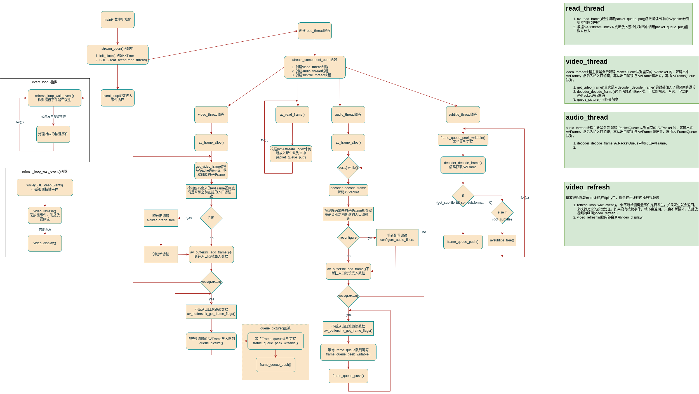

# FFplay 整体框架

参考：
<https://www.cnblogs.com/leisure_chn/p/10301831.html>



FFplay整体流程

## 主线程

**主线程主要实现三项功能：视频播放(音视频同步)、字幕播放、SDL消息处理。**

主线程在进行一些必要的初始化工作、创建解复用线程后，即进入event_loop()主循环，处理视频播放和SDL消息事件：

### 视频播放

视频播放在`event_loop()`函数中的`refresh_loop_wait_event()`函数

### SDL消息处理

在event_loop()函数中，处理各种SDL消息，比如暂停、强制刷新等按键事件。

### 解复用线程(read_thread)

* **解复用线程读取视频文件，将取到的packet根据类型(音频、视频、字幕)存入不同是packet队列中。**

* 解复用线程是在`main()`函数中的**stream_open**函数调用 `is->read_tid     = SDL_CreateThread(read_thread, "read_thread", is);` 来进行创建的。

* 这里read_thread会调用**stream_component_open函数**创建音频、视频、字幕的解码线程。
* read_thread会调用 **av_read_frame函数**来读取packet,通过**packet_queue_put函数**放到对应的解码队列中。

**总结：**
**解复用线程实现如下功能：**

1. 创建音频、视频、字幕解码线程
2. 从输入文件读取packet，根据packet类型(音频、视频、字幕)将这放入不同packet队列。

## 视频解码线程(video_thread)

1. **视频解码线程从视频packet队列中取数据，解码后存入视频frame队列。**

2. video_thread 线程主要是负责 **解码** PacketQueue 队列里面的 AVPacket 的，解码出来 AVFrame，然后**丢给入口滤镜**，再**从出口滤镜把 AVFrame 读出来**，再**插入 FrameQueue 队列**

* video_thread 调用 **get_video_frame**函数从packet队列中取一个packet解码得到一个frame，并判断是否要根据framedrop机制丢弃失去同步的视频帧。
  * **get_video_frame** 实际上就是对 decoder_decode_frame() 函数进行了封装，加入了视频同步逻辑。
  * **decoder_decode_frame**是一个通用的解码函数，可以解码 音频，视频，字幕的 AVPacket
  
> ffplay文档中对"-framedrop"选项的说明:
   Drop video frames if video is out of sync.Enabled by default if the master clock is not set to video.
   Use this option to enable frame dropping for all master clock sources, use - noframedrop to disable it.
> "-framedrop"选项用于设置当视频帧失去同步时，是否丢弃视频帧。"-framedrop"选项以bool方式改变变量framedrop值。
  音视频同步方式有三种：A同步到视频，B同步到音频，C同步到外部时钟。
>
> 1) 当命令行不带"-framedrop"选项或"-noframedrop"时，framedrop值为默认值-1，若同步方式是"同步到视频"则不丢弃失去同步的视频帧，否则将丢弃失去同步的视频帧。
>
> 2) 当命令行带"-framedrop"选项时，framedrop值为1，无论何种同步方式，均丢弃失去同步的视频帧。
>
> 3) 当命令行带"-noframedrop"选项时，framedrop值为0，无论何种同步方式，均不丢弃失去同步的视频帧。

## 音频解码线程(audio_thread)

**audio_thread 线程主要是负责 解码 PacketQueue 队列里面的 AVPacket 的，解码出来 AVFrame，然后丢给入口滤镜，再从出口滤镜把 AVFrame 读出来，再插入 FrameQueue 队列。**

### 打开音频设备

音频设备的打开实际是在解复用线程中实现的。解复用线程中先打开音频设备(设定音频回调函数供SDL音频播放线程回调)，然后再创建音频解码线程。调用链如下：

> main() -->
stream_open() -->
read_thread() -->
stream_component_open() -->
    audio_open(is, channel_layout, nb_channels, sample_rate, &is->audio_tgt);
    decoder_start(&is->auddec, audio_thread, is);

### audio_thread()

不断地调 **decoder_decode_frame**() 函数来解码出 AVFrame，然后把 AVFrame 往 **入口滤镜** 丢，再循环调 **av_buffersink_get_frame_flags**()，不断从**出口滤镜**收割经过 Filter 的AVFrame，最后调 **frame_queue_push**() 把 AVFrame 插入 **FrameQueue** 队列。

**但是如果解码出来的 AVFrame 的音频格式与入口滤镜要求的音频格式不一样，会重建滤镜（reconfigure）.**

## 音频播放线程

音频播放线程是SDL内建的线程，通过回调的方式调用用户提供的回调函数。
回调函数在SDL_OpenAudio()时指定。
暂停/继续回调过程由SDL_PauseAudio()控制。

音频播放线程是之前在 **audio_open**() 函数里面创建的，实际上就是**回调函数 （ wanted_spec.callback）**。当用 SDL 打开音频硬件设备的时候，SDL 库就会创建一个线程，来及时执行回调函数 **sdl_audio_callback**()，至于 SDL 线程多久回调一次函数，这个我们不需要太关心，只要调 SDL_OpenAudioDevice() 函数的时候设置好相关参数即可。

### sdl_audio_callback

sdl_audio_callback() 函数干的事情，就是调 **audio_decode_frame**() 函数，把 is->audio_buf 指针指向要传输的音频数据。然后再调 SDL_MixAudioFormat() 把音频数据拷贝给 stream 指针指向的内存。这样 **SDL 内部就会读 stream 指针指向的内存来播放。**

## 视频播放线程分析(video_refresh)

视频播放线程就是 main 主线程，对于 FFplay 播放器，就是在 **主线程 里面播放视频流的。**

event_loop() 会不断用 **refresh_loop_wait_event**() 函数检测是否有键盘事件发生，如果有键盘事件发生， **refresh_loop_wait_event**() 就会返回，然后跑到 switch{event.type}{...} 来处理键盘事件。

如果没有键盘事件发生， refresh_loop_wait_event() 就不会返回，只会不断循环，**不断去播放视频流的画面。**

## 播放控制

### 暂停/继续状态切换

函数调用关系如下：

```cpp
main() -->
event_loop() -->
toggle_pause() -->
stream_toggle_pause()
```

stream_toggle_pause()实现状态翻转：

``` cpp
/* pause or resume the video */
static void stream_toggle_pause(VideoState *is)
{
    if (is->paused) {
        // 这里表示当前是暂停状态，将切换到继续播放状态。在继续播放之前，先将暂停期间流逝的时间加到frame_timer中
        is->frame_timer += av_gettime_relative() / 1000000.0 - is->vidclk.last_updated;
        if (is->read_pause_return != AVERROR(ENOSYS)) {
            is->vidclk.paused = 0;
        }
        set_clock(&is->vidclk, get_clock(&is->vidclk), is->vidclk.serial);
    }
    set_clock(&is->extclk, get_clock(&is->extclk), is->extclk.serial);
    is->paused = is->audclk.paused = is->vidclk.paused = is->extclk.paused = !is->paused;
}
```

### 暂停状态下的视频播放

在video_refresh()函数中有如下代码：

```cpp
/* called to display each frame */
static void video_refresh(void *opaque, double *remaining_time)
{
    ......
    
    // 视频播放
    if (is->video_st) {
        ......
        // 暂停处理：不停播放上一帧图像
        if (is->paused)
            goto display;
        
        ......
    }
    
    ......
}
```

暂停状态下，不会调用视频播放线程`video_refresh()`,**但是暂停状态下，如果改变了 ffplay 窗口大小，is->forece_refresh 机会变成 1，就会调 video_refresh()**。
因此 main 主线程，在暂停状态下，只会不断检测，处理键盘事件以及一些窗口事件，大部分时候并不会调 video_refresh() 播放视频画面。

暂停状态下，audio_decode_frame() 函数会直接返回 -1，就会导致 输出静音数据，只要直接把 stream 指向的内存数据设置为 0 就是输出静音数据了。
`memset(stream, 0, len1);`
虽然是输出静音数据，但是音频播放线程还是在跑的，没有阻塞，她在跑，就会更新音频时钟，

### 从启动状态切换到暂停状态，影响的地方

导致 **视频播放函数(video_refresh())** 没有调用，导致 FrameQueue 堆积，所以 **视频解码线程(video_thread)** 会阻塞在 frame_queue_peek_writable() 函数里面

导致**音频播放线程(sdl_audio_callback)**直接输出静音数据，没有从 FrameQueue 读数据，导致 FrameQueue 堆积，所以**音频解码线程**会阻塞在 frame_queue_peek_writable() 函数里面。

音频解码线程，视频解码线程阻塞，一直不从 PacketQueue 拿数据去解码，导致 PacketQueue 堆积，从而导致 **read_thread解复用线程不再从文件读取数据了**。

### 逐帧播放

逐帧播放是用户每按一次s键，播放器播放一帧画现。
逐帧播放实现的方法是：每次按了s键，就将状态切换为播放，播放一帧画面后，将状态切换为暂停。
函数调用关系如下：

```cpp
main() -->
event_loop() -->
step_to_next_frame() -->
stream_toggle_pause()
```

实现代码比较简单，如下：

```cpp
static void step_to_next_frame(VideoState *is)
{
    /* if the stream is paused unpause it, then step */
    if (is->paused)
        stream_toggle_pause(is);        // 确保切换到播放状态，播放一帧画面
    is->step = 1;
}
```

```cpp
/* called to display each frame */
static void video_refresh(void *opaque, double *remaining_time)
{
    ......
    
    // 视频播放
    if (is->video_st) {
        ......
        if (is->step && !is->paused)
            stream_toggle_pause(is);    // 逐帧播放模式下，播放一帧画面后暂停
        ......
    }
    
    ......
}
```

### SEEK操作

SEEK操作就是由用户干预而改变播放进度的实现方式，比如鼠标拖动播放进度条。

### 数据结构及SEEK标志

相关数据变量定义如下：

```cpp
typedef struct VideoState {
    ......
    int seek_req;                   // 标识一次SEEK请求
    int seek_flags;                 // SEEK标志，诸如AVSEEK_FLAG_BYTE等
    int64_t seek_pos;               // SEEK的目标位置(当前位置+增量)
    int64_t seek_rel;               // 本次SEEK的位置增量
    ......
} VideoState;
```

“VideoState.seek_flags”表示SEEK标志。SEEK标志的类型定义如下：

```cpp
#define AVSEEK_FLAG_BACKWARD 1 ///< seek backward
#define AVSEEK_FLAG_BYTE     2 ///< seeking based on position in bytes
#define AVSEEK_FLAG_ANY      4 ///< seek to any frame, even non-keyframes
#define AVSEEK_FLAG_FRAME    8 ///< seeking based on frame number
```

SEEK目标播放点(后文简称SEEK点)的确定，根据SEEK标志的不同，分为如下几种情况：
[1]. AVSEEK_FLAG_BYTE：SEEK点对应文件中的位置(字节表示)。有些解复用器可能不支持这种情况。
[2]. AVSEEK_FLAG_FRAME：SEEK点对应stream中frame序号(?frame序号还是frame 的PTS?)，stream由stream_index指定。有些解复用器可能不支持这种情况。
[3]. 如果不含上述两种标志且stream_index有效：SEEK点对应时间戳，单位是stream中的timebase，stream由stream_index指定。SEEK点的值由“目标frame中的pts(秒) × stream中的timebase”得到。
[4]. 如果不含上述两种标志且stream_index是-1：SEEK点对应时间戳，单位是AV_TIME_BASE。SEEK点的值由“目标frame中的pts(秒) × AV_TIME_BASE”得到。
[5]. AVSEEK_FLAG_ANY：SEEK点对应帧序号(待确定)，播放点可停留在任意帧(包括非关键帧)。有些解复用器可能不支持这种情况。
[6]. AVSEEK_FLAG_BACKWARD：忽略。

其中AV_TIME_BASE是FFmpeg内部使用的时间基，定义如下：

```cpp
/**
 * Internal time base represented as integer
 */

#define AV_TIME_BASE            1000000
```

AV_TIME_BASE表示1000000us。

### SEEK的触发方式

当用户按下 **“PAGEUP”，“PAGEDOWN”，“UP”，“DOWN”，“LEFT”，“RHIGHT”** 按键以及用**鼠标拖动进度条**时，引起播放进度变化，会触发SEEK操作。
在event_loop()函数进行的SDL消息处理中有如下代码片段：

```cpp
case SDLK_LEFT:
    incr = seek_interval ? -seek_interval : -10.0;
    goto do_seek;
case SDLK_RIGHT:
    incr = seek_interval ? seek_interval : 10.0;
    goto do_seek;
case SDLK_UP:
    incr = 60.0;
    goto do_seek;
case SDLK_DOWN:
    incr = -60.0;
do_seek:
        if (seek_by_bytes) {
            pos = -1;
            if (pos < 0 && cur_stream->video_stream >= 0)
                pos = frame_queue_last_pos(&cur_stream->pictq);
            if (pos < 0 && cur_stream->audio_stream >= 0)
                pos = frame_queue_last_pos(&cur_stream->sampq);
            if (pos < 0)
                pos = avio_tell(cur_stream->ic->pb);
            if (cur_stream->ic->bit_rate)
                incr *= cur_stream->ic->bit_rate / 8.0;
            else
                incr *= 180000.0;
            pos += incr;
            stream_seek(cur_stream, pos, incr, 1);
        } else {
            pos = get_master_clock(cur_stream);
            if (isnan(pos))
                pos = (double)cur_stream->seek_pos / AV_TIME_BASE;
            pos += incr;
            if (cur_stream->ic->start_time != AV_NOPTS_VALUE && pos < cur_stream->ic->start_time / (double)AV_TIME_BASE)
                pos = cur_stream->ic->start_time / (double)AV_TIME_BASE;
            stream_seek(cur_stream, (int64_t)(pos * AV_TIME_BASE), (int64_t)(incr * AV_TIME_BASE), 0);
        }
    break;
```

此函数实现如下功能：
[1]. 首先确定SEEK操作的播放进度增量(SEEK增量)和目标播放点(SEEK点)，seek_by_bytes不生效时，将增量设为选定值，如10.0秒(用户按“RHIGHT”键的情况)。
[2]. 将同步主时钟加上进度增量，即可得到SEEK点。先将相关数值记录下来，供后续SEEK操作时使用。stream_seek(cur_stream, (int64_t)(pos *AV_TIME_BASE), (int64_t)(incr* AV_TIME_BASE), 0);就是记录目标播放点和播放进度增量两个参数的，精确到微秒。调用这个函数的前提是，[我们只考虑第[4]种情况](#数据结构及seek标志)

再看一下stream_seak()函数的实现，仅仅是变量赋值：
**重点是设置 了 is->seek_req 标记 以及 要跳到到哪些位置播放。然后就会唤醒 read_thread() 线程。**

```cpp
/* seek in the stream */
static void stream_seek(VideoState *is, int64_t pos, int64_t rel, int seek_by_bytes)
{
    if (!is->seek_req) {
        is->seek_pos = pos;
        is->seek_rel = rel;
        is->seek_flags &= ~AVSEEK_FLAG_BYTE;
        if (seek_by_bytes)
            is->seek_flags |= AVSEEK_FLAG_BYTE;
        is->seek_req = 1;
        SDL_CondSignal(is->continue_read_thread);
    }
}
```

### SEEK操作的实现

在解复用线程主循环中处理了SEEK操作。

```cpp
static int read_thread(void *arg)
{
    ......
    for (;;) {
        if (is->seek_req) {
            int64_t seek_target = is->seek_pos;
            int64_t seek_min    = is->seek_rel > 0 ? seek_target - is->seek_rel + 2: INT64_MIN;
            int64_t seek_max    = is->seek_rel < 0 ? seek_target - is->seek_rel - 2: INT64_MAX;
// FIXME the +-2 is due to rounding being not done in the correct direction in generation
//      of the seek_pos/seek_rel variables

            ret = avformat_seek_file(is->ic, -1, seek_min, seek_target, seek_max, is->seek_flags);
            if (ret < 0) {
                av_log(NULL, AV_LOG_ERROR,
                       "%s: error while seeking\n", is->ic->url);
            } else {
                if (is->audio_stream >= 0) {
                    packet_queue_flush(&is->audioq);
                    packet_queue_put(&is->audioq, &flush_pkt);
                }
                if (is->subtitle_stream >= 0) {
                    packet_queue_flush(&is->subtitleq);
                    packet_queue_put(&is->subtitleq, &flush_pkt);
                }
                if (is->video_stream >= 0) {
                    packet_queue_flush(&is->videoq);
                    packet_queue_put(&is->videoq, &flush_pkt);
                }
                if (is->seek_flags & AVSEEK_FLAG_BYTE) {
                   set_clock(&is->extclk, NAN, 0);
                } else {
                   set_clock(&is->extclk, seek_target / (double)AV_TIME_BASE, 0);
                }
            }
            is->seek_req = 0;
            is->queue_attachments_req = 1;
            is->eof = 0;
            if (is->paused)
                step_to_next_frame(is);
        }
    }
    ......
}
```

上述代码中的SEEK操作执行如下步骤：
[1]. 调用avformat_seek_file()完成解复用器中的SEEK点切换操作

```cpp
// 函数原型
int avformat_seek_file(AVFormatContext *s, int stream_index, int64_t min_ts, int64_t ts, int64_t max_ts, int flags);

// 调用代码
ret = avformat_seek_file(is->ic, -1, seek_min, seek_target, seek_max, is->seek_flags);
```

这个函数会等待SEEK操作完成才返回。实际的播放点力求最接近参数ts，并确保在[min_ts, max_ts]区间内，之所以播放点不一定在ts位置，是因为ts位置未必能正常播放。

函数与SEEK点相关的三个参数(实参“seek_min”，“seek_target”，“seek_max”)取值方式与SEEK标志有关(实参“is->seek_flags”)，此处“is->seek_flags”值为0，对应7.4.1节中的第[4]中情况。

[2]. 冲洗各解码器缓存帧，使当前播放序列中的帧播放完成，然后再开始新的播放序列(播放序列由各数据结构中的“serial”变量标志，此处不展开)。代码如下：

```cpp
if (is->video_stream >= 0) {
    packet_queue_flush(&is->videoq);
    packet_queue_put(&is->videoq, &flush_pkt);
}
```

[3]. 清除本次SEEK请求标志is->seek_req = 0;

### 快进如何实现？

1. 在命令行里里使用 -ss 参数，如下，跳到到第 60 秒的地方开始播放。
`ffplay -x 400 -ss 60 -i juren.mp4`

2. 在播放过程中，按上下左右减，进行快进后退操作。

上面这两种跳转时间点播放的方式，其实都是调 `avformat_seek_file()` 来实现的，都是在 `read_thread()` 线程函数里面进行 **seek** 操作的。

### avformat_seek_file 设置文件的读取位置

* 在做音视频数据分析的时候，经常会遇到这样的需求，每隔5分钟抽取一帧数据进行分析。
* 在做播放器开发的时候，也会遇到这种情况，就是拖动进度条跳转到某个位置进行播放。

如果直接用 av_read_frame() 不断读数据，读到第 5 分钟的 AVPacket 才开始处理，其他读出来的 AVPacket 丢弃，**这样做会带来非常大的磁盘IO**。

**avformat_seek_file() 函数**
实际的播放点⼒求最接近参数 ts ，并确保在[min_ts, max_ts]区间内，**之所以播放点不⼀定在 ts 位置，是因为 ts 位置未必能正常播放(因为如果I帧不在这里，不一定能够正常播放)**。

而且默认情况，是容器里面所有流的读取位置都会被设置，包括 音频流，视频流，字幕流。

只要流的 discard 属性小于 AVDISCARD_ALL 就会被设置。`AVStream.discard < AVDISCARD_ALL`

函数定义如下：

>1. AVFormatContext *s，已经打开的容器示例。
>2. int stream_index，流索引，但是只有在 flags 包含 AVSEEK_FLAG_FRAME 的时候才是 **设置某个流的读取位置**。其他情况都只是把这个流的 time_base （时间基）作为参考。
>3. int64_t min_ts，跳转到的最小的时间，但是这个变量不一定是时间单位，也有可能是字节单位，也可能是帧数单位（第几帧）。
>4. int64_t ts，要跳转到的读取位置，单位同上。
>5. int64_t max_ts，跳转到的最大的时间，单位同上，通常填 INT64_MAX 即可。
>6. int flags，跳转的方式，有 4 个 flags，如下：
>
> * AVSEEK_FLAG_BYTE，按字节大小进行跳转。
> * AVSEEK_FLAG_FRAME，按帧数大小进行跳转。
> * AVSEEK_FLAG_ANY，可以跳转到**非关键帧的读取位置**，但是解码会出现马赛克。
> * AVSEEK_FLAG_BACKWARD，往 ts 的后面找关键帧，默认是往 ts 的前面找关键帧。

min_ts 跟 max_ts 变量有一些设置的技巧。

如果是**快进**的时候，min_ts 可以设置得比 当前位置 大一点，例如加 2。 而 max_ts 可以填 INT64_MAX.

```cpp
min_ts = 当前位置 + 2
max_ts = INT64_MAX
// +2 是为了防止某些情况，avformat_seek_file() 会把读取位置从 ts 往后挪一点。
```

如果是**后退**的时候，min_ts 可以填 INT64_MIN，max_ts 可以设置得比 当前位置 小一点，例如减 2。

```cpp
min_ts = INT64_MIN
max_ts = 当前位置 - 2
```

**-2**是为了防止某些情况，`avformat_seek_file()` 会把读取位置从 ts 往前挪一点。

#### flags

**当 flags 为 0 的时候**，默认情况，是按时间来 seek 的，而时间基是根据 stream_index 来确定的。

如果 stream_index 为 -1 ，那 ts 的时间基就是 AV_TIME_BASE，

如果stream_index 不等于 -1 ，那 ts 的时间基就是 stream_index 对应的流的时间基。

这种情况，avformat_seek_file() 会导致容器里面所有流的读取位置都发生跳转，包括音频流，视频流，字幕流

---

**当 flags 包含 AVSEEK_FLAG_BYTE**，ts 参数就是字节大小，代表 avformat_seek_file() 会把读取位置设置到第几个字节。用 av_read_frame() 读出来的 pkt 里面有一个字段 pos，代表当前读取的字节位置。可以用pkt->pos 辅助设置 ts 参数，

---

**当 flags 包含 AVSEEK_FLAG_FRAME**，ts 参数就是帧数大小，代表 avformat_seek_file() 会把读取位置设置到第几帧。这时候 stream_index 可以指定只设置某个流的读取位置，如果 stream_index 为 -1 ，代表设置所有的流。

---

**当 flags 包含 AVSEEK_FLAG_ANY**，那就代表 seek 可以跳转到非关键帧的位置，但是非关键帧解码会出现马赛克。如果不设置 AVSEEK_FLAG_ANY， 默认是跳转到离 ts 最近的关键帧的位置的

---

**当 flags 包含 AVSEEK_FLAG_BACKWARD**，代表 avformat_seek_file() 在查找里 ts 最近的关键帧的时候，会往 ts 的后面找，默认是往 ts 的前面找关键帧。

提醒：AVSEEK_FLAG_BYTE ，AVSEEK_FLAG_FRAME，AVSEEK_FLAG_ANY 这 3 种方式，有些封装格式是不支持的。

```cpp

int avformat_seek_file(AVFormatContext *s, int stream_index, int64_t min_ts,
                       int64_t ts, int64_t max_ts, int flags)
{
    if (min_ts > ts || max_ts < ts)
        return -1;
    if (stream_index < -1 || stream_index >= (int)s->nb_streams)
        return AVERROR(EINVAL);

    if (s->seek2any > 0)
        flags |= AVSEEK_FLAG_ANY;
    flags &= ~AVSEEK_FLAG_BACKWARD;

    if (s->iformat->read_seek2) {
        int ret;
        ff_read_frame_flush(s);

        if (stream_index == -1 && s->nb_streams == 1) {
            AVRational time_base = s->streams[0]->time_base;
            ts = av_rescale_q(ts, AV_TIME_BASE_Q, time_base);
            min_ts = av_rescale_rnd(min_ts, time_base.den,
                                    time_base.num * (int64_t)AV_TIME_BASE,
                                    AV_ROUND_UP   | AV_ROUND_PASS_MINMAX);
            max_ts = av_rescale_rnd(max_ts, time_base.den,
                                    time_base.num * (int64_t)AV_TIME_BASE,
                                    AV_ROUND_DOWN | AV_ROUND_PASS_MINMAX);
            stream_index = 0;
        }

        ret = s->iformat->read_seek2(s, stream_index, min_ts,
                                     ts, max_ts, flags);

        if (ret >= 0)
            ret = avformat_queue_attached_pictures(s);
        return ret;
    }

    if (s->iformat->read_timestamp) {
        // try to seek via read_timestamp()
    }

    // Fall back on old API if new is not implemented but old is.
    // Note the old API has somewhat different semantics.
    if (s->iformat->read_seek || 1) {
        int dir = (ts - (uint64_t)min_ts > (uint64_t)max_ts - ts ? AVSEEK_FLAG_BACKWARD : 0);
        int ret = av_seek_frame(s, stream_index, ts, flags | dir);
        if (ret < 0 && ts != min_ts && max_ts != ts) {
            ret = av_seek_frame(s, stream_index, dir ? max_ts : min_ts, flags | dir);
            if (ret >= 0)
                ret = av_seek_frame(s, stream_index, ts, flags | (dir^AVSEEK_FLAG_BACKWARD));
        }
        return ret;
    }

    // try some generic seek like seek_frame_generic() but with new ts semantics
    return -1; //unreachable
}

```

### 在event_loop 进行快进

有两种 seek 方式，一种是按时间 seek （默认），一种是 按字节 seek。如下所示：

如果是按字节 seek，就会把时间转成字节位置。

无论是字节 seek，还是时间 seek，都是绝对的。例如绝对时间 跟 绝对位置。

1. `frame_queue_last_pos()`获取当前视频流，或者音频流播放到哪个字节位置了，再加上 incr （相对）。

2. `get_master_clock()`获取当前主时钟播放到第几秒了，然后再加上 incr （相对）。

3. 最后调 `stream_seek()` 记录要跳转的位置，注意 stream_seek() 只是记录一下位置，并不会进行跳转操作。

```cpp
...

    do_seek:
            // 按照字节进行seek
            if (seek_by_bytes) {
                pos = -1;
                if (pos < 0 && cur_stream->video_stream >= 0)
                    // 获取当前视频流 
                    pos = frame_queue_last_pos(&cur_stream->pictq);
                if (pos < 0 && cur_stream->audio_stream >= 0)
                    // 获取音频流
                    pos = frame_queue_last_pos(&cur_stream->sampq);
                if (pos < 0)
                    pos = avio_tell(cur_stream->ic->pb);
                if (cur_stream->ic->bit_rate)
                    incr *= cur_stream->ic->bit_rate / 8.0;
                else
                    incr *= 180000.0;
                pos += incr;
                stream_seek(cur_stream, pos, incr, 1);
            } else {
                // 获取当前主时钟播放到第几秒了。
                pos = get_master_clock(cur_stream);
                if (isnan(pos))
                    pos = (double)cur_stream->seek_pos / AV_TIME_BASE;
                pos += incr;
                if (cur_stream->ic->start_time != AV_NOPTS_VALUE && pos < cur_stream->ic->start_time / (double)AV_TIME_BASE)
                    pos = cur_stream->ic->start_time / (double)AV_TIME_BASE;
                stream_seek(cur_stream, (int64_t)(pos * AV_TIME_BASE), (int64_t)(incr * AV_TIME_BASE), 0);
            }
        break;
    default:
        break;
...

```

``` cpp
/* seek in the stream */
static void stream_seek(VideoState *is, int64_t pos, int64_t rel, int by_bytes)
{
    if (!is->seek_req) {
        is->seek_pos = pos;
        is->seek_rel = rel;
        is->seek_flags &= ~AVSEEK_FLAG_BYTE;
        if (by_bytes)
            is->seek_flags |= AVSEEK_FLAG_BYTE;
        is->seek_req = 1;
        SDL_CondSignal(is->continue_read_thread);
    }
}

```

**那 is->seek_req 跟 is->seek_pos 会在哪里被使用呢？**
在 read_thread() 里面。

在播放一个 mp4 文件的时候，`read_thread()`会一直阻塞在 for(;;) {...} 循环里面，不断调 `av_read_frame()` 读取 AVPacket 出来。如下：

`avformat_seek_file()` 之后，就需要用 `packet_queue_flush()` **清空之前队列里面的缓存，还有刷新序列号**。

```cpp
...
    for (;;) {
        if (is->abort_request)
            break;
        if (is->paused != is->last_paused) {
            is->last_paused = is->paused;
            if (is->paused)
                is->read_pause_return = av_read_pause(ic);
            else
                av_read_play(ic);
        }
#if CONFIG_RTSP_DEMUXER || CONFIG_MMSH_PROTOCOL
        if (is->paused &&
                (!strcmp(ic->iformat->name, "rtsp") ||
                 (ic->pb && !strncmp(input_filename, "mmsh:", 5)))) {
            /* wait 10 ms to avoid trying to get another packet */
            /* XXX: horrible */
            SDL_Delay(10);
            continue;
        }
#endif
        if (is->seek_req) {
            int64_t seek_target = is->seek_pos;
            int64_t seek_min    = is->seek_rel > 0 ? seek_target - is->seek_rel + 2: INT64_MIN;
            int64_t seek_max    = is->seek_rel < 0 ? seek_target - is->seek_rel - 2: INT64_MAX;
// FIXME the +-2 is due to rounding being not done in the correct direction in generation
//      of the seek_pos/seek_rel variables

            ret = avformat_seek_file(is->ic, -1, seek_min, seek_target, seek_max, is->seek_flags);
            if (ret < 0) {
                av_log(NULL, AV_LOG_ERROR,
                       "%s: error while seeking\n", is->ic->url);
            } else {
                if (is->audio_stream >= 0)
                    packet_queue_flush(&is->audioq);
                if (is->subtitle_stream >= 0)
                    packet_queue_flush(&is->subtitleq);
                if (is->video_stream >= 0)
                    packet_queue_flush(&is->videoq);
                // 更新外部时钟，跳转到预定的播放时刻。
                if (is->seek_flags & AVSEEK_FLAG_BYTE) {
                   set_clock(&is->extclk, NAN, 0);
                } else {
                   set_clock(&is->extclk, seek_target / (double)AV_TIME_BASE, 0);
                }
            }

```

seek 之后还会更新外部时钟，因为外部时钟就是预定的播放时刻，跳转的就是预定的播放时刻。

``` cpp
if (is->seek_flags & AVSEEK_FLAG_BYTE) {
    set_clock(&is->extclk, NAN, 0);
} else {
    set_clock(&is->extclk, seek_target / (double)AV_TIME_BASE, 0);
}

```

## H264

## 项目

---

# 自制播放器

<https://cloud.tencent.com/developer/article/1938051>

## 播放器的基本实现原理

读取文件 -> 解复用（demux）-> 音视频解码（decode）-> 渲染

### 如何读文件，我们知道吗？

**还好我们有开源的 ffmpeg，读文件用 avio api，解复用 avformat 的相关 api，解码用 avcodec 的相关 api。**

avformat_open_input 这个函数可以打开一个媒体文件（或流媒体 url）

**avformat_find_stream_info 这个函数可以查找媒体文件中的流信息**，调用后我们就知道媒体中有多少**音频流、视频流、字幕流**，还能知道**视频帧率、视频宽高、视频像素格式、音频采样率、音频声道数、视频压缩方式、音频压缩方式、...** 等等各种你需要的信息。

#### 读取时，设置读取对列的长度？

这里我们是瞬间就把整个视频读入内存了，这样我们播放小视频的话 问题不大，但是当播放大视频的时候，就把内存吃光了，因此必须要管管他

目前想到比较好的方法就是 读取的时候限制队列的长度，当里面的数据超过某个范围的时候 就先等等。

### 如何解复用，我们知道吗？

**av_read_frame** 用于从媒体文件读入 frame，实际上读入的是一个 **AVPacket**，而读入的 AVPacket 的类型可能是 audio、video 或 subtitle（字幕）。这一步其实就是解复用了（demux）。

### 如何做解码，我们知道吗？

avcodec_find_decoder avcodec_open2 avcodec_close 这三个函数，用于查找、打开、关闭，音视频解码器。

### 如何做渲染，我们知道吗？

### 总结

* 首先 avformat_open_input 打开一个文件，
* 然后 avformat_find_stream_info 获取各种信息，然后根据获取的信息查找并打开对应的 decoder（解码器），
* 然后用 av_read_frame 从打开的文件不停的读取 AVPacket，如果是音频，就用对应的音频解码器去解码，如果是视频，就用对应的视频解码器解码。
* 解码出来的音视频，就扔给渲染器渲染。对的，基本流程就这样。（收尾的工作，比如关闭文件、关闭解码器，等等反初始化的工作，我们暂且不考虑。）

## 架构设计

一个播放器的主要核心模块：

* demux - 从输入文件分离出 audio packet 和 video packet 等等
* audio decode - 解码 audio packet
* video decode - 解码 video packet
* render - 负责 audio 和 video 的渲染
* adev - 抽象的 audio 输出设备
* vdev - 抽象的 video 输出设备

### 单线程方式是否可行？

那么缺陷在哪里？

* 很难保证音视频回放的连续性
* audio 和 video 同步问题
* 帧率稳定性和均匀性的问题

首先**demux 出来的 packet 可能就没法保证 audio 和 video 的同步**

**demux 本质上是磁盘 IO 或者网络 IO，** 要么耗时要么会阻塞线程。**解码是非常耗时的，而且时间是不固定的**（视频解码关键帧时也许耗时更多，非关键帧相对耗时较少）。**渲染也是一个耗时的操作**，视频渲染需要做像素格式转换，需要往屏幕绘制，**很耗时但时间相对固定**；**音频渲染操作**，只需要把 buffer 送给音频设备，**不耗时但是可能会导致线程阻塞**（阻塞可以理解为广义上的耗时）...

因此我们看到的问题就是，**demux、解码、渲染这些操作，都可能非常耗时。**

为什么耗时是问题呢？

因为**视频播放，对时间非常敏感，对实时性要求也非常高**。我们想想，如果**视频帧率是 30fps，那么每一帧的时间只有 33ms**。也就是说在 **33ms 内，我们必须完成一帧视频的 demux、decoding、rendering**；或者说这个线程的 while 循环必须平均每 33ms 就执行一次。但是在这种**单线程架构中，如果其中任意一个环节耗时超过了 33ms，线程就没法持续地满足视频回放的吞吐量，就是没法做到连续播放的，更不要提音视频同步了。**

**解决办法：**
对于耗时的操作，有必要**建立队列进行缓冲，同时开专门的线程进行处理**。这个原理说白了就是**流水线原理**。最初的设计，流水线上每个工序只有一个人处理，也没有缓冲（只有一个产品在线上跑），假如某个工序很耗时，那么这个工序就必然拖慢下游的时间，从而拖慢整个流水线的时间。在耗时长的工序上，增加更多的人，增加缓冲，就能提高流水线的效率。队列就是用于衔接不同工序的缓冲，线程就是工位上做事情的人。耗时的任务，cpu 就会让线程执行更多的时间，直到线程把自己的队列都填满了，就进入阻塞。

因此，要实现一个播放器，我们必须使用多线程，使用多线程的目的，就是为了保证视频播放的连续性、帧率稳定和音视频同步。

### 多线程的架构设计

我们可以做出新的架构设计：

* fanplayer 负责 demux 和 decode
* render 负责音视频的渲染工作
* adev & vdev 是抽象的音视频设备
* 多线程的架构总共五个线程（demux,adecode,vdecode,arender,vrender）
* packet 队列用于 demux 和 decode
* audio buffer 队列用于 audio decode 和 audio render
* video buffer 队列用于 video decode 和 video render

总结下来，我们必须要有 **5 个线程，分别用于 demux, audio decode, video decode, audio render, video render**。

具体实现过程中，**render 的线程是 adev/vdev 的内部实现**，跟平台相关。fanplayer 的 windows 版本实现中，vdev 内部是有线程的，而 adev 的实现没有用到线程，但这个线程实际上是运行在 windows 操作系统音频驱动的内部的。

所以我们也可认为只有**3 个线程，demux、audio decode 和 video decode，而 adev 和 vdev 是带缓冲队列的渲染设备。**

**总结来说，就是一个源头、五个线程、三个队列、两个设备。这就是 fanplayer 的最终架构。**

## 音视频同步与帧率控制

### 音视频同步

音视频同步是一个播放器要处理的基本问题，音视频同步的好坏直接影响到播放效果。

解码后的音频片段和视频片段，都分别带有 pts 时间戳信息。回放时需要做的，就是**尽量保证 apts（音频时间戳）和 vpts（视频时间戳），之间的差值是最小的**。为了达到这个目的，**就需要在 adev 和 vdev 进行渲染的时候进行控制**。控制的方法就是 delay。

由于音频在回放时，我们必须保证连续性，就是说两个时间上连续的音频片段是不允许有 delay 的。如果有了 delay 人的耳朵可以很明显的分辨出来，给人的主观感受就是声音卡顿。所以通常情况下，声音都是连续播放，然后在视频渲染的时候做 delay，将视频同步到音频。

fanplayer 中，VDEV_COMMON_MEMBERS 中定义了

```cpp
int64_t   apts;
int64_t   vpts;
```

这两个变量，用于记录当前的 apts 和 vpts。**apts 是在 adev 中，由 waveout 的 callback 函数进行更新的，代表着当前音频 pts 时间**。**vpts 是在 vdev 的视频渲染线程中更新的，代表着当前视频 pts 时间**。在视频渲染线程中，有一段控制算法：

```cpp
//++ frame rate & av sync control ++//
DWORD   tickcur  = GetTickCount();
int     tickdiff = tickcur - c->ticklast;
int64_t avdiff   = apts - vpts - c->tickavdiff;
c->ticklast = tickcur;
if (tickdiff - c->tickframe >  2) c->ticksleep--;
if (tickdiff - c->tickframe < -2) c->ticksleep++;
if (apts != -1 && vpts != -1) {
    if (avdiff > 5) c->ticksleep-=2;
    if (avdiff <-5) c->ticksleep+=2;
}
if (c->ticksleep < 0) c->ticksleep = 0;
if (c->ticksleep > 0) Sleep(c->ticksleep);
av_log(NULL, AV_LOG_INFO, "d3d d: %3lld, s: %d\n", avdiff, c->ticksleep);
//-- frame rate & av sync control --//
```

这一段代码，就实现了音视频同步和帧率控制。

这里：

```cpp
int64_t avdiff   = apts - vpts - c->tickavdiff;
```

计算出了当前 apts 和 vpts 之间的差值 avdiff。如果**avdiff 为负数，说明 video 的渲染比 audio 快了**，所以视频渲染线程的延时需要增加；**如果 avdiff 为正数，说明 audio 跑得比 video 快了，所以要减少延时**：

```cpp
if (apts != -1 && vpts != -1) {
    if (avdiff > 5) c->ticksleep-=2;
    if (avdiff <-5) c->ticksleep+=2;
}
```

这段代码在动态运行时，**实时计算当前 avdiff 值，并且实时调整 c->ticksleep，使得 avdiff 值趋向于收敛**，正常情况下 **avdiff 的绝对值可达到 <30ms，也就是说渲染时音视频之间的时间差在 60ms 以内**，这样的同步效果已经非常理想，**靠人眼和耳朵的主观判断，已经无法分辨**。

### 帧率控制

同时，这段代码还实现了帧率控制。**通常的帧率控制，基本上也就是通过 sleep 延时来实现**。
比如说 30fps 的视频，每帧之间的间隔是 33.3ms，但是我们是否就是每次都延时 33.3ms 呢？
肯定不是，因为几乎所有 os 上 sleep 的精度都是不可靠的。**所以我们利用了 GetTickCount() 这个函数来获取当前的 tick 时间，是一个 ms 为单位的时间。通过这个 tick 就可以计算每次渲染线程实际的延时时间**。

``` cpp
DWORD   tickcur  = GetTickCount(); // 取得当前的 tick
int     tickdiff = tickcur - c->ticklast; // c->ticklast 是上一次的 tick
c->ticklast = tickcur;
```

在线程的 while 循环中，每次执行到 int tickdiff = tickcur - c->ticklast; 这一行代码时，我们就计算出了上一次执行到这行代码和这次执行到这行代码时，极为精确的时间差值，精确到 1ms。

理论上这个 tickdiff 值，就应当等于 1000ms / 帧率，所以我们有了这样的动态控制算法：

```cpp
if (tickdiff - c->tickframe >  2) c->ticksleep--;
if (tickdiff - c->tickframe < -2) c->ticksleep++;
// tickdiff 为实际的实时的当前的视频渲染前后帧的时间差值
// c->tickframe 为 1000ms / 帧率
// c->ticksleep 为渲染线程的 sleep 延时时间
```

原理就是当 tickdiff 过大，就减少延时时间，当 tickdiff 过小就增加延时时间。这也是一个实时的动态的控制过程，在运行过程中会自动实时调整 ticksleep 值，使得 tickdiff 收敛于 tickframe，即保证视频渲染的帧率恒定。

帧率控制的动态算法和音视频同步的动态算法，最终的**计算结果，其实就是 c->ticksleep 这样一个延时时间**。说白了，**音视频同步和帧率控制，就是在视频渲染线程中通过做延时来实现的**，而**控制的关键变量，就是 ticksleep 这个延时时间**。整个算法的最终目的，**就是动态计算和调整 ticksleep，来保证 tickdiff 和 avdiff 两个指标趋于收敛**。这段代码原理就是如此（算是比较简单），十几行代码就轻松解决了音视频同步和帧率控制两个关键问题。

当然目前的实现，**只是考虑了将视频同步到音频**，这样足以应付绝大多数多媒体文件。

对于部分视频文件，其音频和视频的 pts 可能是不连续的，怎么办？

这就需要将**音视频的 pts 同步到系统的 clock 上**。**什么是系统的 clock，其实就是 GetTickCount 出来的系统 tick 值**。在音视频渲染的开始，记录下当时的 tick 值，之后每次渲染音视频的时候，都重新获取当前的 tick 值，就能计算出系统的 clock 过去了多少 ms。然后比较系统 clock 和 apts/vpts 时间的差值，来决定延时时间。这就是所谓的同步音视频到系统 clock 的原理。

以下结合代码，注释说明 fanplayer 中实现的音视频收敛算法：

```cpp
//++ frame rate & av sync control ++//
tickframe   = 100 * c->tickframe / c->speed; // 从多媒体文件实际帧率和变速播放速度计算出来的帧间隔时间
tickcur     = av_gettime_relative() / 1000;  // 当前的 tick 时间
tickdiff    = (int)(tickcur - c->ticklast);  // 当前的帧间隔，即这次渲染和上次渲染的 tick 差值
c->ticklast = tickcur;
// 帧率稳定的目标，就是 tickdiff 要收敛到 tickframe，这就保证了帧率稳定


// re-calculate start_pts & start_tick if needed
if (c->start_pts == AV_NOPTS_VALUE) {
    c->start_pts = c->vpts;
    c->start_tick= tickcur;
}
// 这里的 start_tick 和 start_pts 用于计算系统时钟

// 这一行代码，是计算系统时钟
sysclock= c->start_pts + (tickcur - c->start_tick) * c->speed / 100;


// 这一行代码，计算当前 apts 和 vpts 之间的差值
avdiff  = (int)(c->apts  - c->vpts - c->tickavdiff); // diff between audio and video pts

// 这一行代码，计算当前 apts 和 系统时钟的差值
scdiff  = (int)(sysclock - c->vpts - c->tickavdiff); // diff between system clock and video pts

// 如果 apts 是无效的，比如没有音频流
// 或者 avdiff 的值太差，就是说 apts 与 vpts 差距太大
// 那么就将视频同步到音频
if (c->apts <= 0 || avdiff < -1000) avdiff = scdiff; // if apts is invalid or avsync is not good,
                                                     // we sync video to system clock

// 这两行代码，用于控制帧率稳定，即实现 tickdiff 向 tickframe 收敛
if (tickdiff - tickframe >  5) c->ticksleep--;
if (tickdiff - tickframe < -5) c->ticksleep++;

// 这一段代码，用于进行音视频同步的收敛，收敛的目标就是 avdiff 收敛到 0
// 原理就是根据 avdiff 去计算 ticksleep
// 而 ticksleep 就是当前视频帧渲染后要做的 sleep 延时
if (c->vpts >= 0) {
    if      (avdiff >  500) c->ticksleep  = 0;
    else if (avdiff >  50 ) c->ticksleep -= 1;
    else if (avdiff < -500) c->ticksleep += 2;
    else if (avdiff < -50 ) c->ticksleep += 1;
}
if (c->ticksleep < 0  ) c->ticksleep = 0;   // 这两行用于保证延时的范围 [0, 500] ms 
if (c->ticksleep > 500) c->ticksleep = 500;
//-- frame rate & av sync control --//
```

## 难点 seek 操作

如何实现 seek 操作，这的确是一个难点！

ffmpeg 提供了 av_seek_frame 这样一个 api 用来执行 seek 操作，函数定义如下：

```cpp
/**
 * Seek to the keyframe at timestamp.
 * 'timestamp' in 'stream_index'.
 *
 * @param s media file handle
 * @param stream_index If stream_index is (-1), a default
 * stream is selected, and timestamp is automatically converted
 * from AV_TIME_BASE units to the stream specific time_base.
 * @param timestamp Timestamp in AVStream.time_base units
 *        or, if no stream is specified, in AV_TIME_BASE units.
 * @param flags flags which select direction and seeking mode
 * @return >= 0 on success
 */
int av_seek_frame(AVFormatContext *s, int stream_index, int64_t timestamp,
                  int flags);
```

```cpp
第一个参数是从 avformat_open_input 得到的一个 AVFormatContext
第二个参数是 stream 的 index，可以传入 -1，表示选用默认的 stream
第三个参数 timestamp 传入要定位到的时间点，以 AV_TIME_BASE 为单位

第四个参数 flags 可以是以下的可选常量组合：
# define AVSEEK_FLAG_BACKWARD 1 ///< seek backward
# define AVSEEK_FLAG_BYTE 2 ///< seeking based on position in bytes
# define AVSEEK_FLAG_ANY 4 ///< seek to any frame, even non-keyframes
# define AVSEEK_FLAG_FRAME 8 ///< seeking based on frame number
```

看起来似乎很简单嘛，要 seek 到什么地方，直接调用这个函数不就 ok ？

当然不是，我们要考虑更多问题：

### 第一 需要暂停这些线程

我们的 **player 是多线程运行**的，执行 **seek** 操作，**多数时候是在 ui 的主线程中进行的**，比如 windows 的窗口处理函数，android 的 Activity UI 主线程。

而在调用这个函数的同时，我们**有 demux 线程、audio 解码线程、video 解码线程，等是同时在执行的**，并且**有很大可能性会访问到共享资源的**。比如，**demux 用到的 AVFormatContext、解码用到的 AVCodecContext**、……。所以**我们需要暂停这些线程，执行 av_seek_frame，然后再恢复这些线程。**

### 第二 仅仅是暂停线程然后恢复，还是不够的，清空缓存

我们有2个队列，音频队列和视频队列，这2个队列里面的数据是可以播放几秒钟的，因此**每次执行跳转的时候需要同时将队列清空**，所以先添加一个清空队列的函数。

因为我们的 pktqueue 里面有 demux 出来的音频 packet 队列和视频 packet 队列。而且这两个队列还比较长，为了保证良好的音视频同步，我们一般将其设定得比较大。那么 seek 之前暂停相关线程，seek 之后恢复相关线程，**pktqueue 里面的包队列，仍然会残留了 seek 之前的音视频 packet**。seek 之后这些 packet 会被继续解码并播放，等于就是 seek 后我们仍然会看到 seek 之前的音视频回放，而且可能会持续好几秒，这当然是不能接受的。

### 每次跳转的时候都会出现花屏的现象

是因为解码器中保留了上一帧视频的信息，而现在视频发生了跳转，从而使得解码器中保留的信息会对解码当前帧产生影响。

因此，清空队列的时候我们也要同时清空解码器的数据(包括音频解码器和视频解码器)，

可以往队列中放入一个特殊的packet，当解码线程取到这个packet的时候，就执行清除解码器的数据：

```cpp
if (av_seek_frame(is->ic, stream_index, seek_target, AVSEEK_FLAG_BACKWARD) < 0) {    fprintf(stderr, "%s: error while seeking
",is->ic->filename);
} else {
    if (is->audioStream >= 0) {
        AVPacket *packet = (AVPacket *) malloc(sizeof(AVPacket)); //分配一个packet 
        av_new_packet(packet, 10);
        strcpy((char*)packet->data,FLUSH_DATA);
        packet_queue_flush(&is->audioq); //清除队列
        packet_queue_put(&is->audioq, packet); //往队列中存入用来清除的包
    }
    if (is->videoStream >= 0) {
        AVPacket *packet = (AVPacket *) malloc(sizeof(AVPacket)); //分配一个packet 
        av_new_packet(packet, 10);
        strcpy((char*)packet->data,FLUSH_DATA);
        packet_queue_flush(&is->videoq); //清除队列
        packet_queue_put(&is->videoq, packet); //往队列中存入用来清除的包
        is->video_clock = 0;
    }
}
```

然后在解码线程中如下操作(以解码图像线程为例，音频线程也是类似)：

```cpp
while(1){
 
    if (is->isPause == true) //判断暂停
    {
        SDL_Delay(10);
        continue;
    }
 
    if (packet_queue_get(&is->videoq, packet, 1) <= 0)
    {
        break;//队列里面没有数据了  读取完毕了
    }
 
    //收到这个数据 说明刚刚执行过跳转 现在需要把解码器的数据 清除一下        
    if(strcmp((char*)packet->data,FLUSH_DATA) == 0)
    {
        avcodec_flush_buffers(is->video_st->codec);
        av_free_packet(packet);
        continue;
    }
     
    ....
}
```

和暂停函数类似，seek函数也只是设置一下变量而已：

```cpp
void VideoPlayer::seek(int64_t pos){
    if(!mVideoState.seek_req)
    {
        mVideoState.seek_pos = pos;
        mVideoState.seek_req = 1;
    }
}
```

### 第三 av_seek_frame 如何做到避免马赛克，又能保证定位精度呢？

**av_seek_frame 可以帮我们定位到关键帧和非关键帧**。定位到非关键帧肯定是不行的，因为视频的解码需要依赖于关键帧。**如果跳过关键帧，解码出来的图像是会出现马赛克的**，影响用户体验。通常情况下，我们的 seek 接口都是以 ms 为单位的，如果指定的 ms 时间点，刚好不是关键帧（这个概率很大），ffmpeg 会自动往回 seek 到最近的关键帧，这就是 AVSEEK_FLAG_BACKWARD 这个 flag 的含义。

**如果不加入这个 flag，av_seek_frame 可以精确的定位到 timestamp 附近的音视频帧上，但是不会保证是关键帧；如果加上这个 flag 可以保证关键帧，但是又没法保证 seek 的精度，因为有可能会往回 seek。**

举个例子：

假如 我们的视频 只有在10秒和15秒上才有关键帧，这时候我们希望跳转到13秒，调用

av_seek_frame后视频只能跳到10秒或者15秒，因为解码器解码视频必须要有关键帧的信息才能解码，因此av_seek_frame这样设定是合理的，所以我们seek之后还需要执行一些操作来处理这个情况。

**这里先说下av_seek_frame中第三个参数flags的值：**

```cpp
# define AVSEEK_FLAG_BACKWARD 1 ///< seek backward
# define AVSEEK_FLAG_BYTE     2 ///< seeking based on position in bytes
# define AVSEEK_FLAG_ANY      4 ///< seek to any frame, even non-keyframes
# define AVSEEK_FLAG_FRAME    8 ///< seeking based on frame number
```

试验结果：

AVSEEK_FLAG_BACKWARD：若你设置seek时间为1秒，但是只有0秒和2秒上才有I帧，则时间从0秒开始。

AVSEEK_FLAG_ANY：若你设置seek时间为1秒，但是只有0秒和2秒上才有I帧，则时间从2秒开始。

AVSEEK_FLAG_FRAME：若你设置seek时间为1秒，但是只有0秒和2秒上才有I帧，则时间从2秒开始。

**于是我们在跳转的时候把第三个参数设置成:AVSEEK_FLAG_BACKWARD**

来达到往前面跳转的目的，继续前面的例子，我们的目的是跳转13秒，现在实际是跳到了10秒的位置。此时读取函数正常读取将10~13秒的数据都放入了视频线程。所以视频就从10秒的位置开始播放了，显然这就和我们预期跳转的位置差了3秒。

方法也很简单，首先解码器解码需要关键帧的信息，因此10到13秒的数据还不能丢弃，还是正常放入队列，让解码器解码之后不做显示而是直接丢弃。

同样的方法，再次加一个变量用来记录是否跳转：

（为了不影响主的跳转功能，这里把跳转标志分开）：

``` cpp
   /// 跳转相关的变量    int             seek_req; //跳转标志
    int64_t         seek_pos; //跳转的位置 -- 微秒
    int             seek_flag_audio;//跳转标志 -- 用于音频线程中
    int             seek_flag_video;//跳转标志 -- 用于视频线程中
    double          seek_time; //跳转的时间(秒)  值和seek_pos是一样的
```

然后在读取线程中，跳转完毕后，将这些标志设置上：

```cpp
    if (av_seek_frame(is->ic, stream_index, seek_target, AVSEEK_FLAG_BACKWARD) < 0)
    {        
        fprintf(stderr, "%s: error while seeking
",is->ic->filename);
    } 
    else 
    {
       ...
    }
    is->seek_req = 0;
    is->seek_time = is->seek_pos / 1000000.0;
    is->seek_flag_audio = 1;
    is->seek_flag_video = 1;
}
```

最后在解码线程中，解码完获取到pts后，加入如下语句判断：
这样加上之后，跳转功能也完美了。

```cpp

// (以视频为例，音频也是类似)

    if (is->seek_flag_video)        {
        //发生了跳转 则跳过关键帧到目的时间的这几帧
       if (video_pts < is->seek_time)
       {
           av_free_packet(packet);
           continue;
       }
       else
       {
           is->seek_flag_video = 0;
       }
    }
```

### 最后

最后，seek 的时候，要暂停相关线程、恢复相关线程、清空 packet 队列、处理好多线程的同步等等问题。一旦与多线程扯上关系了，问题往往就比较复杂……

### 那么我们如何解决以上问题，实现一个稳定快速的 seek 操作呢？

**从 ffmpeg 的 api 角度来看，seek 的核心是 av_seek_frame 这个 api 的调用，所有的操作都是围绕它来进行。**

但是从多线程的角度来看，事情却没那么简单，因为**多线程运行时，问题的核心在于共享资源和线程间的同步**。前面提到播放器就如同工厂的流水线，每一道工序就对应了一个处理线程。那么 seek 操作，基本上就可以理解为，我们要把流水线停下来，还要把流水线上已经存在的全部零部件都撤走，然后从源头重新上新的原材料，最后重新启动流水线。可以看到这个动作的代价是巨大且耗时的。

### 正确的 seek 流程

1. 想尽办法停下 demux 线程、音频解码线程、视频解码线程，这三个线程

2. 清空 packet 队列，清空 adev 和 vdev 内部的缓存

3. 恢复线程并解码音频视频（此时还不能进入正常播放状态，不能做音视频渲染）

4. 解码出的音视频帧的 pts 如果小于 seek 的目标 pts，则全部丢掉

5. 一直解码直到音视频帧的 pts 大于等于 seek 的目标 pts，恢复音视频渲染

6. 恢复到正常的播放状态

### 无阻塞的 seek 操作

fanplayer 早期的实现，就是把**seek 操作的全部动作，都放到了 player_seek 这个函数中**，里面有两次耗时的等待，一次是等待 demux 和解码线程的暂停，另一次是等待重新解码至指定的 pts 上。这两次等待有时会消耗非常长的时间（几秒甚至十几秒），这样会导致用户体验差。一种简单的优化，就是在 UI 代码中，将 player_seek 放到一个线程中去执行和处理，但这样会增加 UI 层代码的复杂性。

在最新代码中，**player_seek 的内部实现，改为了无等待无阻塞的实现**，任何情况下执行 player_seek 耗时都是 0ms。
**优化的方式**，**就是将阻塞和耗时的动作，放到了 demux 线程中去做**，player_seek 中只做了简单的时间计算和 seek 操作标志位的设置。经过优化后 seek 操作的速度、准确性，都有了极大提升。

## 暂停

我们是在一个单独的线程中循环读取视频，所以只需要在需要暂停的时候，让读取的操作等下来即可。

做法如下：

1.首先引入一个变量用来记录是否处于暂停状态：

bool isPause;  //暂停标志

总共是有3个线程在运行，分别是：

1)读取线程

2)解码视频线程

3)解码音频线程  

**三个线程都设置上pause变量：**

### 为什么pause都不加互斥锁呢？

**因为这里仅仅是一个变量，很少出现其中一个线程写到一半，另一个线程就来访问的情况。**

最主要的是，即使出现这种情况也没关系，举个例子：

假如，现在视频处于播放状态，pause是false,这时候主线程调用了暂停函数，将pause改成true，(**由于一条赋值语句在汇编上是3条语句，因此中途CPU调度到另一个线程是很正常的**),此时**还没改完，就跑到了解码视频的线程，又刚好解码视频的线程处于判断这个变量的语句上**，这时**本该是暂停**了，但**由于主线程赋值语句没执行完，导致了pause还是false**,于是**解码线程就多解码了一张图片并显示了出来**。

可以看出，**这样没加互斥锁，仅仅导致了多显示一张图片**，**视频一秒钟都是显示十几张以上**，我不相信有人可以感觉的出多显示这一张图片会有什么差别。

**因此这个暂停操作在人眼看来还是“实时的”**。

而且**上面分析的还是非常极端的情况，就是2个线程刚好都处在访问这个变量的情况**。

所以喽，这里没必要加互斥锁，我们的原则是能省事的地方尽量省事。

## 队列的实现？

包队列的作用是用于**缓存解复用 (demux) 阶段出来的音视频的 packet，并将音视频 packet 分发给对应的音视频解码线程**。

### 设计原理和运行流程

在传统的设计中，通常将 video packet queue 和 audio packet queue 设计为两个独立的队列。每个队列都有各自的入队和出队方法。我们来看看，这个队列需要定义和实现那些接口：

* 队列要创建，同时指定容量 - void*queue_create(size);
* 队列要销毁 - void queue_destory(void*queue);
* 入队列 - void queue_enqueue(void *queue, AVPacket*packet)
* 出队列 - AVPacket*queue_dequeue(void*queue);

在 pktqueue 的**内部同时维护着三个队列**，分别是 **free** 队列，**audio**队列，和 **video** 队列。这样做的好处在于，packet 不用每次都 av_packet_alloc 出来，然后用完再 av_packet_free 掉。而是**从 free 队列取出空闲的 packet，用完后再归还给 free 队列。这样可以减少动态内存申请的开销。**

初始化时 free 队列里面就一次性申请了 **DEF_PKT_QUEUE_SIZE** 个可用的 **packet**。**申请 packet 的操作，就变成了从 free 队列出队**。

**demux 出了音频 packet，就用 pktqueue_audio_enqueue 入队到 audio 队列**；
demux 出了视频 packet，就用 pktqueue_video_enqueue 入队到 video 队列。

音频解码线程中，使用 **pktqueue_audio_dequeue 出队列，得到音频 packet 并解码，然后将 packet 归还（入队）给 free 队列（视频解码线程也是有对应操作）**。

### pktqueue 中还对队列的实现进行了简单的优化

假定 DEF_PKT_QUEUE_SIZE 为 2 的幂次，这样队列 head 和 tail 的增长就只需要做 ++ 的操作。在根据 head 和 tail 去获取队列元素时，需要用 (ppq->vsize - 1) 做一下位与操作。其中的原理很简单，**就是取模运算，因为 size 是 2 的幂次，所以可以通过位与来取模，从而实现了循环队列里的回卷操作**。

举个例子，如果队列的 size 为 100，head 从 0 开始，增加到 99 就是最大了，再加到 100 就应该回卷到 0，因此需要对 100 取模。但是如果 size 为 128，head 任意增加，我们始终只需要取 head 的低 7 位，就是执行 & 0x7f 的操作。（当然，这个优化其实不是影响性能的关键，也的确是可有可无，哈哈）

### 线程安全问题

整个运行过程中，存在 demux, adecode, vdecode, 三个线程，那么我们分别看看那些操作存在线程安全问题.

对于 audio 队列的操作：

1. demux 线程会执行 pktqueue_audio_enqueue
2. adecode 线程会执行 pktqueue_audio_dequeue

pktqueue_audio_enqueue 和 pktqueue_audio_dequeue 两个函数，没有被竞争的共享资源，因此不存在线程安全问题。

同理 video 队列也不存在线程安全问题。

但是对于 free 队列：

1. demux 线程会执行 pktqueue_free_dequeue
2. demux 线程会执行 pktqueue_free_cancel
3. adecode 线程会执行 pktqueue_free_enqueue
4. vdecode 线程会执行 pktqueue_free_enqueue

在 pktqueue_free_enqueue 和 pktqueue_free_cancel 两个函数，**存在被竞争的共享资源，就是 ppq->ftail 这个变量**，因此我们需要对其进行加锁保护。我们用到了 **pthread_mutex_t** 这样的锁，同时尽量缩小加锁的粒度，可以看到我们仅仅保护了一行代码：

```cpp
void pktqueue_free_enqueue(void *ctxt, AVPacket *pkt)
{
    PKTQUEUE *ppq = (PKTQUEUE*)ctxt;
    pthread_mutex_lock  (&ppq->lock);
    ppq->fpkts[ppq->ftail++ & (ppq->fsize - 1)] = pkt;
    pthread_mutex_unlock(&ppq->lock);
    sem_post(&ppq->fsem);
}

void pktqueue_free_cancel(void *ctxt, AVPacket *pkt)
{
    PKTQUEUE *ppq = (PKTQUEUE*)ctxt;
    pthread_mutex_lock  (&ppq->lock);
    ppq->fpkts[ppq->ftail++ & (ppq->fsize - 1)] = pkt;
    pthread_mutex_unlock(&ppq->lock);
    sem_post(&ppq->fsem);
}
```

**这个加锁也许看起来没啥作用但却是极为必要的**。

大家也可以做下测试，如果将这个锁去掉，然后打开播放器，**在播放过程中反复执行 seek 操作。就会有较大几率出现播放花屏问题**。

**原因就在于失去了锁的保护，pktqueue 内部维护的状态变量就会因线程竞争，而无法保证正确的值。**

在 seek 操作过程中，会调用 pktqueue_reset 接口，里面会执行 pktqueue_free_enqueue 操作。就是说执行 seek 操作的线程，和 **adecode, vdecode 线程 都可能执行 pktqueue_free_enqueue 操作，这就造成了共享资源的竞争，因此必须进行保护。**

## 暂停

我们总共是有3个线程在运行，分别是：

1)读取线程

2)解码视频线程

3)解码音频线程

因此，读取的线程虽然停下了，但由于队列中还有数据，解码视频和解码音频的线程可以继续获取到数据并显示和播放，这就导致了暂停操作有一定的延时。

解决方法：

在解码视频和解码音频的线程中也一并判断上面设的pause变量：

### 为什么这里的pause被3个线程访问，都不加互斥锁呢？

因为这里仅仅是一个变量，很少出现其中一个线程写到一半，另一个线程就来访问的情况。

最主要的是，即使出现这种情况也没关系，举个例子：

假如，现在视频处于播放状态，pause是false,这时候主线程调用了暂停函数，将pause改成true，(**由于一条赋值语句在汇编上是3条语句，因此中途CPU调度到另一个线程是很正常的**),此时还没改完，就跑到了解码视频的线程，又刚好解码视频的线程处于判断这个变量的语句上，这时本该是暂停了，但由于主线程赋值语句没执行完，**导致了pause还是false,于是解码线程就多解码了一张图片并显示了出来**。

可以看出，这样没加互斥锁，仅仅导致了多显示一张图片，视频一秒钟都是显示十几张以上，我不相信有人可以感觉的出多显示这一张图片会有什么差别。

**因此这个暂停操作在人眼看来还是“实时的”。**

而且上面分析的还是非常极端的情况，就是2个线程刚好都处在访问这个变量的情况。

## 做这个项目遇到了那些问题？

### 队列的设计

异步队列

### 每次跳转的时候都会出现花屏的现象？

是因为解码器中保留了上一帧视频的信息，而现在视频发生了跳转，从而使得解码器中保留的信息会对解码当前帧产生影响。

因此，清空队列的时候我们也要同时清空解码器的数据(包括音频解码器和视频解码器)，

可以往队列中放入一个特殊的packet，当解码线程取到这个packet的时候，就执行清除解码器的数据：

### 访问free队列时，在加锁问题，就是 seek出现花屏？

[free 队列线程安全问题](#线程安全问题)

### 播放的时候发现音频和视频会存在固定的偏差(我测试的时候大概是2S)?

使用普通播放器打开这个文件，也会发现开始播放的前几秒，只出声音，却不出图像。

于是分析了一下CD2和CD3的文件，**发现其视频pts不是从0开始的，也就是说前面一段数据里面只有音频数据，而没有视频数据**。而我们**实现同步的方法是通过读取的时候判断pts来决定显示不显示**，因此碰到这种情况问题就出现了。

前面使用SDL的时候，我们发现，音频不管读的多块，SDL播放的时候都是按照正常的速度放出来的，因此可以**在SDL的回调函数中解码出每一帧音频数据的时候，记录下音频的pts，然后根据此Pts来决定是否显示视频。**

问题

前面已经说到视频的pts不是从0开始的，且音频和视频的pts似乎不是连续的。

因此我们也要给视频开一个缓存，先读取出一定数量的视频帧，存入队列。

然后再开一个线程专门用来从视频队列中取出视频并解码，**解码之后便将得到的pts与音频线程中记录的音频pts做对比，这样就可以达到同步的目的了。**

## 框架流程

### 解复用、视频解码和音频解码模块

ffplayer.c 文件，封装了整个播放器，包含了三个子模块，分别是解复用、视频解码和音频解码模块，三个模块分别位于三个子线程中：

**解复用、视频解码和音频解码模块三个子线程是通过 packet 队列进行通信，生产者和消费者模型。**

```cpp
// 函数实现
void* player_open(char *file, void *win, PLAYER_INIT_PARAMS *params)
{
    PLAYER *player = NULL;

 //........代码省略

    pthread_create(&player->avdemux_thread, NULL, av_demux_thread_proc, player);
    pthread_create(&player->adecode_thread, NULL, audio_decode_thread_proc, player);
    pthread_create(&player->vdecode_thread, NULL, video_decode_thread_proc, player);
    return player; // return

error_handler:
    player_close(player);
    return NULL;
}
```

### 音频播放线程

文件 adev-android.cpp ，**音频播放是通过 JNI 创建了 AudioTrack 对象，开启了一个子线程不断地从保存 PCM 数据的队列（链表）中读取数据**：

```cpp
// 接口函数实现
void* adev_create(int type, int bufnum, int buflen, CMNVARS *cmnvars)
{
 //.......省略代码

    jclass jcls         = env->FindClass("android/media/AudioTrack");
    ctxt->jmid_at_init  = env->GetMethodID(jcls, "<init>" , "(IIIIII)V");
    ctxt->jmid_at_close = env->GetMethodID(jcls, "release", "()V");
    ctxt->jmid_at_play  = env->GetMethodID(jcls, "play"   , "()V");
    ctxt->jmid_at_pause = env->GetMethodID(jcls, "pause"  , "()V");
    ctxt->jmid_at_write = env->GetMethodID(jcls, "write"  , "([BII)I");

    // new AudioRecord
    #define STREAM_MUSIC        3
    #define ENCODING_PCM_16BIT  2
    #define CHANNEL_STEREO      3
    #define MODE_STREAM         1
    jobject at_obj = env->NewObject(jcls, ctxt->jmid_at_init, STREAM_MUSIC, ADEV_SAMPLE_RATE, CHANNEL_STEREO, ENCODING_PCM_16BIT, ctxt->buflen * 2, MODE_STREAM);
    ctxt->jobj_at  = env->NewGlobalRef(at_obj);
    env->DeleteLocalRef(at_obj);

    // start audiotrack
    env->CallVoidMethod(ctxt->jobj_at, ctxt->jmid_at_play);

    // create mutex & cond
    pthread_mutex_init(&ctxt->lock, NULL);
    pthread_cond_init (&ctxt->cond, NULL);

    // create audio rendering thread
    pthread_create(&ctxt->thread, NULL, audio_render_thread_proc, ctxt);
    return ctxt;
}
```

### 视频播放

解码后的视频图像直进行渲染，视频渲染走的是 ffrender.c 的 render_video ，然后调用 vdev-android.cpp 中的 vdev_android_lock：

```cpp
static void vdev_android_lock(void *ctxt, uint8_t *buffer[8], int linesize[8], int64_t pts)
{
    VDEVCTXT *c = (VDEVCTXT*)ctxt;
    if (c->status & VDEV_ANDROID_UPDATE_WIN) {
        if (c->win    ) { ANativeWindow_release(c->win); c->win = NULL; }
        if (c->surface) c->win = ANativeWindow_fromSurface(get_jni_env(), (jobject)c->surface);
        if (c->win    ) ANativeWindow_setBuffersGeometry(c->win, c->vw, c->vh, DEF_WIN_PIX_FMT);
        c->status &= ~VDEV_ANDROID_UPDATE_WIN;
    }
    if (c->win) {
        ANativeWindow_Buffer winbuf;
        if (0 == ANativeWindow_lock(c->win, &winbuf, NULL)) {
            buffer  [0] = (uint8_t*)winbuf.bits;
            linesize[0] = winbuf.stride * 4;
            linesize[6] = c->vw;
            linesize[7] = c->vh;
        }
    }
    c->cmnvars->vpts = pts;
}
```

### 音视频同步

音视频同步用的是视频向音频同步的方式，并且参考 2 帧的理论渲染间隔进行微调，代码位于 vdev-cmn.c 中的 vdev_avsync_and_complete：

```cpp
void vdev_avsync_and_complete(void *ctxt)
{
    LOGCATE("vdev_avsync_and_complete");
    VDEV_COMMON_CTXT *c = (VDEV_COMMON_CTXT*)ctxt;
    int     tickframe, tickdiff, scdiff, avdiff = -1;
    int64_t tickcur, sysclock;

    if (!(c->status & VDEV_PAUSE)) {

        //++ frame rate & av sync control ++//
        tickframe   = 100 * c->tickframe / c->speed; //c->speed 默认 100
        tickcur     = av_gettime_relative() / 1000; //当前系统时间
        tickdiff    = (int)(tickcur - c->ticklast); //2帧渲染的（实际上的）时间间隔
        c->ticklast = tickcur;

        //(tickcur - c->cmnvars->start_tick) 播放了多久，系统时钟时间，单位都是 ms
        sysclock= c->cmnvars->start_pts + (tickcur - c->cmnvars->start_tick) * c->speed / 100;
        scdiff  = (int)(sysclock - c->cmnvars->vpts - c->tickavdiff); // diff between system clock and video pts
        avdiff  = (int)(c->cmnvars->apts  - c->cmnvars->vpts - c->tickavdiff); // diff between audio and video pts
        avdiff  = c->cmnvars->apts <= 0 ? scdiff : avdiff; // if apts is invalid, sync video to system clock

        //tickdiff：两次渲染的实际间隔 ，tickframe 根据帧率计算的理论上的渲染间隔
        if (tickdiff - tickframe >  5) c->ticksleep--;
        if (tickdiff - tickframe < -5) c->ticksleep++;
        if (c->cmnvars->vpts >= 0) {
            if      (avdiff >  500) c->ticksleep -= 3;
            else if (avdiff >  50 ) c->ticksleep -= 2;
            else if (avdiff >  30 ) c->ticksleep -= 1;
            else if (avdiff < -500) c->ticksleep += 3;
            else if (avdiff < -50 ) c->ticksleep += 2;
            else if (avdiff < -30 ) c->ticksleep += 1;
        }
        if (c->ticksleep < 0) c->ticksleep = 0;
        LOGCATE("vdev_avsync_and_complete tickdiff=%d, tickframe=%d, c->ticksleep=%d", tickdiff, tickframe, c->ticksleep);
        //-- frame rate & av sync control --//
    } else {
        c->ticksleep = c->tickframe;
    }

    if (c->ticksleep > 0 && c->cmnvars->init_params->avts_syncmode != AVSYNC_MODE_LIVE_SYNC0) av_usleep(c->ticksleep * 1000);
    av_log(NULL, AV_LOG_INFO, "d: %3d, s: %3d\n", avdiff, c->ticksleep);
}
```

## 更多的实现原理细节

线程间如何同步？

如何渲染音频

如何渲染视频：
