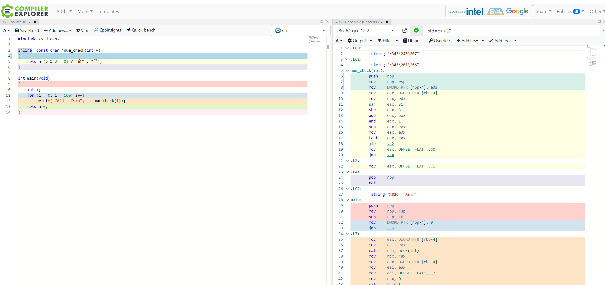
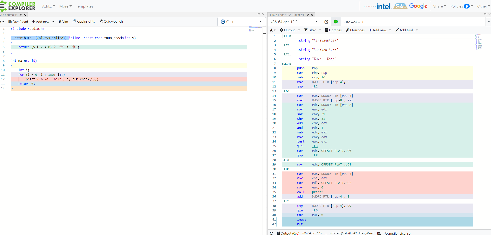
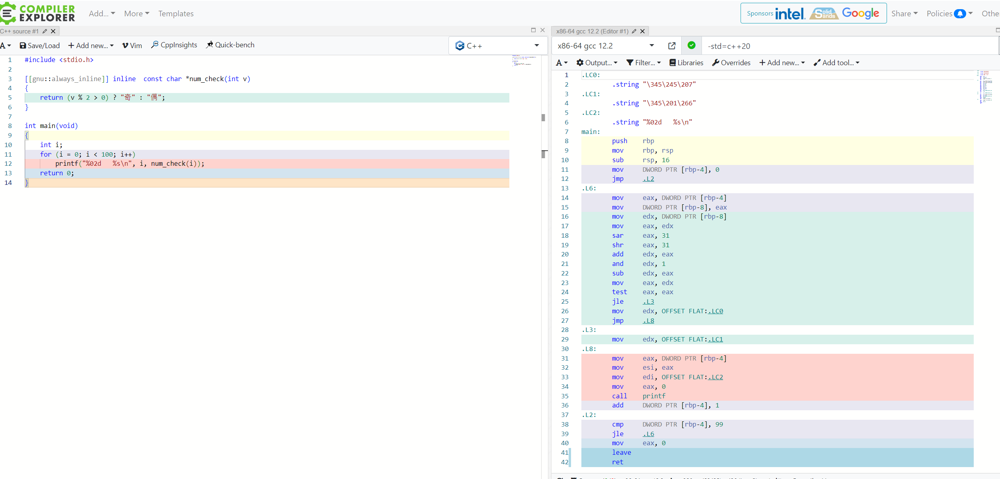
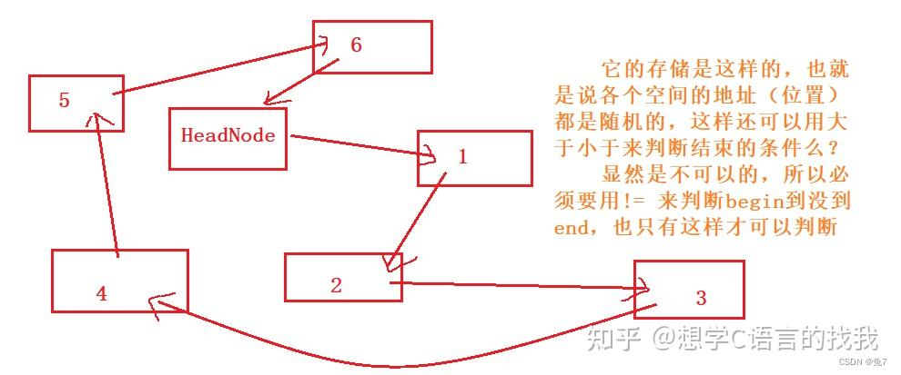
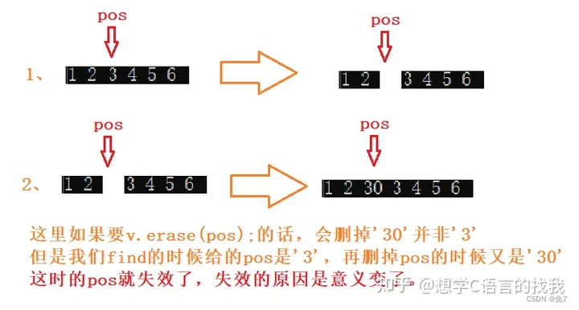
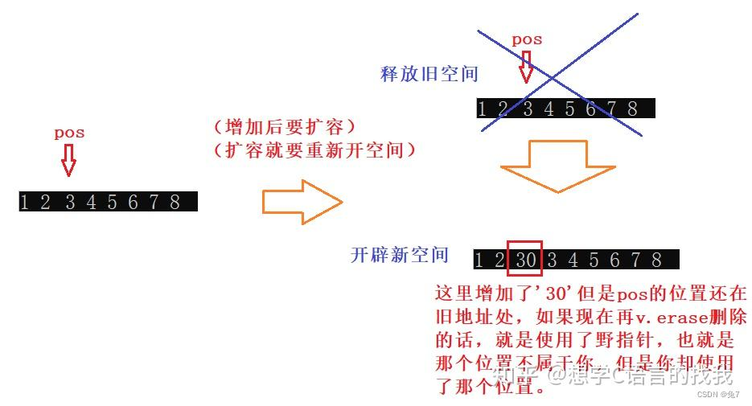
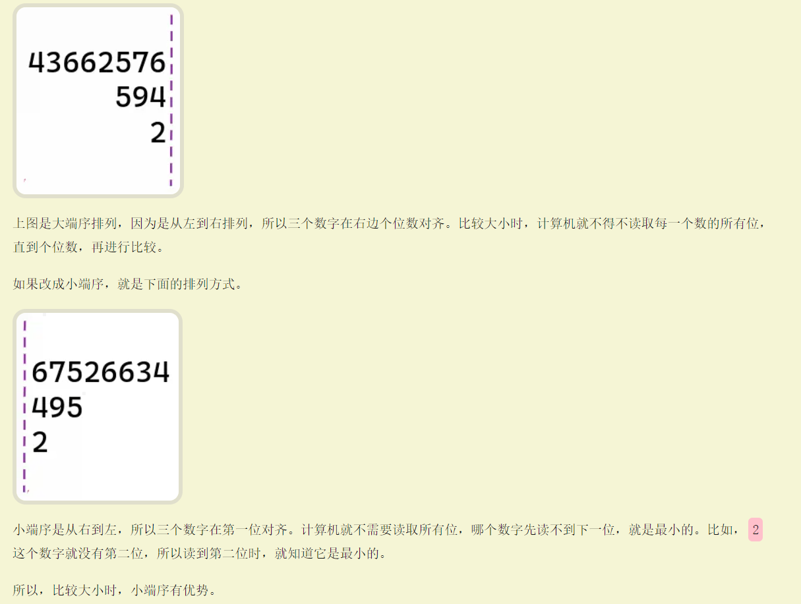
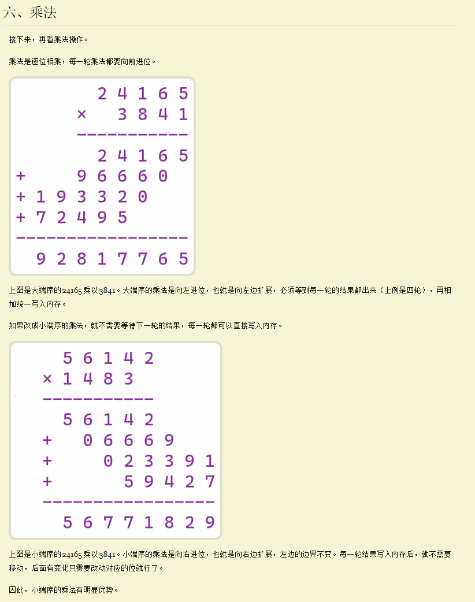

- [c++ 基础知识，多态](#c-基础知识多态)
  - [1、指针和引用的区别](#1指针和引用的区别)
  - [指针函数和函数指针?](#指针函数和函数指针)
  - [野(wild)指针与悬空(dangling)指针](#野wild指针与悬空dangling指针)
    - [野指针](#野指针)
    - [悬空指针](#悬空指针)
  - [2、局部变量和全局变量可以重名么](#2局部变量和全局变量可以重名么)
  - [3、局部变量和全局变量他们在内存中都存在哪里？](#3局部变量和全局变量他们在内存中都存在哪里)
  - [4、C++类访问权限修饰符以及公有继承保护继承私有继承的区别](#4c类访问权限修饰符以及公有继承保护继承私有继承的区别)
  - [5、类内定义变量，如何在其他类访问？](#5类内定义变量如何在其他类访问)
  - [6、C++中几种构造函数， 拷贝构造函数什么时候会调用(2)](#6c中几种构造函数-拷贝构造函数什么时候会调用2)
  - [7、深拷贝和浅拷贝的区别](#7深拷贝和浅拷贝的区别)
  - [8、static关键字用法和作用，初始化值是多少?](#8static关键字用法和作用初始化值是多少)
  - [9、static关键字在C++程序编译过程的哪个阶段起作用？](#9static关键字在c程序编译过程的哪个阶段起作用)
  - [13、using关键字](#13using关键字)
    - [using 声明](#using-声明)
    - [using 指示 (引入命名空间)](#using-指示-引入命名空间)
    - [类型重定义，取代 typedef](#类型重定义取代-typedef)
  - [14、完美转发](#14完美转发)
  - [15、move](#15move)
  - [16、值传递、指针传递、引用传递的区别和效率](#16值传递指针传递引用传递的区别和效率)
  - [17、C++中的指针参数传递和引用参数传递有什么区别？底层原理你知道吗？](#17c中的指针参数传递和引用参数传递有什么区别底层原理你知道吗)
  - [18、多态的底层实现及原理](#18多态的底层实现及原理)
    - [静态多态](#静态多态)
    - [动态多态](#动态多态)
    - [虚表和虚指针](#虚表和虚指针)
    - [虚表在那个阶段产生的？](#虚表在那个阶段产生的)
    - [一般我们认为多态会影响性能，你觉得为什么影响性能？](#一般我们认为多态会影响性能你觉得为什么影响性能)
  - [19、什么是虚函数，虚函数的实现原理是什么()？](#19什么是虚函数虚函数的实现原理是什么)
    - [虚函数实现原理](#虚函数实现原理)
    - [虚函数的代价是什么？](#虚函数的代价是什么)
  - [20、虚析构函数的作用？父类的析构函数是否要设置为虚函数？为什么析构函数一般写成虚函数？](#20虚析构函数的作用父类的析构函数是否要设置为虚函数为什么析构函数一般写成虚函数)
  - [构造函数可以是虚函数吗？](#构造函数可以是虚函数吗)
  - [22、动态绑定和静态绑定](#22动态绑定和静态绑定)
    - [带有缺省值的virtual函数(条款37)](#带有缺省值的virtual函数条款37)
    - [为什么要以这种乖张的方式来运作呢？](#为什么要以这种乖张的方式来运作呢)
    - [两种缺省参数处理的对比](#两种缺省参数处理的对比)
  - [23、什么是纯虚函数，与虚函数的区别](#23什么是纯虚函数与虚函数的区别)
  - [24、为什么需要虚函数？](#24为什么需要虚函数)
  - [c++重载怎么实现](#c重载怎么实现)
    - [为什么需要函数重载（why）？](#为什么需要函数重载why)
    - [编译器如何解决命名冲突的?(C++的函数名称修饰是怎么样的？)](#编译器如何解决命名冲突的c的函数名称修饰是怎么样的)
      - [为什么编译器在给函数修饰的时候，不考虑返回值的不同？ todo](#为什么编译器在给函数修饰的时候不考虑返回值的不同-todo)
      - [编译器是如何解析重载函数调用的？](#编译器是如何解析重载函数调用的)
      - [如何禁止这种修饰？](#如何禁止这种修饰)
      - [如何根据修饰后的符号查找对应的函数名？](#如何根据修饰后的符号查找对应的函数名)
      - [模板（template）的重载时怎么样的？模板函数和普通函数构成的重载，调用时又是如何匹配的呢？todo](#模板template的重载时怎么样的模板函数和普通函数构成的重载调用时又是如何匹配的呢todo)
      - [在C++中加号+，即可用于两个int型之间的相加、也可以用于浮点数数之间的相加、字符串之间的连接，那+算不算是操作符重载呢？换个场景C语言中加号+，即可用于两个int型之间的相加、也可以用于浮点数数之间的相加，那算不算操作符重载呢？ todo](#在c中加号即可用于两个int型之间的相加也可以用于浮点数数之间的相加字符串之间的连接那算不算是操作符重载呢换个场景c语言中加号即可用于两个int型之间的相加也可以用于浮点数数之间的相加那算不算操作符重载呢-todo)
  - [重写和重载原理](#重写和重载原理)
  - [26、C++中的重载(overload)、重写（覆盖override）和隐藏的区别](#26c中的重载overload重写覆盖override和隐藏的区别)
  - [override跟final](#override跟final)
  - [、C++中extern “C”含义？](#c中extern-c含义)
  - [、数组名和指针（这里为指向数组首元素的指针）区别？](#数组名和指针这里为指向数组首元素的指针区别)
  - [c和c++结构体有啥区别?](#c和c结构体有啥区别)
    - [成员](#成员)
    - [继承](#继承)
    - [定义方式](#定义方式)
  - [写一个空类，编译器自动生成了哪些函数](#写一个空类编译器自动生成了哪些函数)
  - [C和C++有什么区别？](#c和c有什么区别)
  - [c++结构体和类的异同](#c结构体和类的异同)
  - [C++ struct结构体内存对齐](#c-struct结构体内存对齐)
  - [c++对象的大小如何计算](#c对象的大小如何计算)
  - [从hello world 说程序运行机制](#从hello-world-说程序运行机制)
  - [让C++对象只能分配到堆/栈区](#让c对象只能分配到堆栈区)
    - [如何只在栈上分配内存?](#如何只在栈上分配内存)
    - [对象只分配在堆上？](#对象只分配在堆上)
  - [C++中面向对象怎么理解(类有什么好处)](#c中面向对象怎么理解类有什么好处)
    - [封装](#封装)
    - [继承](#继承-1)
    - [多态](#多态)
  - [RAII](#raii)
  - [this指针](#this指针)
  - [具体说一下虚继承是什么状态？](#具体说一下虚继承是什么状态)
  - [虚函数可以内联吗？C++ 内联函数？](#虚函数可以内联吗c-内联函数)
  - [描述一下C++编译的整个过程  todo](#描述一下c编译的整个过程--todo)
  - [对静态库和动态库的理解](#对静态库和动态库的理解)
  - [进程虚拟地址空间(C++内存分区)](#进程虚拟地址空间c内存分区)
  - [c++对象的内存模型](#c对象的内存模型)
  - [c++中的memroy order](#c中的memroy-order)
  - [malloc实现原理](#malloc实现原理)
  - [对缓存的思考【续】——编写高速缓存友好代码](#对缓存的思考续编写高速缓存友好代码)
  - [C++里面的锁 todo](#c里面的锁-todo)
  - [会自动生成移动构造函数吗？（某些特定情况下会的、五法则）](#会自动生成移动构造函数吗某些特定情况下会的五法则)
  - [- C/C++里面什么情况下会栈溢出？](#--cc里面什么情况下会栈溢出)
    - [哪些情况会用栈?](#哪些情况会用栈)
  - [new的重载主要用在什么地方?](#new的重载主要用在什么地方)
  - [C++中new、operator new和placement new的区别](#c中newoperator-new和placement-new的区别)
    - [new](#new)
    - [C++对象实例化的时候使用new关键字和不使用new关键字的区别是什么？](#c对象实例化的时候使用new关键字和不使用new关键字的区别是什么)
    - [再看看operator new和placement new](#再看看operator-new和placement-new)
      - [operator new](#operator-new)
  - [深拷贝和浅拷贝的区别以及他们的好处（滴滴）](#深拷贝和浅拷贝的区别以及他们的好处滴滴)
  - [- C++的循环展开](#--c的循环展开)
  - [- CPU的流水线和分支预测？](#--cpu的流水线和分支预测)
  - [\* C++读写一个变量，操作系统内部的完整过程](#-c读写一个变量操作系统内部的完整过程)
  - [\* 实现一个模板判断元素是左值还是右值？](#-实现一个模板判断元素是左值还是右值)
  - [\* 模板的全特化和偏特化](#-模板的全特化和偏特化)
- [c++11](#c11)
  - [智能指针的原理、常用的智能指针及实现](#智能指针的原理常用的智能指针及实现)
    - [原理](#原理)
    - [常用的智能指针](#常用的智能指针)
    - [手写实现智能指针](#手写实现智能指针)
  - [make\_shared 的好处](#make_shared-的好处)
  - [智能指针的循环引用](#智能指针的循环引用)
  - [智能指针的线程安全问题](#智能指针的线程安全问题)
    - [引用计数讨论(引用计数具体是怎么实现的？怎么做到多个shared\_ptr之间的计数能共享，同步更新的呢？)](#引用计数讨论引用计数具体是怎么实现的怎么做到多个shared_ptr之间的计数能共享同步更新的呢)
    - [修改指向是否线程安全](#修改指向是否线程安全)
    - [所管理数据的线程安全性](#所管理数据的线程安全性)
  - [inline关键字（新标准，17之后）](#inline关键字新标准17之后)
    - [如何强制编译器进行inline](#如何强制编译器进行inline)
    - [ODR 原则](#odr-原则)
  - [thread\_local](#thread_local)
  - [move 原理](#move-原理)
  - [forward](#forward)
    - [**forward(typename std::remove\_reference\<\_Tp\>::type\& \_\_t)**](#forwardtypename-stdremove_reference_tptype-__t)
  - [- auto会在什么情况下推导出不一样的情况?](#--auto会在什么情况下推导出不一样的情况)
    - [第一种情况](#第一种情况)
    - [第二种情况](#第二种情况)
- [STL](#stl)
  - [C++ 什么时候使用 vector、list、以及 deque?](#c-什么时候使用-vectorlist以及-deque)
  - [map和unordered\_map的区别，在使用上如何选择？](#map和unordered_map的区别在使用上如何选择)
  - [vector,list,map,unordered\_map底层实现](#vectorlistmapunordered_map底层实现)
    - [map中为什么用红黑树而不用AVL树实现？](#map中为什么用红黑树而不用avl树实现)
  - [六大组件](#六大组件)
  - [迭代器解决了什么问题？](#迭代器解决了什么问题)
    - [迭代器用法](#迭代器用法)
      - [while (it != v.end()) 和 while (it \< vec.end())](#while-it--vend-和-while-it--vecend)
      - [范围for问题](#范围for问题)
    - [迭代器失效问题？](#迭代器失效问题)
      - [vector和string 迭代器失效](#vector和string-迭代器失效)
      - [list迭代器失效](#list迭代器失效)
      - [deque迭代器失效](#deque迭代器失效)
      - [set和map迭代器失效](#set和map迭代器失效)
  - [能够使用sort的容器需要满足什么条件？](#能够使用sort的容器需要满足什么条件)
- [c++ 17 20 后面的内容 todo](#c-17-20-后面的内容-todo)
  - [STL如何解决线程同步问题](#stl如何解决线程同步问题)
    - [vector](#vector)
      - [如果B，C，D，E，F这个5个线程是等价的，要不停消费vector中的元素，会造成重复消费不？](#如果bcdef这个5个线程是等价的要不停消费vector中的元素会造成重复消费不)
    - [关联容器的线程安全问题 todo](#关联容器的线程安全问题-todo)
  - [linux 进程通信方式 pipe无名管道 fifo有名管道 共享内存映射 socket 消息队列](#linux-进程通信方式-pipe无名管道-fifo有名管道-共享内存映射-socket-消息队列)
- [GDB](#gdb)
  - [程序运行参数](#程序运行参数)
    - [切换文件](#切换文件)
  - [- strace命令是干嘛的？](#--strace命令是干嘛的)
  - [core文件](#core文件)
    - [Segmentation fault (core dumped)，段错误产生的情况](#segmentation-fault-core-dumped段错误产生的情况)
    - [控制core文件是否生成](#控制core文件是否生成)
    - [gdb调式core文件的步骤](#gdb调式core文件的步骤)
- [git](#git)
  - [常用的git命令](#常用的git命令)
  - [大小端问题](#大小端问题)
    - [大小端优势？](#大小端优势)
- [内存泄漏](#内存泄漏)
  - [常发性内存泄漏](#常发性内存泄漏)
  - [偶发性内存泄漏](#偶发性内存泄漏)
  - [一次性内存泄漏](#一次性内存泄漏)
  - [隐式内存泄漏](#隐式内存泄漏)
  - [std::string能否被继承，为什么？](#stdstring能否被继承为什么)
  - [如何查看内存泄露？](#如何查看内存泄露)
    - [日志](#日志)
    - [统计](#统计)
    - [工具](#工具)
  - [c++原子操作是怎么实现的（CAS）？](#c原子操作是怎么实现的cas)
    - [cpu cache 一致性问题](#cpu-cache-一致性问题)
      - [为什么要有CPU cache?](#为什么要有cpu-cache)
      - [cpu cache 读写策略是什么？](#cpu-cache-读写策略是什么)
      - [为什么会有缓存一致性问题？](#为什么会有缓存一致性问题)
      - [怎么解决缓存一致性问题？](#怎么解决缓存一致性问题)
      - [MESI 一致性](#mesi-一致性)
  - [c++ 编译速度优化](#c-编译速度优化)
    - [分布式编译](#分布式编译)
    - [减少头文件的引用](#减少头文件的引用)
  - [程序性能瓶颈查找?](#程序性能瓶颈查找)
    - [CPU占用查看](#cpu占用查看)
      - [perf 神器](#perf-神器)
- [设计模式](#设计模式)
  - [设计模式是什么？](#设计模式是什么)
    - [那遵循设计模式能带来什么好处？](#那遵循设计模式能带来什么好处)
- [并发编程](#并发编程)
  - [什么是互斥锁，自旋锁呢，底层是怎么实现的？](#什么是互斥锁自旋锁呢底层是怎么实现的)
  - [讲一讲死锁，死锁怎么处理？](#讲一讲死锁死锁怎么处理)
  - [什么是读写锁？](#什么是读写锁)
  - [Linux同步机制？](#linux同步机制)
  - [信号量是如何实现的？](#信号量是如何实现的)
  - [- 互斥锁、条件变量和信号量有什么区别？](#--互斥锁条件变量和信号量有什么区别)
  - [c++条件变量为什么要和mutex搭配，不能单独使用吗?](#c条件变量为什么要和mutex搭配不能单独使用吗)
- [编译链接](#编译链接)
  - [动态库的显示调用和隐式调用？](#动态库的显示调用和隐式调用)
    - [隐式调用](#隐式调用)
    - [显示调用](#显示调用)
  - [函数调用约定？](#函数调用约定)
    - [stdcall调用规范](#stdcall调用规范)
    - [cdecl调用规范](#cdecl调用规范)
    - [fastcall调用规范](#fastcall调用规范)
    - [thiscall调用规范](#thiscall调用规范)
    - [naked call调用规范](#naked-call调用规范)
    - [函数调用约定导致的常见问题](#函数调用约定导致的常见问题)

# c++ 基础知识，多态

## 1、指针和引用的区别

- 指针是一个变量，存储的是一个地址，引用跟原来的变量实质上是同一个东西，是原变量的别名
- 指针可以有多级，引用只有一级
- 指针可以为空，引用不能为NULL且在定义时必须初始化
- 指针在初始化后可以改变指向，而引用在初始化之后不可再改变
- sizeof指针得到的是本指针的大小，sizeof引用得到的是引用所指向变量的大小
- 当把指针作为参数进行传递时，也是将实参的一个拷贝传递给形参，两者指向的地址相同，但不是同一个变量，在函数中改变这个变量的指向不影响实参，而引用却可以。
- 引用本质是一个指针，同样会占4字节内存；指针是具体变量，需要占用存储空间（具体情况还要具体分析）

```cpp
#include <iostream>
void add(int* p, int& r, int num) {
  *p += num;
  r += num;
}
int main() {
  int x = 10;
  int* p = &x;
  int& r = x;
  std::cout << *p << " " << r << std::endl; // 10
  add(p, r, 5);
  std::cout << *p << " " << r << std::endl; // 20
  double nn = 0;
  double& inf = nn;
  double *ptr = &nn;
  std::cout << sizeof(nn) << sizeof(inf) << sizeof(ptr) << std::endl;// 8 8 4
  return 0;
}

/*在这个示例中，x是一个整数，p是指向x的指针，r是对x的引用。add 函数接收一个整数指针和一个整数引
用，以及一个要增加的值 num。函数使用指针和引用更改x的值，将其增加 num。
在主函数中，我们首先输出了指针和引用所指向的值，然后调用 add 函数，并再次输出指针和引用所指向的
值。由于传入的是指针和引用的引用，所以函数可以在不返回任何值的情况下更改传入的参数的值，这使得在
有些情况下使用指针和引用更为方便。
需要注意的是，指针和引用的主要区别在于指针可以指向空值，而引用不能，指针可以随意改变指向的对象，
而引用不能，指向对象后就不再改变。另外，指针需要使用*运算符来访问所指向的对象，而引用不需要。*/
```

## 指针函数和函数指针?

指针函数：带指针的函数，即本质是一个函数。函数返回类型是某一类型的指针。

 `类型标识符 *函数名(参数表)     int*f(x，y);`

2、函数指针：指向函数(首地址)的指针变量，即本质是一个指针变量。

函数指针说的就是一个指针，但这个指针指向的函数，不是普通的基本数据类型或者类对象。

指向函数的指针包含了函数的地址，可以通过它来调用函数。

## 野(wild)指针与悬空(dangling)指针

### 野指针

野指针是指尚未初始化的指针，**既不指向合法的内存空间，也没有使用 NULL/nullptr 初始化指针**。

### 悬空指针

悬空指针是指 **指针指向的内存空间已被释放或不再有效**。

情况一

p 指针在被 free 后，成为悬空指针，被 NULL 赋值后不再是悬空指针。

```cpp
#include <iostream>
using namespace std;
 
int main()
{
    int *p = new int(5);
    cout<<"*p = "<<*p<<endl;
    free(p);  // p 在释放后成为悬空指针
    p = NULL; // 非悬空指针
    return 0;
}
```

**注意：这里 free 掉的是 p 的内存空间，并不是变量 p，**

```cpp
#include <iostream>
using namespace std;
 
int main()
{
    int *p = new int(5);
    cout<<"*p = "<<*p<<endl;
    cout<<"p 地址："<<p<<endl;
    free(p);  // p 在释放后成为悬空指针
    cout<<"p 地址："<<p<<endl;
    cout<<"*p = "<<*p<<endl;
    p = NULL; // 非悬空指针
    return 0;
}
```

情况二

超出了变量的作用范围。

``` cpp
#include <iostream>
using namespace std;
 
int main()
{
    int *p;
    {
        int tmp = 10;
        p = &tmp;
    }
    //p 在此处成为悬空指针
    return 0;
} 
```

情况三

指向了函数局部变量。

``` cpp
#include <iostream>
using namespace std;
 
int* getVal() {
    int tmp = 10;
    return &tmp;
}
 
int main()
{
    int *p = getVal(); //悬空指针
    cout<<"*p = "<<*p<<endl;
    return 0;
}
```

在函数 getVal 执行完后，局部变量的内存空间会被释放，而这里 p 指向了函数内的局部变量，p 便成为了悬空指针，可以将 tmp 变为 static 的。

## 2、局部变量和全局变量可以重名么

  答：能，局部会屏蔽全局。要用全局变量，需要使用 ":: "

局部变量可以与全局变量同名，在函数内引用这个变量时，会用到同名的局部变量，而不会用到全局变量。对于有些编译器而言，在同一个函数内可以定义多个同名的局部变量，比如在两个循环体内都定义一个同名的局部变量，而那个局部变量的作用域就在那个循环体内。

- 如何引用一个已经定义过的全局变量？

  答：可以用引用头文件的方式，也可以用extern关键字，如果用引用头文件方式来引用某个在头文件中声明的全局变量，假定你将那个变量写错了，那么在编译期间会报错，如果你用extern方式引用时，假定你犯了同样的错误，那么在编译期间不会报错，而在连接期间报错。

- 全局变量可不可以定义在可被多个.C文件包含的头文件中？为什么？　　

  答：可以，在不同的C文件中以static形式来声明同名全局变量。前提是只能有一个C文件中对此变量赋初值，连接才不会出错。
  **建议不要在头文件中定义变量，头文件中只做变量的声明！**

  - 为什么要声明为static的原因如下：

  1. 每个.c文件，会编译成一个obj，这样，如果你在头文件中定义，而不是声明，那么每个引用这个头文件的obj中都会有一个这个变量的实例，连接的时候就会报重复定义出错了。

  2. static变量的作用域只在该编译单元内有效

## 3、局部变量和全局变量他们在内存中都存在哪里？

  1. 局部变量在栈空间上分配，这个局部变量所在的函数被多次调用时，每次调用这个局部变量在栈上的位置都不一定相同。 局部变量也可以在堆上动态分配，但是记得使用完这个堆空间后要释放之。
  2. 那些在代码中被我们**指定了初始值的全局变量和静态变量**在虚拟内存空间中的存储区域我们叫做**数据段(DATA 段（全局初始化区）)**。
  3. 那些**没有指定初始值的全局变量和静态变量**在虚拟内存空间中的存储区域我们叫做 **BSS段**。这些未初始化的全局变量被加载进内存之后会被初始化为 0 值。

## 4、C++类访问权限修饰符以及公有继承保护继承私有继承的区别

  1. public 继承不改变基类成员的访问权限；
  2. protected 继承将基类中 public 成员变为子类的 protected 成员，其它成员的访问权限不变；
  3. private 继承使得基类所有成员在子类中的访问权限变为 private。

## 5、类内定义变量，如何在其他类访问？

继承，public和protected

## 6、C++中几种构造函数， 拷贝构造函数什么时候会调用(2)

移动构造和赋值构造函数,默认构造函数

构造会在以下场景

``` cpp

vector<int> a; // 默认构造
vector<int> b{a}; // 复制构造
vector<int> b = a; // 不声明explict 时，会调用复制构造
vector<int> c{std::move(a)}; // 移动构造
vector<int> c = std::move(b); //  不声明explict 时，会调用移动构造
```

## 7、深拷贝和浅拷贝的区别

- 浅拷贝
  **浅拷贝只是拷贝一个指针，并没有新开辟一个地址**，拷贝的指针和原来的指针指向同一块地址，如果原 来
  的指针所指向的资源释放了，那么再释放浅拷贝的指针的资源就会出现错误。(double free)

- 深拷贝
  **深拷贝不仅拷贝值，还开辟出一块新的空间用来存放新的值**，即使原先的对象被析构掉，释放内存了也 不
  会影响到深拷贝得到的值。在自己实现拷贝赋值的时候，如果有指针变量的话是需要自己实现深拷贝 的。

``` cpp
#include <string.h>

#include <iostream>
using namespace std;
class Student {
 private:
  int num;
  char* name;

 public:
  Student() {
    name = new char(20);
    cout << "Student" << endl;
  };
  ~Student() {
    cout << "~Student " << &name << endl;
    delete name;
    name = NULL;
  };
  Student(const Student& s) {  // 拷贝构造函数
    // 浅拷贝，当对象的name和传入对象的name指向相同的地址
    name = s.name;
    // 深拷贝
    // name = new char(20);
    // memcpy(name, s.name, strlen(s.name));
    cout << "copy Student" << endl;
  };
};
int main() {
  {  // 花括号让s1和s2变成局部对象，方便测试
    Student s1;
    Student s2(s1);  // 复制对象
  }
  system("pause");
  return 0;
}
// 浅拷贝执行结果：
// Student
// copy Student
// ~Student 0x7ffd49912b88
// ~Student 0x7ffd49912b78
// free(): double free detected in tcache 2
// [1]    22963 IOT instruction  ./test
// 深拷贝执行结果：
// Student
// copy Student
//~Student 0x7fffebca9fb0
//~Student 0x7fffebca9fc0
```

## 8、static关键字用法和作用，初始化值是多少?

1. 先来介绍它的第一条也是最重要的一条：隐藏。（static函数，static变量均可） 当
同时编译多个文件时，所有未加static前缀的全局变量和函数都具有全局可见性。
2. static的第二个作用是保持变量内容的持久。（static变量中的记忆功能和全局生存期）存储在静态数 据
区的变量会在程序刚开始运行时就完成初始化，也是唯一的一次初始化。共有两种变量存储在静态存 储区：
全局变量和static变量，只不过和全局变量比起来，static可以控制变量的可见范围，说到底static还是
用来隐藏的。
3. **static的第三个作用是默认初始化为0（static变量）**
其实全局变量也具备这一属性，因为全局变量也存储在静态数据区。在静态数据区，内存中所有的字节 默
认值都是0x00，某些时候这一特点可以减少程序员的工作量
4. static的第四个作用：C++中的类成员声明static
    1) 函数体内static变量的作用范围为该函数体，不同于auto变量，该变量的内存只被分配一次，因此其值
在下次调用时仍维持上次的值；
    2) 在模块内的static全局变量可以被模块内所用函数访问，但不能被模块外其它函数访问；
    3) 在模块内的static函数只可被这一模块内的其它函数调用，这个函数的使用范围被限制在声明它的模块
   内；
    4) 在类中的static成员变量属于整个类所拥有，对类的所有对象只有一份拷贝；
    5) 在类中的static成员函数属于整个类所拥有，这个函数不接收this指针，因而只能访问类的static成员变量。
    6) static类对象必须要在类外进行初始化，static修饰的变量先于对象存在，所以static修饰的变量要在类外初始化；
    7) 由于static修饰的类成员属于类，不属于对象，因此static类成员函数是没有this指针的，this指针是指向本对象的指针。正因为没有this指针，所以static类成员函数不能访问非static的类成员，只能访问static
修饰的类成员；
    8) static成员函数不能被virtual修饰，static成员不属于任何对象或实例，所以加上virtual没有任何实际 意义；静态成员函数没有this指针，虚函数的实现是为每一个对象分配一个vptr指针，而vptr是通过this 指针调用的，所以不能为virtual；虚函数的调用关系，this->vptr->ctable->virtual functio

## 9、static关键字在C++程序编译过程的哪个阶段起作用？

在链接阶段，todo

## 13、using关键字

### using 声明

using 声明 (using declaration) 是将命名空间中单个名字注入到当前作用域的机制，使得在当前作用域下访问另一个作用域下的成员时无需使用限定符 ::

```cpp
// ...
{
    using std::map;
    map<int, std::string> the_map; //ok
}
map<int, std::string> the_map2;  //error
```

using 声明将其它 namespace 的成员引入本命名空间的 当前作用域 (包括其嵌套作用域)  。一个 using 声明一次只引入一个命名空间成员，它使得无论程序中使用哪些名字，都非常准确。
利用 using 声明，可以改变派生类对父类成员的访问控制:

```cpp
#include <iostream>
class Base{
protected:
    int bn1;
    int bn2;
};
 
class Derived: private Base{
public:
    using Base::bn1;
};
 
class DerivedAgain: public Derived{
};
 
int main(){
    Derived d;
    DerivedAgain da; 
    d.bn1 = 1;
    d.bn2 = 2; //error, 'bn2' is a private member of 'Base'
    da.bn1 = 3;  //ok
    std::cout<<d.bn1<<std::endl;
 
    return 0;
}
```

**尽管 Derived 对 base 是私有继承，但通过 using 声明，我们还是可以在 Derived 中访问其成员，且后续的继承同样不受 private 限定的影响。**

### using 指示 (引入命名空间)

`using 指示 (using directive)` 是使一个命名空间中的 所有 名字都在该作用域中可见的机制。这是最常用的方式了。需要注意的是命名冲突问题。

```cpp
#include <iostream>
namespace n1{ 
    int n1_member = 10; 
    int m = 11; 
}
 
int m = 12; 
 
int main(){
    using namespace n1; 
    std::cout<<n1_member<<std::endl;
    //std::cout<<m<<std::endl;  //error 命名冲突
    std::cout<<::m<<std::endl;
 
    int m = 13; //ok, 局部变量屏蔽命名空间变量
    std::cout<<m<<std::endl;
 
    return 0;
}
```

> Notice: 尽管 using指示很方便，但在实际工作中应该尽量避免：它一下子将另一个 namespace 中的成员全部引入了，一不小心就会出现命名空间污染问题。

### 类型重定义，取代 typedef

```cpp
using alias = typename
```

这是 C++11 中的新用法，比 typedef 更能表达别名的定义。

``` cpp
using fun = void (*)(int, int);
//typedef void (*fun)(int, int); //与上一句等价
using int16 = short;
//typedef short int16; //与上一句等价
 
int main(){
    std::cout<<sizeof(int16)<<std::endl;
}
```

在 C++98/03 中 ，typedef 重定义有一些限制，比如，模板。
我们想实现这样一个模板：将一个 int 映射到任意类型，类似于我们想表达这种效果：

```cpp
typedef std::map<int, int> map_int_t;
typedef std::map<int, std::string> map_str_t;
typedef std::map<int, bool> map_b_t;
//... Others
```

我们在 C++98/03 中必须这样写：

``` cpp
template<typename Val>
struct int_map{
    typedef std::map<int, Val> type;
};
 
int main(){
    int_map<int>::type imap;
 
    return 0;
}
```

在C++11 中，我们可以使用 using 重定义模板

```cpp
template<typename Val>
using int_map_t = std::map<int, Val>;
 
int main(){
    int_map_t<int> imap;
 
    return 0;
}
```

## 14、完美转发

就是右值通过传参进函数的时候，就不是右值了，就会成为左值，这就要通过forward让他保持原来的右值性质，就是完美转发  

## 15、move

区分左值与右值的便捷方法是：看能不能对表达式取址&，如果能，则为左值，不能则为右值。

所有的值必属于左值、将亡值、纯右值三者之一。

右值由两个概念构成：
一个是将亡值一个是纯右值。

- 所有的右值引用叠加到右值引用上仍然是一个右值引用，其他引用折叠都为左值引用。
- 编译器会将已命名的右值引用视为左值，未命名的右值视为右值。

move实际上不能移动任何东西，它唯一的功能是将一个左值强制转化为一个右指引用。强制转换为右值的目的是为了方便实现移动构造。

这里要注意对move语义的**误解**,move只是转移了资源的控制权，本质上是将左值强制转换为右值引用，以用于move语义，避免含有资源的对象发生无所谓的拷贝。**move对于拥有形如对内存、文件句柄等资源的成员的对象有效。如果是一些基本类型，比如int和char[10]数组等，如果使用move仍然会发生拷贝(因为没有对应的移动构造函数)，所以说对含有资源的对象来说更有意义**

## 16、值传递、指针传递、引用传递的区别和效率

- 值传递：有一个形参向函数所属的栈拷贝数据的过程，如果值传递的对象是类对象或是大的结构体对象，将耗费一定的时间和空间。（传值）
- 指针传递：同样有一个形参向函数所属的栈拷贝数据的过程，但拷贝的数据是一个固定为4字节的地址。（传值，传递的是地址值
- 引用传递：形参相当于是**实参的“别名”**，对形参的操作其实就是对实参的操作，在引用传递过程中，被调函数的形式参数虽然也作为局部变量在栈中开辟了内存空间，但是这时存放的是由主调函数放进来的实参变量的地址。被调函数对形参的任何操作都被处理成间接寻址，即通过栈中存放的地址访问主调函数中的实参变量。正因为如此，被调函数对形参做的任何操作都影响了主调函数中的实参变量。（传地址）
- 效率上讲，指针传递和引用传递比值传递效率高。**一般主张使用引用传递**，代码逻辑上更加紧凑、 清晰。

## 17、C++中的指针参数传递和引用参数传递有什么区别？底层原理你知道吗？

1. **指针参数传递本质上是值传递**，它所传递的是一个地址值。
值传递过程中，被调函数的形式参数作为被调函数的局部变量处理，会在栈中开辟内存空间以存放由主调函数传递进来的实参值，从而形成了实参的一个副本（替身）。
值传递的特点是，被调函数对形式参数的任何操作都是作为局部变量进行的，不会影响主调函数的实参变量的值（**形参指针变了，实参指针不会变**）。

2. 引用参数传递过程中，被调函数的形式参数也作为局部变量在栈中开辟了内存空间，但是这时存放的是由**主调函数放进来的实参变量的地址**。
   被调函数对形参（本体）的任何操作都被处理成间接寻址，即通过栈中存放的地址访问主调函数中的实参变量（根据别名找到主调函数中的本体）。因此，被调函数对形参的任何操作都会影响主调函数中的实参变量。
3. 引用传递和指针传递是不同的，虽然他们都是在被调函数栈空间上的一个局部变量，但是任何对于**引用参数的处理都会通过一个间接寻址的方式操作到主调函数中的相关变量**。而对于指针传递的参数，如果改变被调函数中的指针地址，它将应用不到主调函数的相关变量。如果想通过指针参数传递来改变主调函数中的相关变量（地址），那就得使用指向指针的指针或者指针引用。
4. 从编译的角度来讲，程序在编译时分别将指针和引用添加到符号表上，符号表中记录的是变量名及变量所对应地址。
指针变量在符号表上对应的地址值为指针变量的地址值，而引用在符号表上对应的地址值为引用对象的地址值（与实参名字不同，地址相同）。符号表生成之后就不会再改，因此指针可以改变其指向的对象（指针变量中的值可以改），而引用对象则不能修改。

## 18、多态的底层实现及原理

**是什么？ 为什么？ 怎么用？**

### 静态多态

编译时,

- 编译期多态通常通过**函数重载和模板**实现。
- 函数重载是指在同一作用域内有多个同名函数，但它们的参数列表不同，**编译器根据参数类型和数量在编译时期决定调用哪个函数。**
- 模板通过泛型编程允许函数和类在使用时再指定具体的类型。模板的实例化发生在编译期，编译器生成针对特定类型的函数或类版本。
- 编译时多态的**主要优势是性能，因为编译器在编译代码时就能确定要调用的确切函数，从而减少运行时的决策。**
- 缺点：比如调试困难、编译耗时、代码膨胀、编译器支持的兼容性，不能够处理异质对象集合。

### 动态多态

多态，简单来说，是指在继承层次中，父类的指针可以具有多种形态——当它指向某个子类对象时，通过它能够调用到子类的函数，而非父类的函数。

优点：

- OO设计，对是客观世界的直觉认识；

- 实现与接口分离，可复用；

- 处理同一继承体系下异质对象集合的强大威力；

缺点：

- 运行期绑定，导致一定程度的运行时开销；
- 编译器无法对虚函数进行优化；
- 笨重的类继承体系，对接口的修改影响整个类层次；

### 虚表和虚指针

虚指针(vptr)的设定和重置是有每一个class的constructor、destructor、copy assignment运算符自动完成的。

<https://lyt-s.github.io/2024/02/19/cpp/vptr%E5%92%8Cvtbl/>

### 虚表在那个阶段产生的？

编译期

**表格中的virtual functions地址是如何被建构起来的？**

在C++中，virtual functions（可经由其class object被调用）可以在编译时期获知。此外，**这一组地址是固定不变的，执行期不可能新增或替换之。** 由于程序执行时，表格的大小和内容都不会改变，所以其建构和存取皆可以由编译器完全掌控，不需要执行期的任何介入。”

**这是其中一半，如何找到那些地址呢？**

两个步骤完成这项任务：

1. 为了找到表格，每一个class object 被安插了一个由编译器内部产生的指针，指向该表格。
2. 为了找到函数地址，每个virtual function 被指派了一个表格索引值。
3. 这些工作由编译器完成。执行期要做的，就只是在特定的virtual table slot(记录着virtual function的地址) 中激活virtual function.

- **虚函数按照其声明顺序放于表中。**
- **父类的虚函数在子类的虚函数前面。**

### 一般我们认为多态会影响性能，你觉得为什么影响性能？

大多数人认为，虚函数的调用会先通过虚指针跳到虚函数表，然后通过偏移确定函数真实地址，再跳转到地址执行，是间接调用导致了性能损失。

但实际上无法内联才是虚函数性能低于正常函数的主要原因。由于多态是运行时特征，在编译时编译器并不知道指针指向的函数地址，所以无法被内联。同时跳转到特定地址执行函数可能引发的L1 cache miss（空间局部性不好），这也会影响性能。

## 19、什么是虚函数，虚函数的实现原理是什么()？

虚函数（Virtual Function）是一种特殊的成员函数，**主要用于实现多态（Polymorphism）**。虚函数允许**基类的指针或引用调用派生类的成员函数，从而实现了对函数的动态绑定**。这种绑定方式使得程序在运行时根据对象的实际类型来选择调用哪个函数，提高了代码的可扩展性和维护性。

在基类中声明虚函数时，在成员函数声明之前加上关键字virtual。

多态机制可以简单地概括为“**一个接口，多种方法**”。

### 虚函数实现原理

**虚函数是通过一张虚函数表（Virtual Table）来实现的，简称为V-Table。** 在这个表中，主要是一个类的虚函数的地址表，这张表解决了继承、覆盖的问题，保证其真实反应实际的函数。这样，在有虚函数的类的实例中这个表被分配在了这个实例的内存中，所以，当我们用父类的指针来操作一个子类的时候，这张虚函数表就显得极为重要了，它就像一个地图一样，指明了实际所应该调用的函数。

### 虚函数的代价是什么？

1. 带有虚函数的类，每一个类会产生一个虚函数表，用来存储指向虚成员函数的指针，增大类；

2. 带有虚函数的类的每一个对象，都会有有一个指向虚表的指针，会增加对象的空间大小；

3. 不能再是内联的函数，因为内联函数在编译阶段进行替代，而虚函数表示等待，在运行阶段才能确定到低是采用哪种函数，虚函数不能是内联函数。

## 20、虚析构函数的作用？父类的析构函数是否要设置为虚函数？为什么析构函数一般写成虚函数？

C++中基类采用virtual**虚析构函数是为了防止内存泄漏**。

**析构时防止只析构基类而不析构派生类的状况发生，要将基类的析构函数声明为虚函数。**

具体地说，如果派生类中申请了内存空间，并在其析构函数中对这些内存空间进行释放。

如果析构函数不被声明成虚函数，则**编译器实施静态绑定，在删除基类指针时，只会调用基类的析构函数而不调用派生类析构函数，这样就会造成派生类对象析构不完全，造成内存泄漏。**

所以，为了防止这种情况的发生，C++中基类的析构函数应采用virtual虚析构函数。

所以将析构函数声明为虚函数是十分必要的。在实现多态时，当用基类操作派生类，在**析构时防止只析构基类而不析构派生类的状况发生，要将基类的析构函数声明为虚函数。**

## 构造函数可以是虚函数吗？

vptr的初始化：**当对象在创建时，由编译器对vptr指针进行初始化。在定义子类对象时，vptr先指向父类的虚函数表，在父类构造完成之后，子类的vptr才指向自己的虚函数表。**

**如果构造函数时虚函数，那么调用构造函数就需要去找vptr，而此时vptr指向的虚表还没有初始化。**

因此，构造函数不可以是虚函数。

## 22、动态绑定和静态绑定

- 静态类型：对象在程序中声明时采用的类型，在编译期既已确定；
- 动态类型："目前所指对象的类型"，也就是说，动态类型可以表现为一个对象将会有什么行为，是在运行期决定的；
- 静态绑定：绑定的是静态类型，所对应的函数或属性依赖于对象的静态类型，发生在编译期；
- 动态绑定：绑定的是动态类型，所对应的函数或属性依赖于对象的动态类型，发生在运行期；
**非虚函数一般都是静态绑定，而虚函数都是动态绑定（如此才可实现多态性）**

``` cpp
class A
{
public:
    /*virtual*/ void func(){ std::cout << "A::func()\n"; }
};
class B : public A
{
public:
    void func(){ std::cout << "B::func()\n"; }
};
class C : public A
{
public:
    void func(){ std::cout << "C::func()\n"; }
};
```

``` cpp
 C* pc = new C(); //pc的静态类型是它声明的类型C*，动态类型(new)也是C*；
 B* pb = new B(); //pb的静态类型和动态类型也都是B*；
 A* pa = pc;      //pa的静态类型是它声明的类型A*，动态类型是pa所指向的对象pc的类型C*；
 pa = pb;         //pa的动态类型可以更改，现在它的动态类型是B*，但其静态类型仍是声明时候的A*；
 C *pnull = NULL; //pnull的静态类型是它声明的类型C*,没有动态类型，因为它指向了NULL；
```

注意此时，A::func 不是虚函数

``` cpp
pa->func();      //A::func() pa的静态类型永远都是A*，不管其指向的是哪个子类，都是直接调用A::func()；
pc->func();      //C::func() pc的动、静态类型都是C*，因此调用C::func()；
pnull->func();   //C::func() 不用奇怪为什么空指针也可以调用函数，因为这在编译期就确定了，和指针空不空没关系；
```

如果注释掉类C中的func函数定义，其他不变，即

```cpp
class C : public A
{
};

pa->func();      //A::func() 理由同上；
pc->func();      //A::func() pc在类C中找不到func的定义，因此到其基类中寻找；
pnull->func();   //A::func() 原因也解释过了；
```

如果为A中的void func()函数添加virtual特性，其他不变，即如下

``` cpp
class A
{
public:
    virtual void func(){ std::cout << "A::func()\n"; }
};
// 和上面是，关联的
pa->func();      //B::func() 因为有了virtual虚函数特性，pa的动态类型指向B*，因此先在B中查找，找到后直接调用；
pc->func();      //C::func() pc的动、静态类型都是C*，因此也是先在C中查找；
pnull->func();   //空指针异常，因为是func是virtual函数，因此对func的调用只能等到运行期才能确定，然后才发现pnull是空指针；

A* a; // 静态类型为A* , 没有动态类型
A* a_b = new B; // 静态类型为A*，动态类型为 B*
A* a_c = new C; // 静态类型为A*, 动态类型为 C*
```

分析：
在上面的例子中，

1. 如果基类A中的func不是virtual函数，那么不论pa、pb、pc指向哪个子类对象，对func的调用都是在定义pa、pb、pc时的静态类型决定，早已在编译期确定了。
    同样的空指针也能够直接调用no-virtual函数而不报错（这也说明一定要做空指针检查啊！），因此静态绑定不能实现多态；
2. 如果func是虚函数，那所有的调用都要等到运行时根据其指向对象的类型才能确定，比起静态绑定自然是要有性能损失的，但是却能实现多态特性；
 本文代码里都是针对指针的情况来分析的，但是对于引用的情况同样适用。

至此总结一下静态绑定和动态绑定的区别：

1. 静态绑定发生在编译期，动态绑定发生在运行期；

2. 对象的动态类型可以更改，但是静态类型无法更改；

3. 要想实现动态，必须使用动态绑定；

4. **在继承体系中只有虚函数使用的是动态绑定，其他的全部是静态绑定；**

**建议**：

**绝对不要重新定义继承而来的非虚(non-virtual)函数**（《Effective C++ 第三版》条款36），因为这样导致**函数调用由对象声明时的静态类型确定**了，而和对象本身脱离了关系，没有多态，也这将给程序留下不可预知的隐患和莫名其妙的BUG；

### 带有缺省值的virtual函数(条款37)

**缺省参数**
一个函数的缺省参数是指不必须指定值的参数。 在大多数程序设计语言中，函数可以接受一个或多个参数。 通常对于每个参数都需要指定它们的值（例如C语言）。 一些较新的程序设计语言（例如C++）允许程序员设定缺省参数并指定默认值，当调用该函数并未指定值时，该缺省参数将为缺省值。

另外，在动态绑定也即在virtual函数中，要注意默认参数的使用。**当缺省参数和virtual函数一起使用的时候一定要谨慎**，不然出了问题怕是很难排查。看下面的代码:

```cpp
class E
{
public:
    virtual void func(int i = 0)
    {
        std::cout << "E::func()\t"<< i <<"\n";
    }
};
class F : public E
{
public:
    virtual void func(int i = 1)
    {
        std::cout << "F::func()\t" << i <<"\n";
    }
};

void test2()
{
    F* pf = new F(); // pf 缺省参数值静态绑定到 F* i = 1;
    E* pe = pf; // pe 的缺省参数值，已经静态绑定到E*了。注意 i= 0 默认
    pf->func(); //F::func() 1  正常，就该如此；
    pe->func(); //F::func() 0  哇哦，这是什么情况，调用了子类的函数，却使用了基类中参数的默认值！
}
```

为什么会有这种情况，请看《Effective C++ 第三版》 条款37。
这里只给出建议：
绝对不要重新定义一个继承而来的virtual函数的缺省参数值，因为**缺省参数值都是静态绑定（为了执行效率），而virtual函数却是动态绑定。**

### 为什么要以这种乖张的方式来运作呢？

答案在于运行效率。如果缺省的参数值是动态绑定的，编译器就必须有某种方法在运行期为virtual函数决定适当的参数缺省值。这比目前实行的“在编译期决定”的机制更慢且复杂。为了程序的执行速度和编译器实现上的简易成都，c++做了这样的取舍，其结果就是你如今所享受的执行效率。

### 两种缺省参数处理的对比

同时提供缺省参数给base和drive classes 的用户

``` cpp
class Shape{
  public:
    enum ShapeColor{Red, Green, Blue};
    virtual void draw(ShapeColor color = Red) const = 0;
    ...
};

class Rectangle : public Shape{
  public:
  virtual void draw(ShapeColor color = Red) const;
  ...
};
```

赏析: 代码重复。更糟糕的是，代码重复定义又带着相依性，如果Shape内的缺省值变了，所有“重复给定缺省参数值”的那些derived classes也必须改变，否则会导致 **“重复定义一个继承而来的缺省参数值”**。

NVI(non-virtual interface)手法:

``` cpp

class Shape{
  public:
    enum ShapeColor{Red, Green, Blue};
    void draw(ShapeColor color = Red) const{ // 如今他是 non-virtual
      doDraw(color); // 调用一个virtual
    }
    ...
 private:
  virtual void doDraw(ShapeColor color) const = 0;

};

class Rectangle : public Shape{
  public:
  ...
  private:
  virtual void doDraw(ShapeColor color) const; // 注意不需要指定缺省参数值
};
```

## 23、什么是纯虚函数，与虚函数的区别

- 虚函数是为了实现动态编联产生的，目的是通过基类类型的指针指向不同对象时，自动调用相应的、和基类同名的函数（使用同一种调用形式，既能调用派生类又能调用基类的同名函数）。虚函数需要在基类中加上virtual修饰符修饰，因为virtual会被隐式继承，所以子类中相同函数都是虚函数。当一个成员函数被声明为虚函数之后，其派生类中同名函数自动成为虚函数，在派生类中重新定义此函数时要求函数名、返回值类型、参数个数和类型全部与基类函数相同。
- 纯虚函数只是相当于一个接口名，但含有纯虚函数的类不能够实例化。

**区别。**

纯虚函数首先是虚函数，其次它没有函数体，取而代之的是用“=0”。

既然是虚函数，它的函数指针会被存在虚函数表中，由于纯虚函数并没有具体的函数体，因此它在虚函数表中的值就为0，而具有函数体的虚函数则是函数的具体地址。

一个类中如果有纯虚函数的话，称其为抽象类。抽象类不能用于实例化对象，否则会报错。抽象类一般用于定义一些公有的方法。子类继承抽象类也必须实现其中的纯虚函数才能实例化对象。

## 24、为什么需要虚函数？

虚函数是为了实现动态编联产生的，**目的是通过基类类型的指针指向不同对象时，自动调用相应的、和基类同名的函数（使用同一种调用形式，既能调用派生类又能调用基类的同名函数）**。

虚函数需要在基类中加上virtual修饰符修饰，因为virtual会被隐式继承，所以子类中相同函数都是虚函数。当一个成员函数被声明为虚函数之后，其派生类中同名函数自动成为虚函数，**在派生类中重新定义此函数时要求函数名、返回值类型、参数个数和类型全部与基类函数相同。**

## c++重载怎么实现

### 为什么需要函数重载（why）？

- 试想如果没有函数重载机制，如在C中，你必须要这样去做：为这个print函数取不同的名字，如print_int、print_string。这里还只是两个的情况，如果是很多个的话，就需要为实现同一个功能的函数取很多个名字，如加入打印long型、char*、各种类型的数组等等。这样做很不友好！
- 类的构造函数跟类名相同，也就是说：构造函数都同名。如果没有函数重载机制，要想实例化不同的对象，那是相当的麻烦！
- 操作符重载，本质上就是函数重载，它大大丰富了已有操作符的含义，方便使用，如+可用于连接字符串等！

### 编译器如何解决命名冲突的?(C++的函数名称修饰是怎么样的？)

- 发现函数`void print(int i)`编译之后为：（注意它的函数签名变为——**_Z5printi**）
- 发现函数`void print(string str)` 编译之后为：（注意它的函数签名变为——**_Z5printSs**）

我们可以发现编译之后，重载函数的名字变了不再都是print！这样不存在命名冲突的问题了.

但又有新的问题了——变名机制是怎样的，即**如何将一个重载函数的签名映射到一个新的标识？**

我的第一反应是：**函数名+参数列表，因为函数重载取决于参数的类型、个数，而跟返回类型无关。**

但看下面的映射关系：

void print(int i)                    -->         _Z5printi
void print(string str)         -->_Z5printSs

前缀 _Z是GCC的规定(写gcc编译器人员规定的)，5代表函数名称的长度，print函数名，i表示整型int，Ss表示字符串string，即映射为函数名+参数列表。

**类中的重载。**

```cpp
#include<iostream>
using namespace std;

class test{
public:
        void print(int i)
        {
                cout<<"int"<<endl;
        }
        void print(char c)
        {
                cout<<"char"<<endl;
        }
};
int main()
{
        test t;
        t.print(1);
        t.print('a');
        return 0;
}
```

我们现在再来看一下这时print函数映射之后的函数名：

void print(int i)                    -->            _ZN4test5printEi

void print(char c)               -->            _ZN4test5printEc

注意前面的N4test，我们可以很容易猜到应该表示作用域，N4可能为命名空间、test类名等等。这说明最准确的映射机制为：作用域+函数名+参数列表

#### 为什么编译器在给函数修饰的时候，不考虑返回值的不同？ todo

#### 编译器是如何解析重载函数调用的？

- 根据函数名确定候选函数集
- 确定可用函数
- 确定最佳匹配函数

#### 如何禁止这种修饰？

extern "C"

#### 如何根据修饰后的符号查找对应的函数名？

c++filt

#### 模板（template）的重载时怎么样的？模板函数和普通函数构成的重载，调用时又是如何匹配的呢？todo

#### 在C++中加号+，即可用于两个int型之间的相加、也可以用于浮点数数之间的相加、字符串之间的连接，那+算不算是操作符重载呢？换个场景C语言中加号+，即可用于两个int型之间的相加、也可以用于浮点数数之间的相加，那算不算操作符重载呢？ todo

## 重写和重载原理

## 26、C++中的重载(overload)、重写（覆盖override）和隐藏的区别

**重载（overload）**
重载是指在同一范围定义中的同名成员函数才存在重载关系。主要特点是函数名相同，参数类型和数目有所不同，**不能出现参数个数和类型均相同仅仅依靠返回值不同来区分的函数**。重载和函数成员是否是虚函数无关。

举个例子：

```cpp
class A{
 ...
 virtual int fun();
 void fun(int);
 void fun(double, double);
 static int fun(char);
 ...
}
```

**重写（覆盖）（override）**
重写指的是在派生类中覆盖基类中的同名函数，重写就是重写函数体，要求基类函数必须是虚函数且：

- 与基类的虚函数有相同的参数个数
- 与基类的虚函数有相同的参数类型
- 与基类的虚函数有相同的返回值类型
举个例子:

```cpp
//父类
class A{
  public:
  virtual int fun(int a){}
}
//子类
class B : public A{
  public:
  //重写,一般加override可以确保是重写父类的函数
  virtual int fun(int a) override{}
}
```

重载与重写的区别：

- 重写是父类和子类之间的垂直关系，重载是不同函数之间的水平关系重写要求参数列表相同，重载则要求参数列表不同，返回 值不要求
- 重写关系中，调用方法根据对象类型决定，重载根据调用时实参表与形参表的对应关系来选择函数体

**隐藏（hide）**
隐藏指的是某些情况下，派生类中的函数屏蔽了基类中的同名函数，包括以下情况：

- 两个函数参数相同，但是基类函数不是虚函数。和重写的区别在于基类函数是否是虚函数。举个例子：

```cpp
//父类
class A{
  public:
  void fun(int a){
  cout << "A中的fun函数" << endl; 
  }
};
//子类
class B : public A{
 public:
 //隐藏父类的fun函数
 void fun(int a){
 cout << "B中的fun函数" << endl; 
}
};
int main(){
  B b;
  b.fun(2); //调用的是B中的fun函数
  b.A::fun(2); //调用A中fun函数
  return 0; 
}
```

两个函数参数不同，无论基类函数是不是虚函数，都会被隐藏。和重载的区别在于两个函数不
在同一个类中。举个例子:

```cpp
//父类
class A {
  public:
    virtual void fun(int a) {
    cout << "A中的fun函数" << endl;
    }
};
//子类
class B : public A {
  public:
    //隐藏父类的fun函数
    virtual void fun(char* a) {
    cout << "A中的fun函数" << endl;
    }
};
int main() {
  B b;
  b.fun(2); //报错，调用的是B中的fun函数，参数类型不对
  b.A::fun(2); //调用A中fun函数
  return 0;
}

```

## override跟final

<https://lyt-s.github.io/2023/10/26/sylar/c++/final%E5%92%8Coverride%E7%9A%84%E4%BD%9C%E7%94%A8/>

## 、C++中extern “C”含义？

<https://www.cnblogs.com/sddai/p/10445591.html>

## 、数组名和指针（这里为指向数组首元素的指针）区别？

## c和c++结构体有啥区别?

### 成员

1. C++允许有内部成员函数，且允许该函数是虚函数，C的结构体内不允许有函数存在，但是可以有函数指针。所以C的结构体是没有构造函数、析构函数、和this指针的。
2. C的结构体对内部成员变量的访问权限只能是public，而C++允许public,protected,private三种。

### 继承

1. C语言的结构体是不可以继承的，C++的结构体是可以从其他的结构体或者类继承过来的。

### 定义方式

1. C语言定义结构体
   1. 不带typedef，一种创建实例的写法：

    ``` cpp
    // 同名定义，两种创建实例的写法：
          struct A{
          int x;
        };
        struct A a;
    ```

   2. 先定义结构体，再typedef

    ```cpp
    // 不同名定义，两种创建实例的写法：
      struct A{
          int x;
        };
        typedef struct A A;
        struct A a;
        A a2;
    
    ```

    ``` cpp
    // 同名定义，两种创建实例的写法：
       struct A{
         int x;
      };
      typedef struct A B;
      struct A a;
      B a2;
    ```

   3. typedef 加 结构体定义

   ``` cpp
   // 同名定义，两种创建实例的写法：
   typedef struct A{
         int x;
      }A;
      struct A a;
      A a2;
   ```

   ``` cpp
   // 不同名定义，两种创建实例的写法：

      typedef struct A{
         int x;
      }B;
      struct A a;
      B a2;

   ```

   4. typedef匿名结构体

    ``` cpp
          typedef struct{
         int x;
      }A;
      A a;
    ```

2. C++定义结构体
   1. 不带typedef

   ``` cpp
   struct A{
         int x;
      };
      // struct可以省略
      A a;
   ```

   2. 结构体定义并创建实例，不同名

   ```cpp

      struct A{
         int x;
      }a;
      int main()
      {
         struct A b;
          A c;
          a.x=12345,b.x=1234,c.x=123;
          cout<<a.x<<" "<<b.x<<" "<<c.x;
         return 0;
      }
   ```

   3. 结构体定义并创建实例，同名

   ``` cpp
         struct A{
         int x;
      }A;
      int main()
      {
         struct A a;
          a.x=12345,A.x=123;
          cout<<a.x<<" "<<A.x;
         return 0;
      }
  
   ```

**C++除了可以使用上述C语言能使用的所有写法之外，还有3种额外写法：**

本质上，先定义结构体再typedef，和typedef 加 结构体定义，并没有什么区别。

## 写一个空类，编译器自动生成了哪些函数

1. 空类，声明时编译器不会生成任何成员函数
2. 空类，定义时会生成6个成员函数。一个缺省的构造函数、一个拷贝构造函数、一个析构函数、一个赋值运算符、两个取址运算符。

## C和C++有什么区别？

- c++新增了面对对象的特性以及泛型编程的特性。
- c++用new与delete取代了c中的malloc与free，并且c11还新增了智能指针，更加安全。
- c++用string类取代了c中的字符串处理函数。
- c++IO操作用iostream库取代了标准io操作。
- c++允许函数重载，c不允许。
- c++新增了引用，比指针更方便。

## c++结构体和类的异同

相同

- 结构体也可以包含函数，也可以定义public、private、protected数据成员；定义了结构体之后，可以用结构体名来创建对象。
- C++当中，结构体中可以有成员变量，可以有成员函数，可以从别的结构体继承，也可以被别的结构体继承，可以有虚函数。
- 总之，class和struct的语法基本相同，从声明到使用，都很相似，但是struct的约束要比class多，理论上，struct能做到的class都能做到，但class能做到的stuct却不一定做的到。

不同

- 对于成员访问权限以及继承方式，class中默认的是private，而struct中则是public。

## C++ struct结构体内存对齐

为什么要字节对齐？

1. 减少访存次数
2. 有些平台只能从特定的地址开始存取，不允许在内存中任意存放

<https://www.cnblogs.com/hyacinthLJP/p/16041690.html>

## c++对象的大小如何计算

1. 空类大小为1。
2. 仅有常规函数、无成员变量类大小也为1。
3. 含有一般成员变量的类。内存对齐参考struct。
4. 含静态成员变量的类，静态成员变量不影响对象的大小。
5. 有虚函数时，就会有虚指针，**大小为成员变量+指针的大小(考虑内存对齐)**
   1. 这里只有虚函数，无其他成员变量时，大小为8(64位)，有静态成员变量也为8。
   2. 有其他成员变量时，需要考虑内存对齐。
   3. 当有继承时，子类会继承父类的成员变量，再进行内存对齐计算(与占最大字节的变量进行对齐)。

    ```cpp
    class Base {
    public:
      Base() : x(0){};
      virtual void print() { printf("print my value %d\n", x); }

    private:
      int x;
      static std::string s_x;

      // int y;
      double value;
    };

    // class Base2 {
    //   virtual void print_2() { printf("print my value %d\n"); }
    // };

    std::string Base::s_x = "lz";

    class Driver : public Base {
    public:
      virtual void print() { printf("print my value %d\n", xl); }

    private:
      // string 32大小
      // std::string name;
      int xl = 3;
      char a;
      int m_y;
    };

    // base::sizeof = 24
    // driver::sizeof = 40
    ```

6. 子类继承多个父类时
   1. 继承几个父类，就要有几个虚指针，并且继承父类的成员变量

   ``` cpp
    class Base {
    public:
      Base() : x(0){};
      virtual void print() { printf("print my value %d\n", x); }

    private:
      int x;
      static std::string s_x;

      // int y;
      double value;
    };

    class Base2 {
      virtual void print_2() { printf("print my value %d\n", x); }

    private:
      int x = 0;
      double value;
    };

    std::string Base::s_x = "lz";

    class Driver : public Base, public Base2 {
    public:
      virtual void print() { printf("print my value %d\n", xl); }

    private:
      // string 32大小
      // std::string name;
      int xl = 3;
      char a;
      int m_y;
    };
    //base::sizeof = 24
    //driver::sizeof = 64
   ```

<https://huailiang.github.io/blog/2021/cpp/>

## 从hello world 说程序运行机制

gcc --verbose hello.c  -static
-wl, --verbose 可以查看所有链接选项
解释了end符号的由来

- 编译
- 汇编
- 链接

gcc -c hellp.c

objdump -d hello.o

<https://www.cnblogs.com/yanlingyin/archive/2012/03/05/2379199.html>

## 让C++对象只能分配到堆/栈区

### 如何只在栈上分配内存?

使用new运算符，对象才会建立在堆上，因此，只要禁用new运算符就可以实现类对象只能建立在栈上。虽然我们不能影响new operator的能力（因为那是C++语言内建的），但我们可以利用一个事实：new operator 总是先调用 operator new，而后者我们是可以自行声明重写的。因此，**将operator new()设为私有即可禁止对象被new在堆上**。

```cpp
Class A 
{
  private:
    void *operator new(size_t t) {}
    void operator delete(void *p) {} //重载new, delete必须同时进行重新改写
  public:
    A() {}
    ~A() {}
};
```

### 对象只分配在堆上？

编译器在为类对象分配栈空间时, 会检查类的析构函数的访问性(其他非静态函数也会检查)，如果**类的析构函数是私有的， 则编程器不会在栈空间上为类对象分配内存**。 因此, 我们只需要将析构函数设为私有，类对象就无法建立在栈上了，如下所示：

``` cpp
Class A 
{
  public:
    A() {}
    void destroy(){delete this;} 
  private:
    ~A() {}
};
```

注意，由于new表达式会在分配内存以后调用构造函数，因此构造函数必须是公有的，同时**由于delete此时无法访问私有的析构函数，因此必须提供一个destroy函数，来进行内存空间的释放**。

<https://www.cnblogs.com/jo3yzhu/p/12558449.html>

## C++中面向对象怎么理解(类有什么好处)

### 封装

封装就是将一个类的某些信息隐藏在类的内部，不允许外界直接访问，而是提供某些方法实现对隐藏信息的访问和操作。

封装的好处就是增强了**数据安全性以及隐藏了类的实现细节，使用者无需了解具体实现细节**，只需通过特定的接口进行访问，这样也方便类自身的实现和修改。

### 继承

继承是类与类之间的一种关系，即子类继承父类的特征和行为，使得子类具有和父类相同的属性和行为。

继承的好处在于子类继承了父类的属性和方法从而实现了代码的复用。

### 多态

即父类类别的指针（或者引用）指向其子类的实例，然后通过父类的指针（或者引用）调用实际子类的成员函数。多态机制可以简单地概括为“**一个接口，多种方法**”。

## RAII

资源获取即初始化，他说：使用局部对象来管理资源的技术称为资源获取即初始化；这里的资源主要是指操作系统中有限的东西如内存、网络套接字等等，局部对象是指存储在栈的对象，它的生命周期是由操作系统来管理的，无需人工介入。

a.设计一个类封装资源

b.在构造函数中初始化

c.在析构函数中执行销毁操作

d.使用时声明一个该对象的类。

**锁的设计RAII.**

## this指针

从cpu角度，成员函数和普通函数是一样，this指针是每个成员函数的默认参数。 只是c++语法将其隐藏起来了。

谁给成员函数输入this指针呢？
当对象调用的成员函数时，都会把自己的地址当作this指针输入给成员函数。

## 具体说一下虚继承是什么状态？

为了解决多继承时的命名冲突和冗余数据问题，C++ 提出了虚继承，使得在派生类中只保留一份间接基类的成员。

**具体讲菱形继承，**

<https://zhuanlan.zhihu.com/p/342271992>

## 虚函数可以内联吗？C++ 内联函数？

现代编译器很聪明，如果编译器能够在编译时推断出真实的函数，可能会直接内联这个虚函数。虚函数的调用是否内联取决于编译器的实现和上下文。

- inline virtual 唯一可以内联的时候是：编译器知道所调用的对象是哪个类（如 Base::who()），这只有在编译器具有实际对象而不是对象的指针或引用时才会发生。。

## 描述一下C++编译的整个过程  todo

- [] 未完成

<https://blog.csdn.net/weixin_38278334/article/details/113854362>
<https://www.cnblogs.com/mickole/articles/3659112.html>
<https://taifua.com/c-cpp-compilation-process.html>
<https://oicebot.github.io/2020/03/20/c-compilers-explained.html>

## 对静态库和动态库的理解

## 进程虚拟地址空间(C++内存分区)

- 内核区
- 栈区(stack)
- 文件映射和匿名映射区
  - 文件映射与匿名映射区域。进程运行时所**依赖的动态链接库**中的代码段，**数据段**，**BSS 段**就加载在这里。还有我们调用 **mmap 映射出来的一段虚拟内存空间也保存在这个区域**。注意：在文件映射与匿名映射区的地址增长方向是**从高地址向低地址增长**。
- 堆区(heap)
  
  > 代码段和数据段，它们是从程序的二进制文件中直接加载进内存中的，BSS 段中的数据也存在于二进制文件中，因为内核知道这些数据是没有初值的，所以在二进制文件中只会记录 BSS 段的大小，在加载进内存时会生成一段 0 填充的内存空间。

- .bss区: uninitialized / read & write
  - (**未初始化的全局变量和局部静态变量，或者初始化为默认值的静态变量和全局变量**)
- 数据段（全局变量和静态变量）
  - .data: initialized / read & write
    - (初始化数据段，**初始化了的全局变量和全局静态变量和局部静态变量**)
- 只读数据段(.rodata[read-only for constant])  --
  - **存的只读变量和字符串常量**。
  - const 修饰的全局变量在常量区，const修饰的局部变量只是为了防止修改，没有放入常量区。
- 代码区(.text[read-only for program]) --程序代码
- 保留区（不可访问--数值比较小的地址通常被认为不是一个合法的地址，这块小地址是不允许访问的。比如在**C 语言中我们通常会将一些无效的指针设置为 NULL**，指向这块不允许访问的地址。）

## c++对象的内存模型

## c++中的memroy order

<https://www.cnblogs.com/ishen/p/13200838.html>

- 数据成员的声明顺序和存储顺序的行为与编译器强相关
- 对于有虚函数的类编译器会生成一个虚表指针，指向虚表，存储的是函数的实现地址
- 对于有继承关系的对象，派生类会保持继承的基类的顺序，先存放各个基类的subobject及各自的vptr，然后才是自己的数据成员

## malloc实现原理

<https://zhuanlan.zhihu.com/p/57863097>
<https://www.jianshu.com/p/2fedeacfa797>

## 对缓存的思考【续】——编写高速缓存友好代码

<https://www.cnblogs.com/yanlingyin/archive/2012/02/15/thinkingincache.html>

## C++里面的锁 todo

## 会自动生成移动构造函数吗？（某些特定情况下会的、五法则）

总结：
当用户**自定义移动构造函数，或移动赋值运算符，或拷贝构造函数，或拷贝赋值运算符，或析构函数时**，编译器不会自动生成移动构造函数和移动赋值运算符，这时，只要通过default方式定义默认的移动构造函数和移动赋值运算符，编译器就会自动生成默认的移动构造函数和移动赋值运算符，就可以解决这个问题了。

**自动生成移动构造函数情况:**

1. 不手工编写任何构造函数，析构函数，拷贝赋值运算符和移动赋值运算符。
2. 默认构造函数。

<https://blog.csdn.net/swordmanwk/article/details/130774621>

## - C/C++里面什么情况下会栈溢出？

### 哪些情况会用栈?

1. 函数调用时传递实参，
2. 函数内定义局部自动变量（或非static变量），
3. 函数返回一个对象时。有的编译还用栈传递this，有的编译如VS2019则用寄存器；若取寄存器变量的地址，或寄存器不够用时，寄存器变量也转用栈存贮。

- **递归深度过深**：递归函数**如果没有正确的递归或者递归深度过深**，会持续消耗栈空间，最终导致栈溢出。
- **局部变量过多或者局部变量占用空间过大**：函数的局部变量都存放在栈上，如果局部变量过多或者**局部变量（例如数组）过大，可能会超过栈的空间，导致栈溢出**。
- 函数调用深度过深：函数调用会在栈上为调用函数的返回地址和参数分配空间，如果函数调用层次过深，同样会消耗栈空间，可能导致栈溢出。
- 不合理的指针操作：如果对指针进行不恰当的操作，比如对未经初始化的指针进行解引用操作，或者对**栈上的指针越界操作，同样可能导致栈溢出**。

## new的重载主要用在什么地方?

- 检测内存泄漏重载new,可以记录下内存申请的具体位置啦。

1. SIMD 中不少指令是要求数据对齐的，请问要是对齐要求超过了 malloc/new 默认的对齐了，你打算怎么办？

  对齐版本的 operator new 重载了解一下？

2. new 申请不到内存时，在默认情况下，是会一个循环，不断调用 std::get_new_handler 返回的函数指针，直到分配成功为止的。我觉得这也太坑了，顶多试三次就行了，你打算怎么办？
3. 我跟你说，要是没重载 new 这个功能，你连最基础的 vector 都实现不了。vector 最核心的需求是什么？是要求内存分配和对象的构造之间能解耦、解分配和对象的析构之间能解耦。说人话，就是需要先用 allocator.allocate() 方法从分配器中提前分配出内存块，**等推迟到合适的时候，才在这个内存块上构造出对象。**

## C++中new、operator new和placement new的区别

要把对象分配到栈上，需要使用到**new operator**，而**new operator**会调用**operator new**和**placement new**。

- operator new用于调用malloc申请堆空间，如果申请失败会抛出bad_alloc异常
- placement new用于“定向构造”，即在指定的内存上（这里就是指operator new申请的空间）调用构造函数以构造出新对象

### new

在使用了new运算符之后，编译器实际做了哪些事情呢？

`Foo* p = new Foo();`

在这个代码中，这里的new实际上是执行如下3个过程：

1. 调用operator new分配内存，大小为Foo对象所占用内存大小；

2. 调用构造函数生成类对象；

3. 返回相应指针。

**因此在C++中使用new关键字相当于先申请内存后执行构造函数；使用delete相当于先执行析构函数后释放内存。**

### C++对象实例化的时候使用new关键字和不使用new关键字的区别是什么？

```cpp
Class Test { ... };
 
// 不使用new
Test test;
 
// 使用new
Test *ptr = new Test;
```

1. 使用new是动态分配内存，这个分配的是堆的内存，需要用户自己手动释放，即通过delete释放；而不使用new的对象在栈的空间中，在当前作用于结束后自动回收。
2. new创建出的对象需要使用指针接收。
3. 因此，**只要禁用new运算符**就可以实现类对象只能建立在栈上。虽然我们不能影响new operator的能力（因为那是C++语言内建的），但我们可以利用一个事实：new operator 总是先调用 operator new，而后者我们是可以自行声明重写的。因此，**将operator new()设为私有即可禁止对象被new在堆上**。
4. **编译器在为类对象分配栈空间时, 会检查类的析构函数的访问性(其他非静态函数也会检查)，如果类的析构函数是私有的， 则编程器不会在栈空间上为类对象分配内存**。 因此, 我们只需要**将析构函数设为私有**，类对象就无法建立在栈上了，

### 再看看operator new和placement new

我这么形象的简单的介绍一下：

**new相当于是封装好的一个最外层的关键字，程序员可以通过调用这个关键字新建对象，如果程序员A只知道使用new关键字而对其内部一无所知的话，那对他而言new关键字的功能就是能让他成功创建新对象的工具而已。而且我们基本不能更改new，因为他也不能重载。**

operator new 和placement new则是在new背后默默付出的。在执行new的过程中，实际上有分三步：申请内存、调用构造函数和返回指针。

#### operator new

申请内存的过程其实就是调用了operator new，operator new默认情况下首先调用分配内存的代码，尝试得到一段堆上的空间，如果成功就返回，如果失败就调用一个new_handler，然后继续前面的过程。当然如果你觉得这个过程太复杂了，自己只想要申请空间的过程干干净净利利索索的，那就自己重载operator new这个函数,一般只能在类中进行重载。如果类中没有重载operator new，那么调用的就是全局的::operator new来完成堆的分配。

**重载operator new/operator delete。**

```cpp
class Test
{
public:
    // 在类中重载operator new
    void* operator new(size_t size)
    {
        printf("operator new called\n");
        return ::operator new(size);
    }
 
private:
    ...
};
```

全局的operator new也可以重载，不过这样以来就不能再递归的使用new来分配内存了，而只能使用malloc了。全局的重载很少见。

## 深拷贝和浅拷贝的区别以及他们的好处（滴滴）

   1. 浅拷贝的好处:
      1. 浅拷贝通常比深拷贝更快
      2. 浅拷贝的实现相对简单，不需要考虑递归复制整个对象
   2. 深拷贝的好处：
      1. 数据独立性：深拷贝创建了原始对象的完全独立副本
      2. 避免副作用：修改一个对象不会影响到另一个对象
         1. 深拷贝可能会消耗更多的内存和时间。  
         2. 深拷贝可能会遇到循环引用或者特殊类型的问题。
         3. 深拷贝可能会破坏原对象的封装性或者隐藏信息。

## - C++的循环展开

## - CPU的流水线和分支预测？

## * C++读写一个变量，操作系统内部的完整过程

## * 实现一个模板判断元素是左值还是右值？

## * 模板的全特化和偏特化

---

# c++11

## 智能指针的原理、常用的智能指针及实现

### 原理

1. 引用计数
2. RAII --创建立即初始化
3. 对象管理资源
4.

智能指针是一个类，用来存储指向动态分配对象的指针，负责自动释放动态分配的对象，防止堆内存泄漏。
动态分配的资源，交给一个类对象去管理，当类对象声明周期结束时，自动调用析构函数释放资源

### 常用的智能指针

- shared_ptr的大小为16(引用计数器指针 + 对象指针)
- unique_ptr的大小为8

**(1) shared_ptr**
实现原理：采用引用计数器的方法，允许多个智能指针指向同一个对象，每当多一个指针指向该对象时，
指向该对象的所有智能指针内部的引用计数加1，每当减少一个智能指针指向对象时，引用计数会减1，
当计数为0的时候会自动的释放动态分配的资源

- 智能指针将一个计数器与类指向的对象相关联，引用计数器跟踪共有多少个类对象共享同一指针，每
次创建类的新对象时，初始化指针并将引用计数置为1
- 当对象作为另一对象的副本而创建时，拷贝构造函数拷贝指针并增加与之相应的引用计数。
- 对一个对象进行赋值时，赋值操作符减少左操作数所指对象的引用计数（如果引用计数为减至0， 则
删除对象），并增加右操作数所指对象的引用计数
- 调用析构函数时，构造函数减少引用计数（如果引用计数减至0，则删除基础对象）。

**(2) unique_ptr**
 unique_ptr采用的是**独享所有权**语义，一个非空的unique_ptr总是拥有它所指向的资源。

- 转移一个unique_ptr将会把所有权全部从源指针转移给目标指针，源指针被置空；
- 所以unique_ptr**不支持普通的拷贝和赋值操作，不能用在STL标准容器中；局部变量的返回值除外（因为编译器知道要返回的对象将要被销毁）；**
- 如果你拷贝一个unique_ptr，那么拷贝结束后，这两个unique_ptr都会指向相同的资源，造成在结束时对同一内存指针多次释放而导致程序崩溃。

**(3) weak_ptr**
weak_ptr：弱引用。

- 引用计数有一个问题就是互相引用形成环（**循环引用**），这样两个指针指向的内
存都无法释放。需要使用weak_ptr打破环形引用。weak_ptr是一个弱引用，它是为了配合shared_ptr 而
引入的一种智能指针，它指向一个由shared_ptr管理的对象而不影响所指对象的生命周期，也就是
说，**它只引用，不计数**。如果一块内存被shared_ptr和weak_ptr同时引用，当所有shared_ptr析构了之 后，
不管还有没有weak_ptr引用该内存，内存也会被释放。所以weak_ptr不保证它指向的内存一定是有效的，在使用
之前**使用函数lock()检查weak_ptr是否为空指针**。

### 手写实现智能指针

```cpp
template <typename T>
class SharedPtr {
 private:
  size_t* m_count_;
  T* m_ptr_;

 public:
  // 构造函数
  SharedPtr() : m_ptr_(nullptr), m_count_(new size_t) {}
  SharedPtr(T* ptr) : m_ptr_(ptr), m_count_(new size_t) { m_count_ = 1; }
  // 析构函数
  ~SharedPtr() {
    --(*m_count_);
    if (*m_count_ == 0) {
      delete m_ptr_;
      delete m_count_;
      m_ptr_ = nullptr;
      m_count_ = nullptr;
    }
  }
  // 拷⻉构造函数
  SharedPtr(const SharedPtr& ptr) {
    m_count_ = ptr.m_count_;
    m_ptr_ = ptr.m_ptr_;
    ++(*m_count_);
  }
  // 拷⻉赋值运算
  void operator=(const SharedPtr& ptr) { SharedPtr(std::move(ptr)); }
  // 移动构造函数
  SharedPtr(SharedPtr&& ptr) : m_ptr_(ptr.m_ptr_), m_count_(ptr.m_count_) {
    ++(*m_count_);
  }
  // 移动赋值运算
  void operator=(SharedPtr&& ptr) { SharedPtr(std::move(ptr)); }
  // 解引⽤
  T& operator*() { return *m_ptr_; }
  // 箭头运算
  T* operator->() { return m_ptr_; }
  // ᯿载bool操作符
  operator bool() { return m_ptr_ == nullptr; }
  T* get() { return m_ptr_; }
  size_t use_count() { return *m_count_; }
  bool unique() { return *m_count_ == 1; }
  void swap(SharedPtr& ptr) { std::swap(*this, ptr); }
};
```

## make_shared 的好处

为什么尽可能使用 `make_shared`，这几乎总是如此？
主要原因有两个：简单和高效。

  1. 使用 `make_shared` 代码更简单。首先要确保清晰和正确。

  2. 使用 `make_shared` 效率更高(**一次性分配对象和共享指针,它减少了分配开销**)。**改善了局部性**。
  3. 避免异常安全问题---使用 `make_shared` 可以避免显式 new 并避免异常安全问题。

[参考链接](https://lyt-s.github.io/2023/10/23/sylar/c++/%E5%B0%BD%E9%87%8F%E4%BD%BF%E7%94%A8make-shared%E5%88%9D%E5%A7%8B%E5%8C%96/)

## 智能指针的循环引用

循环引用是指使用多个智能指针share_ptr时，**出现了指针之间相互指向**，从而形成**环**的情况，
有点类似于死锁的情况，这种情况下，智能指针往往**不能正常调用对象的析构函数**，从而造
成内存泄漏。
举个例子：

```cpp
struct A;
struct B;

struct A {
  std::shared_ptr<B> b_ptr;
  ~A() { std::cout << "A is delete" << std::endl; }
};
struct B {
  std::shared_ptr<A> a_ptr;
  ~B() { std::cout << "B is delete" << std::endl; }
};
int main() {
  std::shared_ptr<A> ap(new A);
  std::shared_ptr<B> bp(new B);
  ap->b_ptr = bp;
  bp->a_ptr = ap;
  return 0;
}
```

## 智能指针的线程安全问题

智能指针的线程安全隐患（shared_ptr）

主要是以下几个方面：
(1) **引用计数**的加减操作是否线程安全。
(2) **修改shared_ptr指向**是否线程安全。
(3) `shared_ptr<T>`的**T的并发操作**的安全性，也应该被讨论。

### 引用计数讨论(引用计数具体是怎么实现的？怎么做到多个shared_ptr之间的计数能共享，同步更新的呢？)

shared_ptr中除了有一个指针，指向所管理数据的地址。还有一个指针执行一个控制块的地址，里面存放了所管理数据的数量（常说的引用计数）、weak_ptr的数量、删除器、分配器等。

也就是说对于引用计数这一变量的存储，是在**堆**上的，**多个shared_ptr的对象都指向同一个堆地址。**在多线程环境下，管理同一个数据的shared_ptr在进行计数的增加或减少的时候是线程安全的吗？

**答案是肯定的，这一操作是原子操作。**

结论：**共享引用计数的不同的shared_ptr被多个线程写，是线程安全的。**

### 修改指向是否线程安全

情况一： 多线程代码操作的是同一个shared_ptr的对象

比如std::thread的回调函数，是一个lambda表达式，其中引用捕获了一个shared_ptr对象，又或者通过回调函数的参数传入的shared_ptr对象，参数类型是指针或引用:

先给出结论：**此时不是线程安全的。**

情况二：多线程代码操作的不是同一个shared_ptr的对象

参数传递的shared_ptr是值传递

这时候每个线程内看到的sp，他们所管理的是同一份数据，用的是同一个引用计数。但是各自是不同的对象，当发生多线程中修改sp指向的操作的时候，是不会出现非预期的异常行为的。

### 所管理数据的线程安全性

尽管前面我们提到了如果是按值捕获（或传参）的shared_ptr对象，那么是该对象是线程安全的。然而话虽如此，但却可能让人误入歧途。因为我们使用shared_ptr更多的是操作其中的数据，对齐管理的数据进行读写。尽管在按值捕获的时候shared_ptr是线程安全的，我们不需要对此施加额外的同步操作（比如加解锁），但是这并不意味着shared_ptr所管理的对象是线程安全的！

**请注意这是两回事。**

如果shared_ptr管理的数据是STL容器，那么多线程如果存在同时修改的情况，是极有可能触发core dump的。比如多个线程中对同一个vector进行push_back，或者对同一个map进行了insert。甚至是对STL容器中并发的做clear操作，都有可能出发core dump，当然这里的线程不安全性，其实是其所指向数据的类型的线程不安全导致的，并非是shared_ptr本身的线程安全性导致的。尽管如此，由于shared_ptr使用上的特殊性，所以我们有时也要将其纳入到shared_ptr相关的线程安全问题的讨论范围内。

<https://www.zhihu.com/question/56836057>

## inline关键字（新标准，17之后）

建议编译器**将函数体的副本插入到调用函数的每个位置**。

仅当编译器自己的成本收益分析显示有价值时，才会进行插入（称为内联展开或内联）。 **内联展开以代码大小较大的潜在成本最大程度地减少函数调用开销**。

内联代码替换操作由编译器自行决定。 例如，如果某个函数的地址已被占用或编译器判定函数过大，则编译器不会内联该函数。(**真的是这样吗？？**) [inline](https://learn.microsoft.com/zh-cn/cpp/cpp/inline-functions-cpp?view=msvc-170)

### 如何强制编译器进行inline

强制之前:


可以使用 [gnu::inline]和`__attribute__((always_inline))`



**inline具体的优化，取决于开启优化等级 -O1 -O2 -O3。**

### ODR 原则

任何一个翻译单元中只允许对任何变量、函数、类类型、枚举类型、概念(C++20 起) 或模板进行一个定义（其中一些可能有多个声明，但只允许一个定义）。

符号有三种类型，extern inline static。

全局的变量函数，什么都不写时，**默认是extern变量**。

```cpp
int x = 0; // 定义
extern int x; // 声明

void foo();

extern void foo(); // 这两个函数都是声明，编译器默认加上

void foo(){  // 写上函数体才认为是定义

}
```

头文件include相当于把头文件的内容粘贴进来。

- 一般情况时，main 里声明 int i; 头文件中 extern int i;

  ```cpp
  // main 
  #include"foo.h"
   int i =9;
   int main(){};

   // foo.h
   extern int i;
  ```

- inline 可以打破ODR原则
  - inline int i ; 可以在多个编译单元出现，链接器在链接时，随机选择其中一个为真正的定义，其他文件中的inline  i，抹消掉并指向同一个。
  - inline 有static的优点，不会重复定义。
  - 还有全局变量的有点，是共享的。
- 不写inline 直接定义 `int i`在头文件中，会显示ODR问题。
- inline 函数也是如此。

总结：
inline 让多个翻译单元享有同一个函数体，变量。

每个翻译单元需要不一样的同名函数时，用static。
需要一样的同名函数时，用inline。

## thread_local

1. 创建线程的时候，除了会给每个线程创建函数堆栈，还会划出一部份区域，用来存放一个或多个thread_local 变量，随着线程结束，堆栈和thread_local变量也会一起销毁
2. 跟用寄存去esp来标识线程当前的“堆栈”栈顶类似，我们用用寄存器fs来标识thread_local变量所在的内存首地址，配合偏移量就可以精确的寻找到每个thread_local变量。
3. thread_local并非没有替代方案，例如在创建线程前，我们申请一段内存块交给该线程私用，并通过参数传递的方式，将内存首地址传递给该线程。当然这显然没有thread_local来的简洁。
4. 不同编译器或库函数对thread_local的实现方式可能有所不同。

## move 原理

类型转换

```cpp
  /**
   *  @brief  Convert a value to an rvalue.
   *  @param  __t  A thing of arbitrary type.
   *  @return The parameter cast to an rvalue-reference to allow moving it.
  */
  template<typename _Tp>
    _GLIBCXX_NODISCARD
    constexpr typename std::remove_reference<_Tp>::type&&
    move(_Tp&& __t) noexcept
    { return static_cast<typename std::remove_reference<_Tp>::type&&>(__t); }
```

## forward

在C++中，std::forward是一个用于实现完美转发的模板函数，它允许函数模板将其接收到的参数以原始的值类别（保持为左值或者右值）传递给另一个函数。

std::forward的基本原理在于它是一个条件性的转换函数，转换发生的条件是基于它的模板参数的值类别。如果参数是一个右值，它会被转换成一个右值引用，这允许参数继续被当作右值处理。如果参数是一个左值，它就保持不变。

std::forward的实现通常依赖于模板推导和引用折叠规则，源码如下：

### **forward(typename std::remove_reference<_Tp>::type& __t)**

这个里面的 **__t** ,我们在`std::forward<int&&>(x);`时 , 要根据x的值来调用对应的forward函数，左值调用第一个，右值调用第二个函数，函数源代码如下。

```cpp
/**
  *  @brief  Forward an lvalue.
  *  @return The parameter cast to the specified type.
  *
  *  This function is used to implement "perfect forwarding".
  */
template<typename _Tp>
  _GLIBCXX_NODISCARD
  constexpr _Tp&&
  forward(typename std::remove_reference<_Tp>::type& __t) noexcept
  { return static_cast<_Tp&&>(__t); }

/**
  *  @brief  Forward an rvalue.
  *  @return The parameter cast to the specified type.
  *
  *  This function is used to implement "perfect forwarding".
  */
template<typename _Tp>
  _GLIBCXX_NODISCARD
  constexpr _Tp&&
  forward(typename std::remove_reference<_Tp>::type&& __t) noexcept
  {
    static_assert(!std::is_lvalue_reference<_Tp>::value,
  "std::forward must not be used to convert an rvalue to an lvalue");
    return static_cast<_Tp&&>(__t);
  }
```

使用std::forward的一个经典的情景是当你编写一个函数模板，你希望它能将它接收到的参数无损转发给另一个函数：

```cpp
template<typename F, typename... Args>
void wrapper(F&& f, Args&&... args) {
    // ... 您可能在这里进行一些额外的操作...

    // 调用f，并且“完美”转发args
    f(std::forward<Args>(args)...);
}

void g(int& x) { /* ... */ }
void h(int&& x) { /* ... */ }

int main() {
    int x = 0;
    wrapper(g, x); // x作为左值传递给g
    wrapper(h, 42); // 临时对象42作为右值传递给h
}
```

## - auto会在什么情况下推导出不一样的情况?

### 第一种情况

产生错误的原因：
最典型的产生错误的原因**是某些变量或者类型使用了代理型别表达式**；
如下:

```cpp
vector<bool>flag(10, 1);

auto f = flag[5];

bool k = flag[5];

```

按照常理，f和k应该都为bool型，但是实际上f为：

```cpp
variable f
Type: reference (aka std::_Bit_reference)

// In main
auto f = flag[5]
```

这里是所以是reference是因为内部实现的问题；

对于std::vector来说，会对bool类型的vector进行压缩，按照比特位来存储布尔值；

常规来说**operator[]操作符返回的应该是引用，此情应该是bool&**，但是**由于c++不支持比特位级的引用，因此传回的是一个中间值引用reference**，在返回的时候，由编译器隐含的从reference转换为bool；

因此此时**直接使用auto进行型别推导，会直接推断出reference**，而不是bool，相当于缺了类型转换哪一步；

这种方法称之为代理类，在一些加速计算的时候，往往使用中间值形式快速运算，只有当返回最终结果的时候，才转换成最终型别；

如何消除错误:

```cpp
vector<bool>flag(10, 1);

auto f = static_cast<bool>(flag[5]);

```

### 第二种情况

如果这样的一个类型不能被成功推导（比如花括号里面包含的是不同类型的变量），编译器会拒绝这样的代码：

```cpp
  auto x5 = {1, 2, 3.0};  // 错误！无法推导std::initializer_list<T>中的T
```

---

# STL

## C++ 什么时候使用 vector、list、以及 deque?

1. list在随机插入数据不会导致数据的搬移。
2. list随机删除也不会导致数据搬移。所以在频繁的随机插入/删除的场景使用list，其他场景使用vector。

- 如果需要高效地快速访问(随即存取)，并且不在乎插入和删除的效率，使用 vector
- 如果需要大量的插入和删除，而且不关心快速访问 (随即存取) ，使用 list
- 如果需要快速访问 (随即存取) ，并且关心两端数据插入和删除，使用 deque

## map和unordered_map的区别，在使用上如何选择？

**大多数情况下，应优先考虑使用unordered_map，除非使用场合要求key是有序的。**

- map和unordered_map在使用接口上非常像，但是两者的实现方式不同，决定了两者的表现形式和性能是不一样的。 map使用红黑树实现，特点是有序，查找效率是O(log(n))，

- unordered_map使用hash map组织元素，因此key是无序的，查找效率是O(1)。

## vector,list,map,unordered_map底层实现

- vector：vector是基于动态数组实现的，内存空间是连续的。当vector需要扩容时，它会分配一块更大的内存空间(这里扩容为原来的2倍)，将原有的数据拷贝到新的空间，并释放原有的内存。
- list：list是基于双向链表实现的，内存空间是非连续的。每个元素都是一个节点，节点之间通过指针相互连接。
- set：基于平衡二叉搜索树（通常是红黑树）实现。元素在容器中按照一定的顺序排列（通过比较运算符 < 或自定义比较函数）。
- unordered_set：基于哈希表实现。元素在容器中的位置由其哈希值决定，因此元素在容器中的顺序是无序的。
- map：基于平衡二叉搜索树（通常是红黑树）实现。键值对按照键的顺序（通过比较运算符 < 或自定义比较函数）排列。
- unordered_map：基于哈希表实现。键值对在容器中的位置由键的哈希值决定，因此键值对在容器中的顺序是无序的。

### map中为什么用红黑树而不用AVL树实现？

1. 如果插入一个node引起了树的不平衡，**AVL和RB-Tree都是最多只需要2次旋转操作**，即两者都是O(1)；但是在删除node引起树的不平衡时，最坏情况下，**AVL需要维护从被删node到root这条路径上所有node的平衡性，因此需要旋转的量级O(logN)，而RB-Tree最多只需3次旋转，只需要O(1)的复杂度**。
2. 其次，**AVL的结构相较RB-Tree来说更为平衡，在插入和删除node更容易引起Tree的unbalance，因此在大量数据需要插入或者删除时，AVL需要rebalance的频率会更高**。因此，RB-Tree在需要大量插入和删除node的场景下，效率更高。自然，由于AVL高度平衡，因此AVL的search效率更高。

3. map的实现只是折衷了两者在search、insert以及delete下的效率。总体来说，RB-tree的统计性能是高于AVL的。

## 六大组件

STL的六大组件如下：

- Container(容器)
- Adapter(适配器)
- Algorithm(算法)
- Iterator(迭代器)
- Function object(函数对象)
- Allocator(分配器)

六大组件的基本作用：

1. **Container(容器)**
   各种数据结构，如Vector,List,Deque,Set,Map,用来存放数据，STL容器是一种Class Template,就体积而言，这一部分很像冰山载海面的比率。

2. **Adapter(适配器)**
  一种用来修饰容器（Containers）或仿函数（Functors）或迭代器（Iterators）接口的东西，例如：STL提供的Queue和Stack，虽然看似容器，其实只能算是一种容器配接器，因为 它们的底部完全借助Deque，所有操作有底层的Deque供应。改变Functor接口者，称为Function Adapter;改变Container接口者，称为Container Adapter;改变Iterator接口者，称为Iterator Adapter。配接器的实现技术很难一言蔽之，必须逐一分析。
3. **Algorithm(算法)**
   各种常用算法如Sort,Search,Copy,Erase,从实现的角度来看，STL算法是一种Function Templates。
4. **Iterator(迭代器)**
   扮演容器与算法之间的胶合剂，是所谓的“泛型指针”，共有五种类型，以及其它衍生变化，从实现的角度来看，迭代器是一种将：Operators*,Operator->,Operator++,Operator--等相关操作予以重载的Class Template。所有STL容器都附带有自己专属的迭代器——是的，只有容器设计者才知道如何遍历自己的元素，原生指针（Native pointer）也是一种迭代器。
5. **Function object(函数对象)**
    行为类似函数，可作为算法的某种策略（Policy）,从实现的角度来看，仿函数是一种重载了Operator()的Class 或 Class Template。一般函数指针可视为狭义的仿函数。
6. **Allocator(分配器)**  
   负责空间配置与管理，从实现的角度来看，配置器是一个实现了动态空间配置、空间管理、空间释放的Class Template。

算法、容器、迭代器三者的关系是：算法操作数据，容器存储数据，迭代器是算法操作容器的桥梁，迭代器与容器一一对应。

## 迭代器解决了什么问题？

迭代器（iterators）是一个超级接口！ **是可以遍历集合的对象，为各种容器提供了公共的操作接口，隔离对容器的遍历操作和底层实现，从而解耦。**

迭代器是类似指针一样的东西，因为它的用法就是模拟指针，但是它不是指针。

迭代器是行为型 设计模式 ，提供了一种方法来遍历一个聚合的容器(集合)中的各个元素，而不用暴露其内部的表示。

对于容器的访问而不需要关注容器内部的实现细节，可以使用迭代器，

**也就是说，不管你是什么容器，都可以用迭代器进行遍历操作和底层实现。**

### 迭代器用法

#### while (it != v.end()) 和 while (it < vec.end())

前面说过迭代器是类似指针一样的东西，因为它的用法就是模拟指针，但是它不是指针。那么大家先来想想，**指针可以比较大小么？** 答案是肯定的，当然可以比较大小啊，但是有一个限定条件就是用指针比较大小的时候，这两个指针在物理空间上是要连续的，也就是像数组那样比较指针的大小。

1. 在vector这个容器是可以的，可以的原因是：vector的底层实现就是用指针来实现它的迭代器，而且它的物理空间也是在空间上连续的。
2. list、map等链式结构就不可以。因为链式结构也就是用链表进行关联各个数据的：


#### 范围for问题

C++在**底层实现范围for其实就是用迭代器进行实现的**，只不过看起来很高级而已，所以只要可以用迭代器遍历，就一定可以用范围for遍历，范围for的实现是依赖于迭代器的。

### 迭代器失效问题？

当使用一个容器的**insert**或者**erase**函数通过迭代器插入或删除元素可能会导致迭代器失效，因此我们为了避免危险，应该获取insert或者erase返回的迭代器，以便用重新获取的新的有效的迭代器进行正确的操作。

#### vector和string 迭代器失效

一是**insert** ,pos的意义变了（指向的位置不是想要指向位置）
二是**扩容** ，pos变成了野指针。(这里的扩容机制,VS2019中以1.5倍扩容，GCC以2倍扩容。)

三 对于vector和string，删除点之前的iterators,pointers,references有效；off-the-end迭代器总是失效的；

 pos意义改变



 pos变成野指针



#### list迭代器失效

- 插入操作(insert)和接合操作(splice)不会造成原有的list迭代器失效，这在vector中是不成立的，因为vector的插入操作可能造成记忆体重新配置，导致所有的迭代器全部失效；

- list的删除操作(erase)也只有指向被删元素的那个迭代器失效，其他迭代器不受影响。（list目前只发现这一种失效情况）

#### deque迭代器失效

- 在deque容器首部或者尾部插入元素，不会使得任何迭代器失效；
- 在deque容器的首部或者尾部删除元素，只会使指向被删元素的迭代器失效；
- 在deque容器的任何其他位置进行插入或删除操作都将使指向该容器元素的所有迭代器失效；

#### set和map迭代器失效

与list相同，当对其进行insert或者erase操作时，操作之前的所有迭代器，在操作完成之后都依然有效，但被删除元素的迭代器失效。

## 能够使用sort的容器需要满足什么条件？

sort函数有以下特征：

1. 要求输入一个范围[first, last)
2. 随机迭代器，能用此算法的容器是支持随机访问的容器：vector, deque, string。

# c++ 17 20 后面的内容 todo

## STL如何解决线程同步问题

### vector

解法一：
加锁是一种解决方案，但是加std::mutex互斥锁确实性能较差。对于多读少写的场景可以用读写锁（也叫共享独占锁），来缓解。C++17引入了std::shared_mutex

解法二：
更多的时候，其实可以通过固定vector的大小，避免动态扩容（无push_back）来做到lock-free！
即在开始并发读写之前（比如初始化）的时候，给vector设置好大小。

```cpp
struct Data {
...
};
vector<Data> v;
v.resize(1000);
```

注意是resize，不是reserve！可能大家平时用reserve()比较多，顾名思义，reserve就是预留内存。为的是避免内存重新申请以及容器内对象的拷贝。说白了，reserve()是给push_back()准备的！而resize除了预留内存以外，还会调用容器元素的构造函数，不仅分配了N个对象的内存，还会构造N个对象。从这个层面上来说，resize()在时间效率上是比reserve()低的。但是在多线程的场景下，用resize再合适不过。

你可以resize好N个对象，多线程不管是读还是写，都是通过容器的下标访问【operator[]】来访问元素，不要push_back新元素。所谓的『写操作』在这里不是插入新元素，而是修改旧元素。如果**N的最大个数是可以预期的就直接设置就好**，如果没办法预期就再把vector搞成 **ring buffer（环形队列）** 来缓解压力。

#### 如果B，C，D，E，F这个5个线程是等价的，要不停消费vector中的元素，会造成重复消费不？

当然会。你可以把 队列头的下标定义程原子变量（std::atomic），尽管原子变量也需要做线程同步，但是比一般的锁开销要小很多啦

如果你想连原子变量也不用，有没有办法呢？有啊。那就给B，C，D，E，F分配不同的消费队列啊。比如当前有5个读线程，那么每个线程就消费下标模5之后的某个固定结果的下标。比如：

- B消费：0、5、10、15、……
- C消费：1、6、11、16、……
- D消费：2、7、12、17、……
- E消费：3、8、13、18、……
- F消费：4、9、14、19、……
每个读线程各自维护自己当前消费的最新下标。

这样做有啥问题没？也有，**就是可能会导致不同的线程繁忙和等待的情况差异巨大：忙的忙死，闲的闲死**。具体场景具体分析，总之，无论如何要控制住。不要让一个任务hang住整个线程。

### 关联容器的线程安全问题 todo

在并发环境下，收集一些Key-Value，存储在某一个公共的容器中。这里也谈一下不用锁的方案，当然做不到放之四海皆准。它有一些限制条件，只能看是否满足你的需要了。

当有多个写线程对情况下，并发地插入 map/unordered_map都会引发core dump。对此，在某些场景下也可以避免加锁：如果全量的key有办法在并发之前就能拿到的，那么就对这个map，提前做一下insert。并发环境中如果只是修改value，而不是插入新key就不会core dump！不过如果你没办法保证多个写线程不会同时修改同一个key的value，那么可能存在value的覆盖。无法保证这点时，还是需要加锁。不过可以对key采取某种hash策略转成整型，然后进行分段加锁，减少一点锁冲突的概率，或者用一下CAS的策略。

---

## linux 进程通信方式 pipe无名管道 fifo有名管道 共享内存映射 socket 消息队列

这里管道的读写是会阻塞的。也就是说当管道写满了之后，如果还要继续写，就得阻塞在那里等待，而不是对数据进行覆盖。
管道是在进程的内核空间的缓冲区，是进程共享的，管道是用环形队列实现的，数据从写端流入从读端流出，这样就实现了进程间通信。
<https://zhuanlan.zhihu.com/p/57454565>

---

# GDB

## 程序运行参数

set args 可指定运行时参数。（如：set args 10 20 30 40 50）
show args 命令可以查看设置好的运行参数。

info registers

### 切换文件

在查看文件内容的时候，很多情况下需要进行文件切换，我们只需要在 list 命令后边将要查看的文件名指定出来就可以了，切换命令执行完毕之后，这个文件就变成了当前文件。文件切换方式如下：

```cpp
# 切换到指定的文件，并列出这行号对应的上下文代码, 默认情况下只显示10行内容
(gdb) l 文件名:行号

# 切换到指定的文件，并显示这个函数的上下文内容, 默认显示10行
(gdb) l 文件名:函数名

```

## - strace命令是干嘛的？

strace命令 是一个集诊断、调试、统计与一体的工具，我们可以使用strace对应用的系统调用和信号传递的跟踪结果来对应用进行分析，以达到解决问题或者是了解应用工作过程的目的。当然strace与专业的调试工具比如说gdb之类的是没法相比的，因为它不是一个专业的调试器。

## core文件

core dumped又叫核心转储, 当程序运行过程中发生异常, 程序异常退出时, 由操作系统把程序当前的内存状况存储在一个core文件中, 叫core dumped。

### Segmentation fault (core dumped)，段错误产生的情况

1. 访问不存在的内存地址
2. 数组越界
3. 访问系统保护的内存地址

### 控制core文件是否生成

1. 使用ulimit -c命令可查看core文件的生成开关。若结果为0，则表示关闭了此功能，不会生成core文件。
2. 使用ulimit -c filesize命令，可以限制core文件的大小（filesize的单位为KB）。如果生成的信息超过此大小，将会被裁剪，最终生成一个不完整的core文件。在调试此core文 件的时候，gdb会提示错误。比如：ulimit -c 1024。
3. 使用ulimit -c unlimited，则表示core文件的大小不受限制。

**在终端通过命令ulimit -c unlimited只是临时修改**，**重启后无效** ，要想永久修改有三种方式：

 （1）在/etc/rc.local 中增加一行 ulimit -c unlimited
 （2）在/etc/profile 中增加一行 ulimit -c unlimited
 （3）在/etc/security/limits.conf最后增加如下两行记录：

```bach
@root soft core unlimited
@root hard core unlimited
```

### gdb调式core文件的步骤

具体步骤：

1. 启动gdb，进入core文件，命令格式：gdb [exec file] [core file]。
  用法示例：gdb ./test test.core。
2. 在进入gdb后，查找段错误位置：**where**或者**bt**

---

# git

## 常用的git命令

1. git add
2. git commit
3. git reset
4. git branch
5. git checkout
6. git rebase
   1. git rebase -i origin/master --》合并多个commit
7. git log
8. git status
9. git cat-file -t
10. git cat-file -p
11. git merge -s
    1. 合并策略
    2. fast-forward
    3. our
    4. their
    5. Octopus // 多分支合并
    6. Recursive
12. git reflog  --->查看历史分值的操作记录，用来回复误删的数据
13. git stash
14. git blame

## 大小端问题

小端模式:

1. 数字的低地址存储在内存的低地址，数字的高地址存储在内存的高地址。

大端模式：

2. cpu的低位字节写在内存的高地址，高位字节写在内存的低地址。

### 大小端优势？

**小端序优势最明显的，大概就是检查奇偶性**，即通过查看个位数，确定某个数字是奇数还是偶数。

以123456为例，大端序从左到右排列，计算机必须一直读到最后一位的个位数6，才能确定这是偶数。

小端序是从右到左排列，个位数在第一位。所以，只要读取第一位，就能确定它是偶数。

**大端序有优势，只看第一位就能知道是不是负数。** 大端序的符号位在左边第一位，小端序的符号位在右边最后一位。

**比较大小时，小端序有优势。**

例: 需要比较大小：43662576，594，2。




**总结：**

如果需要逐位运算，或者需要到从个位数开始运算，都是小端序占优势。反之，如果运算只涉及到高位，或者数据的可读性比较重要，则是大端序占优势。

---

gcc 优化细节

---

# 内存泄漏

[glibc内存管理精髓](https://mp.weixin.qq.com/s/pdv5MMUQ9ACpeCpyGnxb1Q)
[内存泄漏-原因、避免和定位](https://www.cnblogs.com/gaoxingnjiagoutansuo/p/15796119.html)

- 堆内存泄漏：我们经常说的内存泄漏就是堆内存泄漏，在堆上申请了资源，在结束使用的时候，没有释放归还给OS，从而导致该块内存永远不会被再次使用
- 资源泄漏：通常指的是系统资源，比如socket，文件描述符等，因为这些在系统中都是有限制的，如果创建了而不归还，久而久之，就会耗尽资源，导致其他程序不可用

以产生的方式来分类，内存泄漏可以分为四类:

- 常发性内存泄漏
- 偶发性内存泄漏
- 一次性内存泄漏
- 隐式内存泄漏

## 常发性内存泄漏

产生内存泄漏的代码或者函数会被多次执行到，在每次执行的时候，都会产生内存泄漏。

## 偶发性内存泄漏

曾经遇到一个这种内存泄漏。有一个函数专门进行价格加密，每次泄漏3个字节，且只有在竞价成功的时候，才会调用此函数进行价格加密，因此泄漏的非常不明显。当时发现这个问题，是上线后的第二天，帮忙排查线上问题，发现内存较上线前上涨了点(大概几百兆的样子)，了解glibc内存分配原理的都清楚，调用delete后，内存不一定会归还给OS，但是本着宁可信其有，不可信其无的心态，决定来分析是否真的存在内存泄漏。

当时用了个比较傻瓜式的方法，通过top命令，将该进程所占的内存输出到本地文件，大概几个小时后，将这些数据导入Excel中，内存占用基本呈一条斜线，所以基本能够确定代码存在内存泄漏，所以就对新上线的这部分代码进行重新review，定位到泄漏点，然后修复，重新上线。

## 一次性内存泄漏

这种内存泄漏在程序的生命周期内只会泄漏一次，或者说造成泄漏的代码只会被执行一次。

有的时候，这种可能不算内存泄漏，或者说设计如此。就以笔者现在线上的服务来说，类似于如下这种：

```cpp

int main() {
  auto *service = new Service;
  // do sth
  service->Run();// 服务启动
  service->Loop(); // 可以理解为一个sleep，目的是使得程序不退出
  return 0;
}

```

这种严格意义上，并不算内存泄漏，因为程序是这么设计的，即使程序异常退出，那么整个服务进程也就退出了，当然，在Loop()后面加个delete更好。

## 隐式内存泄漏

程序在运行过程中不停的分配内存，但是直到结束的时候才释放内存。严格的说这里并没有发生内存泄漏，因为最终程序释放了所有申请的内存。但是对于一个服务器程序，需要运行几天，几周甚至几个月，不及时释放内存也可能导致最终耗尽系统的所有内存。所以，我们称这类内存泄漏为隐式内存泄漏。

比较常见的隐式内存泄漏有以下三种：

- 内存碎片：还记得我们之前的那篇文章深入理解glibc内存管理精髓，程序跑了几天之后，进程就因为OOM导致了退出，就是因为内存碎片导致剩下的内存不能被重新分配导致
- 即使我们调用了free/delete，运行时库不一定会将内存归还OS，具体深入理解glibc内存管理精髓
- 用过STL的知道，STL内部有一个自己的allocator，我们可以当做一个memory poll，当调用vector.clear()时候，内存并不会归还OS，而是放回allocator，其内部根据一定的策略，在特定的时候将内存归还OS，是不是跟glibc原理很像😁

## std::string能否被继承，为什么？

因为std::string的析构函数不为virtual，**这样会引起内存泄漏**。

## 如何查看内存泄露？

### 日志

这种方案的核心思想，**就是在每次分配内存的时候，打印指针地址，在释放内存的时候，打印内存地址，这样在程序结束的时候，通过分配和释放的差**，如果分配的条数大于释放的条数，那么基本就能确定程序存在内存泄漏，然后根据日志进行详细分析和定位。

### 统计

统计方案可以理解为日志方案的一种特殊实现，其主要原理是在分配的时候，统计分配次数，在释放的时候，则是统计释放的次数，这样在程序结束前判断这俩值是否一致，就能判断出是否存在内存泄漏。

此方法可帮助跟踪已分配内存的状态。为了实现这个方案，需要创建三个自定义函数，一个用于内存分配，第二个用于内存释放，最后一个用于检查内存泄漏。代码如下：

``` cpp
static unsigned int allocated  = 0;
static unsigned int deallocated  = 0;
void *Memory_Allocate (size_t size)
{
    void *ptr = NULL;
    ptr = malloc(size);
    if (NULL != ptr) {
        ++allocated;
    } else {
        //Log error
    }
    return ptr;
}
void Memory_Deallocate (void *ptr) {
    if(pvHandle != NULL) {
        free(ptr);
        ++deallocated;
    }
}
int Check_Memory_Leak(void) {
    int ret = 0;
    if (allocated != deallocated) {
        //Log error
        ret = MEMORY_LEAK;
    } else {
        ret = OK;
    }
    return ret;
}

```

### 工具

在Linux上比较常用的内存泄漏检测工具是valgrind，所以咱们就以valgrind为工具，进行检测。

---

## c++原子操作是怎么实现的（CAS）？

CAS原子操作利用率处理器提供的**CMPXCHG**指令实现，CMPXCHG指令通常与循环结构一起使用，以实现原子的比较和交换操作，例如实现自旋锁，无锁结构等

- 单处理器单核，只需要保证操作指令不被打断(中断，系统调用) ，底层自旋锁来解决。
- 多处理器或者多核，处理保证不被打断，还需要避免其他核心操作，相关的内存空间
  - 锁总线，避免所有的内存访问。
  - lock指令，只需阻止其他核心对相关的地址空间访问。

### cpu cache 一致性问题

首先cpu每个核心都有L1cache和L2cache,还有一个共享的L3cache。

#### 为什么要有CPU cache?

用户： 轻量级的线程同步方案，提高程序并发性能。

为了解决cpu运算速度与内存访问速度不匹配问题

#### cpu cache 读写策略是什么？

- 写策略 write back
  - 是否缓存命中，命中则直接写入，不需要写回内存。
  - 未命中lru算法，替换，被替换的页如果是脏页，则写回内存。
- write through
  - 不管是否命中，都要在cache和内存中写入

- 读策略
  - 是否缓存命中，命中则直接读，返回
  - 没有命中，定位缓存数据块，如果是脏数据就写回内存，同时从内存中将所要读的数据加载到cache line中。

#### 为什么会有缓存一致性问题？

cpu 是多核的，每个核心的cache line 中的同一个变量可能存在不一致问题，写回时需要考虑。

#### 怎么解决缓存一致性问题？

- 写传播 ： 总线嗅探
cache line 在写时，会通知其他核心的cache line ，我进行了数据的变动。

有以下场景:
三个核心，A B C
都有i 变量，

A B 都要更改i的数据。
A ( i = 1) B (i = 20)，

A 先广播 修改， B后广播修改，然后 B 离 C 近 先到达，最终结果 i = 0;
实际上的正确结果应该是 i = 20；**最后写的才是最新数据。**

- 事务的串行化
  - 就是按照更改的顺序，来收到消息，而不是根据消息传递的速度。
  - 广播效率低，优化，尽量减少写传播过程中，给总线的带宽压力。

#### MESI 一致性

- 基于总线嗅探实现了事务的串行化，通过状态机来降低总线带宽的压力。
不感兴趣的数据不要广播给我(通过状态机来解决)。

- 4个状态
  - Modified (已修改)
    - 某个数据已修改，但是没有同步到内存中
    - 通常只有一个核心处于这种状态
  - Exclusive(独占)
    - 只有我这个核心有这个数据
    - 缓存和内存的数据是一致的
  - Shared(共享)
    - 缓存和内存是一致的。
    - 某个数据块在多个核心中加载，但是都没有修改。
  - Involidated(已失效)
    - 在shared状态时，A数据块修改了i ，A数据块就会进行广播 A 就会变为Modified。我这个数据块就会有shared变为Involidated(已失效).不是最新的数据。
    - 在我是I状态时，读取i,我会广播让A将修改的i写入内存，并将 A改为shared状态。我将内存中的i读取到后，将自己也改为shared状态。

**原子操作只需要阻止M、E这两个状态发生改变，就可以实现原子操作。**

阻止 M->I --->其他核心修改了 i 这个数据。(我们这个核心不是最新的。)
M -> S ---> 其他核心读取 i 这个数据。

E -> S ---> 其他核心都这个数据。
E -> I ---> 其他核心修改这个数据。

## c++ 编译速度优化

### 分布式编译

加快编译效率最简单的方法就是增加 cpu 的核数然后使用更多的核去编译，不过 cpu 的核数也不是想加就能加的，比较合适的方法就是使用分布式编译。我们项目中使用的是 distcc，安装完后进行一些配置，然后便可以利用多台机器的 cpu 核一起编译。我们使用了 10 台机器，共 112 核，最终大致能将一次完整编译时间提高到 8 分半左右。

### 减少头文件的引用

c++ 会在预编译的时候展开头文件，头文件越多会导致预编译后的文件越大，编译起来也会越慢。而规模比较大的项目中往往会有一些不必要的引用。主要有间接引用过的引用、未使用的引用和可以用前置声明代替的引用。

- 间接引用过的引用，是在引用的其他头文件中已经引用过的头文件。clang 的补全功能默认会在补全时自动引用对应的头文件，不论是否间接引用过，很容易导致这个问题。
- 未使用的引用，一个文件维护过程中删除功能时很容易漏删头文件，导致这种情况。
- 可以用前置声明代替的引用，是没有使用头文件中定义的类的成员，仅使用了定义的类名，这种情况可以使用前置声明代替。

## 程序性能瓶颈查找?

在高压测试下，我们去查看系统的各类资源的占用情况：**cpu 是不是跑满了？内存是不是不够了？网络IO是不是跑满了？磁盘IO是不是跑满了？中断事件是不是过多？**

- cpu跑满了： 说明启动的进程或线程比较多，看看是否可以优化核心算法，降低cpu的使用率；或者使用更合适的技术，比如做网络服务器的时候，如果采用一个连接一个线程处理的话，很容易跑满，可以试着改成IO多路复用+非阻塞IO或直接用异步IO的方式改造。

- 内存占用满了，看看是不是内存是什么数据结构占用的，是否可以进行数据的内存压缩，索引，或精简下数据结构；或者看看是不是内存就需要更大的内存，那就多分配些吧；还要看下是否swap空间是否被占用过多，影响了性能。
- 网络IO满了，看下报文格式是否可以压缩，比如采用bjson替换json的报文格式等；kafka中的数据的压缩。
- 磁盘IO满了，查看写磁盘是否可以采用顺序写，可以批量写入，或者通过缓存队列，异步写入磁盘；或者换一个更快的SSD磁盘，或通过磁盘阵列的方式提升磁盘的写性能。
- 中断事件比较多，查看中断事件的类型，比如网卡产生的中断，这个一般是发生的小报文，在linux的驱动下，是需要事件通知的，可以考虑替换Linux的网络驱动，换成更快的Netmap驱动等。

### CPU占用查看

一般，我们通过**top，pidstat**等命令，可能只能看到具体哪个进程或线程的CPU过高，但是对于研发来说，可能**更关心的是哪段代码有问题**，存在热点瓶颈。

我常用的两种方法就是：1. 用perf 查看调用；2.用gdb去查看代码

#### perf 神器

> Perf 是内置于Linux 内核源码树中的性能剖析（profiling）工具。它基于事件采样原理，以性能事件为基础，支持针对处理器相关性能指标与操作系统相关性能指标的性能剖析。可用于性能瓶颈的查找与热点代码的定位。linux2.6及后续版本都自带该工具，几乎能够处理所有与性能相关的事件。

常用命令：

```cpp
# 做基本的实时查看-pg可以查看调用栈信息，-a 跟踪所有cpu
# 可以用于观察系统和软件内性能开销最大的函数列表
perf top -g  -a

```

---

# 设计模式

## 设计模式是什么？

**设计模式是软件设计中常见问题的典型解决方案。 它们就像能根据需求进行调整的预制蓝图， 可用于解决代码中反复出现的设计问题。**

### 那遵循设计模式能带来什么好处？

使用设计模式是为了可重用代码、让代码更容易被他人理解、保证代码可靠性。

---

# 并发编程

## 什么是互斥锁，自旋锁呢，底层是怎么实现的？

互斥锁（Mutex）和自旋锁（Spinlock）是两种用于同步和保护共享资源的锁机制，它们都可以防止多个线程或进程同时访问共享资源，从而避免竞态条件（Race Condition）和数据不一致等问题。

互斥锁（Mutex）： 互斥锁是一种用于实现线程或进程间同步的机制。当一个线程获得互斥锁并访问共享资源时，其他试图获得该锁的线程将被阻塞，直到锁被释放。互斥锁可以保证同一时刻只有一个线程能够访问共享资源。互斥锁的底层实现通常依赖于操作系统的原语，例如在Linux系统中使用pthread库的pthread_mutex_t数据结构来实现互斥锁。

自旋锁（Spinlock）： 自旋锁是一种低级的同步原语，通常用于多处理器或多核系统中。与互斥锁不同，当一个线程尝试获得自旋锁时，如果锁已经被其他线程持有，它将不断循环（“自旋”）检查锁是否可用，而不是进入阻塞状态。自旋锁适用于锁持有时间较短且线程不希望在等待锁时进入睡眠状态的场景。自旋锁的底层实现通常依赖于原子操作和CPU指令，如测试和设置（test-and-set）或比较和交换（compare-and-swap）等。

互斥锁和自旋锁的主要区别在于它们在等待锁时的行为：

- 当线程尝试获得已被占用的互斥锁时，它会进入阻塞状态，让出CPU资源，等待锁被释放。
- 当线程尝试获得已被占用的自旋锁时，它会不断循环检查锁是否可用，而不会让出CPU资源。

## 讲一讲死锁，死锁怎么处理？

死锁是指在多线程或多进程环境中，一组或多组线程/进程互相等待彼此持有的资源，导致这些线程/进程无法继续执行的情况。当死锁发生时，受影响的线程/进程无法完成任务，系统性能和吞吐量可能会受到严重影响。

死锁条件

- 互斥条件（Mutual Exclusion）：一个资源在同一时间只能被一个线程或进程占用。
- 占有且等待条件（Hold and Wait）：一个线程或进程在持有至少一个资源的同时，仍然尝试获取其他线程或进程所持有的资源。
- 不可抢占条件（No Preemption）：资源不能被强行从一个线程或进程中抢占，只能由占有它的线程或进程主动释放。
- 循环等待条件（Circular Wait）：存在一个线程/进程等待序列，其中每个线程/进程都在等待下一个线程/进程所持有的资源。

处理死锁

分为预防、避免和检测恢复三种策略：

**预防死锁：** 预防死锁的方法是破坏死锁产生的四个条件中的一个或多个。例如：

- 破坏占有且等待条件：要求线程/进程在请求资源之前释放所有已经持有的资源，或者一次性请求所有需要的资源。
- 破坏循环等待条件：为所有资源分配一个全局的顺序，并要求线程/进程按照这个顺序请求资源。

**避免死锁：** 避免死锁的方法是在运行时动态地检查资源分配情况，以确保系统不会进入不安全状态。银行家算法是一种著名的避免死锁的算法，通过模拟资源分配过程来判断是否会产生死锁，如果会产生死锁，则拒绝分配资源。

**检测和恢复死锁：** 检测和恢复死锁的方法是允许系统进入死锁状态，然后定期检测死锁，并在发现死锁后采取措施解决。常见的检测方法包括资源分配图（Resource Allocation Graph）和检测算法。恢复死锁的方法通常包括以下几种：

- 终止线程/进程：强制终止一个或多个死锁中的线程/进程，从而释放其持有的资源。这种方法可能会导致数据丢失或不一致，因此需要谨慎使用。
- 回滚线程/进程：将死锁中的线程/进程回滚到之前的某个状态，然后重新执行。这种方法需要系统支持事务和恢复功能，并且可能会影响系统性能。
- 动态资源分配：在检测到死锁后，尝试动态地分配资源，以解除死锁。例如，可以向系统请求更多资源，或者在不影响整体性能的情况下调整资源分配策略。
- 等待和重试：在某些情况下，可以让死锁中的线程/进程等待一段时间，以便其他线程/进程释放资源。等待一段时间后，重新尝试请求资源。这种方法可能会导致线程/进程长时间处于等待状态，从而影响系统性能。

## 什么是读写锁？

读写锁（Read-Write Lock）是一种用于同步访问共享资源的锁机制，适用于读操作远多于写操作的场景。与互斥锁（Mutex）不同，读写锁允许多个线程同时进行读操作，但在进行写操作时，只允许一个线程访问共享资源。这种锁机制可以提高多线程程序的性能，因为它允许多个线程在不互相干扰的情况下进行并发读操作。

读写锁具有以下特性：

- 共享读：多个线程可以同时获得读锁，共享读取共享资源。这意味着在没有写操作的情况下，读操作不会被阻塞。
- 独占写：当一个线程获得写锁时，其他线程无法获得读锁或写锁。这可以确保在写操作期间，共享资源不会被其他线程修改或访问。
- 优先级：实现读写锁时，可能需要处理读写操作之间的优先级。根据实现方式的不同，读写锁可能会更倾向于优先处理读操作，或者在某些情况下，优先处理写操作。这可能会导致写饥饿或读饥饿的问题，需要根据实际场景进行权衡。

读写锁在实现时通常依赖于底层的操作系统原语。例如，在Linux系统中，可以使用pthread库中的pthread_rwlock_t数据结构来实现读写锁。

总之，读写锁是一种适用于读操作远多于写操作场景的同步机制。通过允许多个线程同时进行读操作，读写锁可以提高多线程程序在访问共享资源时的性能。然而，根据实现方式的不同，读写锁可能需要处
理读写操作之间的优先级问题。

## Linux同步机制？

**互斥锁（Mutex**）： Linux中的互斥锁是通过POSIX线程库（pthread）实现的。互斥锁（Mutex）用于保证同一时刻只有一个线程访问共享资源。pthread_mutex_t数据结构提供了互斥锁的实现，相关函数包括pthread_mutex_init、pthread_mutex_lock、pthread_mutex_trylock、pthread_mutex_unlock和pthread_mutex_destroy。

**读写锁（Read-Write Lock**）： Linux中的读写锁也是通过POSIX线程库（pthread）实现的。读写锁允许多个线程同时进行读操作，但在进行写操作时，只允许一个线程访问共享资源。pthread_rwlock_t数据结构提供了读写锁的实现，相关函数包括pthread_rwlock_init、pthread_rwlock_rdlock、pthread_rwlock_wrlock、pthread_rwlock_tryrdlock、pthread_rwlock_trywrlock、pthread_rwlock_unlock和pthread_rwlock_destroy。

**条件变量（Condition Variables）**： 条件变量用于实现线程间的同步。当一个线程需要等待某个条件满足时，它可以使用条件变量进入休眠状态，直到另一个线程更改共享资源并通知条件变量。条件变量通常与互斥锁一起使用。pthread_cond_t数据结构提供了条件变量的实现，相关函数包括pthread_cond_init、pthread_cond_wait、pthread_cond_timedwait、pthread_cond_signal、pthread_cond_broadcast和pthread_cond_destroy。

**信号量（Semaphore）**： 信号量是一种用于实现多线程和多进程同步的计数器。信号量用于限制对共享资源的访问数量。Linux系统提供了System V信号量和POSIX信号量两种实现。POSIX信号量使用sem_t数据结构，相关函数包括sem_init、sem_wait、sem_trywait、sem_post和sem_destroy。System V信号量使用了一组系统调用（如semget、semop和semctl）实现。

## 信号量是如何实现的？

## - 互斥锁、条件变量和信号量有什么区别？

- 互斥锁（Mutex）用于**保证同一时刻只有一个线程访问共享资源**。
- **条件变量用于实现线程间的同步**。当一个线程需要等待某个条件满足时，它可以使用条件变量进入休眠状态，直到另一个线程更改共享资源并通知条件变量。条件变量通常与互斥锁一起使用。
- 信号量用于**限制对共享资源的访问数量**。

## c++条件变量为什么要和mutex搭配，不能单独使用吗?

为什么叫条件变量呢？因为内部是通过判断及修改某个全局变量来决定线程的阻塞与唤醒，多线程操作同一个变量肯定需要加锁来使得线程安全。同时一个简单的wait函数调用内部会很复杂的，有可能线程A调用了wait函数但是还没有进入到wait阻塞等待前，另一个线程B在此时却调用了notify函数，此时nofity的信号就丢失啦，如果加了锁，线程B必须等待线程A释放了锁并进入了等待状态后才可以调用notify，继而防止信号丢失

---

# 编译链接

## 动态库的显示调用和隐式调用？

动态库相比静态库的区别是：
静态库是**编译时就加载到可执行文件中的**，而**动态库是在程序运行时完成加载**的，所以使用**动态库的程序的体积要比使用静态库程序的体积小**，并且使用**动态库的程序在运行时必须依赖所使用的动态库文件**(.so文件)，而使用**静态库的程序一旦编译好，就不再需要依赖的静态库文件了**(.a文件)。

### 隐式调用

是由编译器完成对DLL的加载和卸载工作。编译阶段需要添加头文件，编译器根据动态库路径取查找动态库。编译完成后，在执行的时候如果调用动态库中相关的函数也会根据运行机器中的环境变量（目录）进行查找动态库。如何找到就正常执行，找不到就报未定义等等错误。（C\C++中典型的错误）

### 显示调用

是由运行的**APP自行决定什么时候加载 或 卸载动态库的，编译的时候无需添加头文件**等。可以很好的进行分层与结构上的解构，更换库函数不会影响调用者重新编译自己的代码。

Linux提供了一套API来动态装载库。头文件是 `#include<dlfcn.h>`

dlopen：该函数将打开一个新库，并把它装入内存。该函数主要用来加载库中的符号，这些符号在编译的时候是不知道的。

dlsym：获取动态库中函数的指针，需要输入上面根据dlopen返回的句柄、函数名字（字符串），执行后根据输入的函数名字返回函数指针。

dlclose：关闭动态库。

dlerror：返回调用dlopen、dlsym，或dlclose的错误信息的字符串。不是一起返回，是用一个返回一个。

Linux 环境使用的时候需要连接 dl。可以看下面的CMake文件。

显示调用就是在程序运行过程中dlopen动态库，然后通过dlsym获取动态库里函数的地址。

<https://zhuanlan.zhihu.com/p/566841506>

## 函数调用约定？

<https://www.laruence.com/2008/04/01/116.html>

当高级语言函数被编译成机器码时, 有一个问题就必须解决：因为CPU没有办法知道一个函数调用需要多少个、什么样的参数. 即计算机不知道怎么给这个函数传递参数, 传递参数的工作必须由函数调用者和函数本身来协调. 为此, 计算机提供了一种被称为栈的数据结构来支持参数传递.

函数调用时, 调用者依次把参数压栈, 然后调用函数, 函数被调用以后, 在堆栈中取得数据, 并进行计算. 函数计算结束以后, 或者调用者、或者函数本身修改堆栈, 使堆栈恢复原装. 在参数传递中, 有两个很重要的问题必须得到明确说明：

- 当参数个数多于一个时, 按照什么顺序把参数压入堆栈
- 函数调用后, 由谁来把堆栈恢复原装
- 函数的返回值放在什么地方

在高级语言中, 通过函数调用规范(Calling Conventions)来说明这两个问题. 常见的调用规范有:

- stdcall
- cdecl
- fastcall
- thiscall
- naked call

### stdcall调用规范

stdcall 很多时候被称为pascal调用规范, 因为pascal是早期很常见的一种教学用计算机程序设计语言, 其语法严谨, 使用的函数调用约定是stdcall. 在Microsoft C++系列的C/C++编译器中, 常常用PASCAL宏来声明这个调用约定, 类似的宏还有WINAPI和CALLBACK.
stdcall调用规范声明的语法为:

```cpp
int  __stdcall function(int a, int b)
```

stdcall的调用约定意味着:

- 参数从右向左压入堆栈
- 函数自身修改堆栈
- 函数的装饰名(decoration name/mangling name)为函数名自动加前导的下划线, 后面紧跟一个@符号, 其后紧跟着参数的尺寸

### cdecl调用规范

cdecl调用约定又称为C调用约定, 是C语言缺省的调用约定, 它的定义语法是:

```cpp
  int function(int a, int b) //不加修饰默认就是C调用约定
  int __cdecl function(int a, int b) //明确指定C调用约定
```

cdecl调用约定的参数压栈顺序是和stdcall是一样的,

- 参数首先由右向左压入堆栈。 所不同的是,
- 函数本身不清理堆栈, 调用者负责清理堆栈.

由于这 种变化, C调用约定允许函数的参数的个数是不固定的, 这也是C语言的一大特色.

### fastcall调用规范

fastcall调用约定和stdcall类似, 它意味着:

- 函数的第一个和第二个DWORD参数（或者尺寸更小的）通过ecx和edx传递, 其他参数通过从右向左的顺序压栈
- 被调用函数清理堆栈
- 修饰名为函数名前加上一个“@”符号，后面也是一个“@”符号和其参数的字节数

其声明语法为：

`int __fastcall function(int a, int b)`

### thiscall调用规范

thiscall是唯一一个不能明确指明的函数修饰, 因为thiscall不是关键字. 它是C++类成员函数缺省的调用约定. 由于成员函数调用还有一个this指针, 因此必须特殊处理, thiscall意味着:

- 参数从右向左入栈
- 如果参数个数确定, this指针通过ecx传递给被调用者, 如果参数个数不确定, this指针在所有参数压栈后被压入堆栈
- 对参数个数不定的, 调用者清理堆栈, 否则函数自己清理堆栈

### naked call调用规范

这是一个很少见的调用约定, 一般程序设计者建议不要使用. 编译器不会给这种函数增加初始化和清理代码, 更特殊的是, 不能用return返回返回值, 只能用插入汇编返回结果. 这一般用于实模式驱动程序设计, 假设定义一个求和的加法程序, 可以定义为:

``` cpp
 __declspec(naked) int  add(int a, int b) {
     __asm mov eax, a;
     __asm add eax, b;
     __asm ret;
  }
```

注意, 这个函数没有显式的return返回值, 返回通过修改eax寄存器实现, 而且连退出函数的ret指令都必须显式插入.

注意这个修饰是和__stdcall及cdecl结合使用的, 前面是它和cdecl结合使用的代码, 对于和stdcall结合的代码, 则变成:

```cpp
   __declspec(naked) int__stdcall function(int a, int b) {
      __asm mov eax, a;
      __asm add eax, b;
      __asm ret 8; //注意后面的8
   }
   
```

至于这种函数被调用, 则和普通的cdecl及stdcall调用函数一致.

### 函数调用约定导致的常见问题

如果定义的约定和使用的约定不一致, 则将导致堆栈被破坏, 导致严重问题, 下面是两种常见的问题:

- 函数原型声明和函数体定义不一致
- DLL导入函数时声明了不同的函数约定
