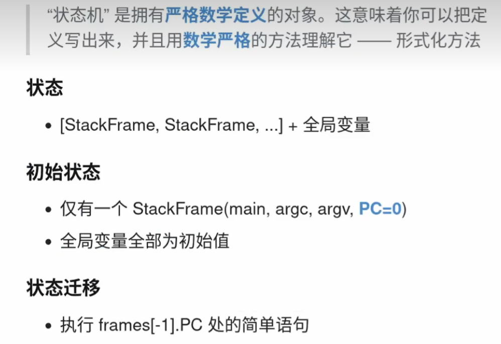
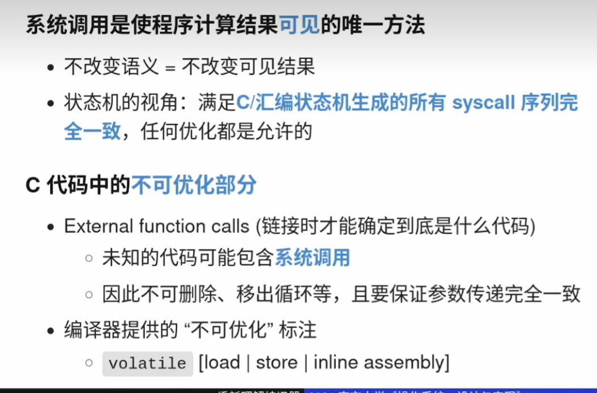

# os

## 应用程序角度的os

* **os是一个神秘的软件，从应用视角来看，可以调用各种syscall(系统调用API) ,操纵操作系统里的对象。**

  * **操作系统的职责：提供令应用程序舒适的抽象 (对象 + API).**
  * 可执行文件是操作系统中的对象

### 可执行文件是操作系统中的对象

* 与 minimal 的二进制文件没有本质区别
* 我们甚至可以像文本一样直接编辑可执行文件

### 任何程序 = minimal.S = 状态机

* 总是从被操作系统加载开始
  * 通过另一个进程执行 execve 设置为初始状态
* 经历状态机执行 (计算 + syscalls)
  * 进程管理：fork, execve, exit, ...
  * 文件/设备管理：open, close, read, write, ...
  * 存储管理：mmap, brk, ...
* 最终调用 _exit (exit_group) 退出

### 程序怎么停下来的

**程序自己是不能 “停下来” 的.**

* 指令集里没有一条关闭计算机的指令，那么操作系统是如何在关闭所有软件后，切断计算机的电源的？

**只能借助操作系统.**

```cpp

movq $SYS_exit,  %rax   # exit(
movq $1,         %rdi   #   status=1
syscall                 # );

```

* 把 “系统调用” 的参数放到寄存器中
* 执行 syscall，操作系统接管程序
  * 操作系统可以任意改变程序状态 (甚至终止程序)

syscall 将状态机完全交给操作系统

### everything = 状态机

Everything (高级语言代码、机器代码) 都是状态机；而**编译器实现了两种状态机之间的翻译**。**无论何种状态机，在没有操作系统时，它们只能做纯粹的计算**，**甚至都不能把结果传递到程序之外**——而**程序与操作系统沟通的唯一桥梁是系统调用** (例如 x86-64 的 syscall 指令)。如此重要的桥梁，操作系统中自然也有工具：strace 可以查看程序运行过程中的系统调用序列。

strace 查看系统调用
-f 跟踪所有子进程

### 状态机




### 汉诺塔实现原理---非递归

### 为什么没有在C代码中看到系统调用？

### C代码如何变为二进制文件的？

### 到底编译器什么优化能做、什么优化不能做？


三板斧

1. 函数内联 : 将函数调用替换为函数本身
2. 常量传播： 在编译时，计算常量表达式的值并替换
3. 死代码删除：删除永远不会执行到的代码

### 最小的可执行程序

指令＋系统调用

## 硬件视角的操作系统

计算机系统是严格的数学对象：没有魔法；计算机系统的一切行为都是可观测、可理解的。

* 处理器是无情的执行指令的机器。
* 处理器会规定好 Reset 后的行为。
* Reset 后 Firmware 开始运行，再加载操作系统。
* 厂商逐渐形成了达成共识的 Firmware Specification (IBM PC “兼容机”、UEFI、……)。

(计算机系统：初始状态)CPU 会reset,以后会进入一个完全确定的状态，这个确定的状态，比如pc是某一个确定的值。

(固件：接管计算机系统的第一个程序。)这个时候我们的固件Firmware(Firmware：配置计算机系统,上的病毒)。

### 从固件到操作系统

怎么样将操作系统一步一步加载起来？

## 数学视角的操作系统

---

## 进程、线程、协程区别与联系？

**进程（Process）**： 进程是操作系统进行资源分配和调度的基本单位，是一个独立运行的程序实体。每个进程拥有独立的内存空间、文件描述符、寄存器状态等资源。进程之间的资源是相互隔离的，因此进程间通信需要通过操作系统提供的特定机制（如管道、消息队列、共享内存等）进行。由于进程拥有独立的资源，所以进程间的切换和调度开销较大。

**线程（Thread）**： 线程是操作系统调度执行的最小单位，是进程内的一个执行流。一个进程可以拥有多个线程，这些线程共享进程的资源（如内存空间、文件描述符等）。由于线程共享相同的资源，线程间通信相对简单，可以直接通过共享变量、锁等方式进行。线程相较于进程，上下文切换和调度开销较小。但多个线程并发执行时，需要处理好同步和互斥问题，以避免数据不一致或竞争条件。

**协程（Coroutine）**： 协程是一种用户态的轻量级线程，它的调度和切换完全由程序控制，不依赖于操作系统的调度。协程之间共享线程的资源，因此协程间通信也可以通过共享变量、锁等方式进行。协程的优势在于能够轻松地实现高并发，因为协程切换和调度的开销非常小。协程适用于I/O密集型任务，通过异步I/O可以有效地提高程序的性能。

进程和线程的主要差别在于它们是不同的操作系统资源管理方式。

**进程有独立的地址空间**，一个进程崩溃后，在保护模式下不会对其它进程产生影响，
而线程只是一个进程中的不同执行路径。

**线程有自己的堆栈和局部变量**，但线程之间没有单独的地址空间，一个线程死掉就等于整个进程死掉，
所以多进程的程序要比多线程的程序健壮，但在进程切换时，耗费资源较大，效率要差一些。
但对于一些要求同时进行并且又要共享某些变量的并发操作，只能用线程，不能用进程。

* 简而言之，一个程序至少有一个进程，一个进程至少有一个线程。
* 线程的划分尺度小于进程，使得多线程程序的并发性高。
* 进程在执行过程中拥有独立的内存单元，而多个线程是共享内存，从而极大地提高了程序的运行效率。
* 线程在执行过程中与进程还是有区别的。 每个独立的线程有一个程序运行的入口、顺序执行序列和程序的出口。 但是线程不能够独立执行，必须依存在应用程序中，由应用程序提供多个线程执行控制。
* 从逻辑角度来看，多线程的意义在于一个应用程序中，有多个执行部分可以同时执行。 但操作系统并没有将多个线程看做多个独立的应用，来实现进程的调度和管理以及资源分配。 这就是进程和线程的重要区别。

**联系**

* 线程属于进程，多个线程共享进程的资源。一个进程可以包含多个线程，这些线程共同完成任务，提高程序的并发性。
* 协程属于线程，多个协程共享线程的资源。一个线程可以包含多个协程，这些协程协同完成任务，提高程序的性能。
* 进程、线程和协程在执行程序时，都需要面对同步、互斥和通信等问题。在实际应用中，可以根据需求和场景选择合适的执行实体来实现最优的性能和资源利用。

## - 孤儿进程和僵尸进程的概念？

僵尸进程与孤儿进程的区别：

孤儿进程是子进程还在运行，而父进程挂了，子进程被init进程收养。

僵尸进程是父进程还在运行但是子进程挂了，但是父进程却没有使用wait来清理子进程的进程信息，导致子进程虽然运行实体已经消失，但是仍然在内核的进程表中占据一条记录，这样长期下去对于系统资源是一个浪费。

## 讲一讲用户线程与内核线程？

**用户线程：** 用户线程是完全在用户空间中实现和管理的线程。它们的创建、同步和调度都由用户级别的线程库（如POSIX线程库，即Pthreads）处理，而不需要内核直接参与。由于用户线程的操作不涉及系统调用，它们的创建和切换开销相对较小。用户线程的一个主要限制是，它们不能充分利用多核处理器的并行能力。因为操作系统调度的基本单位是内核线程，当一个用户线程阻塞时（如I/O操作），整个进程都会被阻塞，即使其他用户线程仍处于就绪状态。这可能导致多处理器系统中的性能下降。

**内核线程：** 内核线程是由操作系统内核直接支持和管理的线程。内核负责创建、调度和销毁内核线程，每个内核线程都拥有独立的内核栈和线程上下文。由于内核线程是操作系统调度的基本单位，它们可以充分利用多处理器系统的并行能力。内核线程的缺点是，它们的创建、切换和同步操作涉及系统调用，导致较大的开销。此外，内核线程需要更多的内核资源（如内核栈），这可能在大量线程的情况下导致资源耗尽。

## 进程间的通信手段以及各自的优缺点（管道、共享内存、信号）

### 管道

**匿名管道**是最常见的管道形式，用于在具有父子关系的进程之间传递数据。它只能用于具有共同祖先的进程之间通信。

* 应用场景：父进程与子进程之间的通信，比如父进程创建子进程后，通过管道将数据传递给子进程，实现进程间的数据交换和同步。
* 优点：简单易用，无需额外的系统调用；适用于具有父子关系的进程间通信。
* 缺点：只能用于具有共同祖先的进程之间通信；只能实现单向通信，需要双向通信时需要建立两个管道。

**命名管道**允许无关进程之间进行通信，它通过在文件系统中创建一个特殊的文件来实现进程间的通信。任何有权限的进程都可以使用该文件进行通信。

* 应用场景：无关进程之间的通信，比如在不同的终端中的两个独立进程之间传递数据。
* 优点：可以实现无关进程之间的通信；适用于不具有父子关系的进程间通信。
* 缺点：需要在文件系统中创建特殊文件；只能实现单向通信。

### 信号

信号（Signal）是一种异步通信方式，用于在进程间传递简单的消息。Linux系统提供了多种信号，如SIGINT、SIGTERM等。

* 应用场景：进程之间的简单通知和中断处理，比如在用户按下Ctrl+C时，向目标进程发送SIGINT信号。
* 优点：简单易用，适用于进程之间的简单通知和中断处理。
* 缺点：只能传递简单的消息，不能传递复杂的数据；信号的发送和接收是异步的，无法保证可靠的数据传输。

### 消息队列

消息队列（Message Queue）是一种通过内核维护的消息缓冲区，在进程间传递数据的方式。进程可以将消息发送到消息队列中，并由其他进程从队列中接收消息。

* 应用场景：进程之间需要传递结构化数据或大量数据的情况，比如进程A将数据写入消息队列，进程B从队列中读取数据进行处理。
* 优点：能够传递结构化数据或大量数据；消息队列具有缓冲能力，发送方和接收方可以以不同的速度进行通信。
* 缺点：消息队列的容量有限，可能会导致消息丢失；需要在进程间共享消息队列的标识符。

### 共享内存

共享内存就是映射一段能被其他进程所访问的内存,这段共享内存由一个进程创建,但多个进程都可以访问.共享内存是最快的IPC(进程间通信)方式,它是针对其它进程间通信方式运行效率低而专门设计的.它往往与其他通信机制,如信号量,配合使用,来实现进程间的同步与通信.

### 套接字

套接字（Socket）是一种在网络中进行进程间通信的方式，通过IP地址和端口号建立网络连接，实现不同主机上的进程间通信。

* 应用场景：不同主机上的进程间通信，比如客户端与服务器之间的数据交换。
* 优点：适用于不同主机上的进程间通信；支持可靠的数据传输和网络编程的灵活性。
* 缺点：相对于其他进程间通信方式，套接字的实现复杂度较高；与网络相关，受网络性能等因素的影响。

## 一个进程可以创建多少个线程？

## fork一个进程后发生了什么

## 虚拟内存有什么作用？

第一，**虚拟内存可以使得进程对运行内存超过物理内存大小**，因为**程序运行符合局部性原理**，CPU 访问内存会有很明显的重复访问的倾向性，**对于那些没有被经常使用到的内存，我们可以把它换出到物理内存之外**，比如硬盘上的 swap 区域。
第二，由于每个进程都有自己的页表，所以每个进程的虚拟内存空间就是相互独立的。进程也没有办法访问其他进程的页表，所以这些页表是私有的，这就**解决了多进程之间地址冲突的问题**。
第三，页表里的**页表项中除了物理地址之外，还有一些标记属性的比特**，比如控制一个**页的读写权限**，**标记该页是
否存在**等。在**内存访问方面，操作系统提供了更好的安全性**。

## 什么叫文件描述符？

* 指向操作系统对象的"指针"
  * everything is a file
  * 通过指针可以访问"一切"
* 对象的访问都需要指针
  * open close read/write , lseek

# todo

## 读 man  sh
