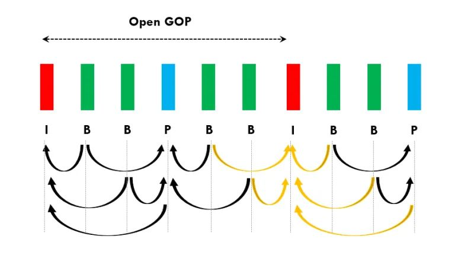

#

## SPS 和 PPS 在 extradata 中的作用是什么？

SPS（Sequence Parameter Set）和 PPS（Picture Parameter Set）是 H.264 视频编码中的两种重要参数集。它们包含了视频序列的特性和参数信息，对于解码器来说非常重要。

SPS 包含了**视频序列的全局参数，如分辨率、帧率、颜色空间**等。PPS **则包含了与特定图像相关的参数，如切片组的配置、参考帧的使用**等。

在 extradata 中，SPS 和 PPS 的作用是为解码器提供视频序列的配置信息，以确保解码器能够正确地解释和处理视频数据。通过提供这些参数集，解码器能够准确地还原视频序列的特性，从而实现高质量的视频解码。

## I 帧和 IDR 帧有什么区别？在什么情况下 I 帧不是 IDR 帧？

I 帧：I 帧是视频序列中的关键帧，它是一个完整的图像帧，类似于 JPEG 或 BMP 图像文件。I 帧不依赖于其他帧，因此可以独立解码和显示。在视频序列中，I 帧通常用于随机访问点，也作为其他帧解码的参考。

IDR 帧：IDR 帧是一种特殊的 I 帧，它具有刷新解码器缓冲区的功能。当解码器接收到 IDR 帧时，它会清除之前的解码状态，确保从该帧开始解码，从而避免错误传播。IDR 帧通常用于视频序列的随机访问点，以及在视频传输或存储中用于错误恢复。

因此 IDR 帧一定是 I 帧，但是 I 帧则不一定是 IDR 帧。在遇到 OpenGOP 的情况下，就会出现 I 帧为非 IDR 帧的情况。

如上图所示右数第一个 I 帧就是一个非 IDR 的 I 帧，前一个 GOP 中的 B 帧依赖了当前 GOP 的 I 帧。所以右数第一个 I 帧接受时，不能刷新解码器，否则上一个 GOP 中的 B 帧无法被成功解码，可能会出现花屏或者报错。

## 如果让你设计一个播放器的架构，你会分哪几层？

我们可以分下面几层来设计播放器的架构：

* 音视频核心层：职责在于处理网络协议、音视频解封装（Demuxer）、音视频解码（Decoder）、音视频数据结构封装等等，通常基于 FFmpeg 来实现。
* 播放器内核层：基于音视频核心层的能力来封装播放器内核能力，包括使用多线程、多缓冲区串联网络、解封装、解码、渲染等节点；支持播放、暂停、seek、刷新数据源等控制能力；提供播放状态获取、播放事件回调、播放器错误上报等接口。
* 播放器封装层：基于平台开发语言对播放器内核进行封装，提供高内聚低耦合的播放器接口。
* 播放器工具层：在播放器核心能力的基础上组装和扩展其他播放相关的其他能力，比如：边下边播视频缓存能力、播放远程配置能力、播放数据埋点上报能力等等。
* 播放业务控制层：基于业务属性进行播放策略控制，比如：码率选档、解码方式选择、网络链路优选等策略。

## 什么是 MP4 的 moov Box？我们在封装 MP4 时通常怎么处理它？为什么？

> moov Box 即 Movie Box，MP4 中存储所有媒体数据的索引信息的 Box。moov Box 可以说是 MP4 文件中最重要的 Box，一般播放器的实现都需要读取到 moov 的数据才能开始播放流程。
>
> 对于通过网络播放 MP4 视频的场景，都建议将视频处理为 moov 前置。因为 moov 前置后，从网络读取和播放 MP4 文件时，就可以较快获取到 moov 的数据并开始播放。
